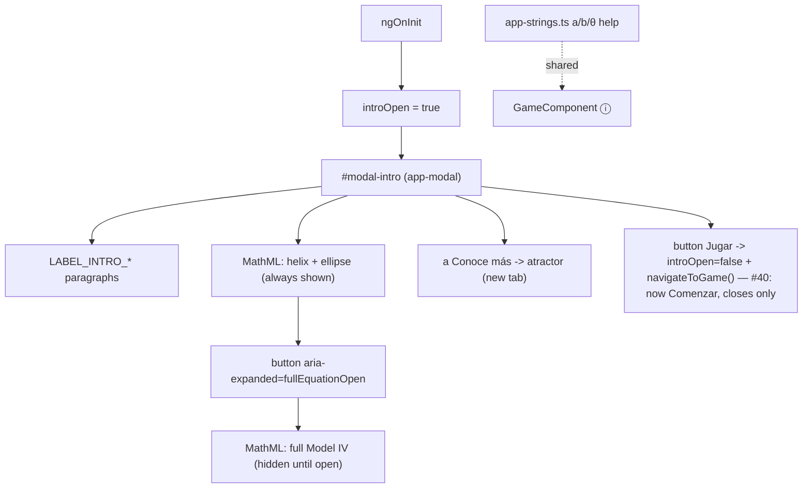

<!-- vt.idd:plan -->
<!-- vt.idd:plan -->
## Implementation Plan

**Generated**: 2026-09-30
**Issue**: #3 — [Initial screen] Welcome pop-up: new copy mentioning the game + show the equation

> **Superseded by #40 (2026-10-01):** the button is now "Comenzar" (`#intro-start-button`, `startButtonClick()` → `closeIntro()` only); it no longer calls `navigateToGame()`. Every "Jugar" in this plan refers to the #3-era button.

### Technical Context

Angular 17 (NgModule app), TypeScript, Karma/Jasmine + ChromeHeadless (single
headless run since #18), viewport pinned via `src/testing/viewport.ts`. The welcome
pop-up is `#modal-intro`, a shared `<app-modal>` (#31) in
`src/app/sandbox/sandbox.component.html`, opened on `ngOnInit` and from the intro
(book) button. Styling uses the `--modal-*` tokens from `src/styles.css`. **No new
runtime dependency** — the equation is native MathML markup. Decisions D1–D8 from the
spec were the fixed inputs; D9 (lines after the equation, "Conoce más" last) and D10
(centred pop-up, "¿te animas?" on one line) came later, during validation. See
[Deviations from the plan](#deviations-from-the-plan) for what changed while building.

### Research Findings

- **Equation source**: `surfaceFunction()` in `src/app/shell-viewer.ts:186-218` is
  Atractor Shell Model IV. `x = d·[A·sinβ·cosθ + r_e·cos(s+φ)·cos(θ+Ω) −
  r_e·sin(s+φ)·sinμ·sin(θ+Ω)]·e^(θcotα)`, etc.; `r_e = 1/√((cos s/a)²+(sin s/b)²)`.
  `d` (= D) is fixed at 1 for every preset and the random shell, so the displayed full
  form omits D. `s` is drawn over 0..4π and θ up to `theta·π` in code; the pop-up
  shows no ranges.
- **a/b/θ help are string-only**: `parameter-help.ts` maps `a`→`LABEL_PARAM_A1_*`,
  `b`→`LABEL_PARAM_B_*`, `theta`→`LABEL_PARAM_THETA_*`. Fixing the wording touches only
  `app-strings.ts`; the map and the game wiring are unchanged. The `a` help is shared
  with `GameComponent`, so `game.component.spec.ts` must expect the new `a` text.
- **Expander pattern**: the parameter ⓘ buttons already use
  `[attr.aria-expanded]`/`[attr.aria-controls]` (the a, b, θ ⓘ in `sandbox.component.html`).
  The equation expander reuses that pattern (D8) with a boolean field on
  `SandboxComponent` (e.g. `fullEquationOpen`).
- **"Jugar"**: the private `SandboxComponent.navigateToGame()` already *(#40: now "Comenzar", which closes and stays)*
  does `router.navigate(['game'])`; the button closes the pop-up then calls it.

- **MathML**: MathML Core is baseline in the app's target evergreen browsers (D7); a
  visually-hidden text alternative covers AT and the no-MathML case (FR-009, FR-014).
- **Current intro spec** (#31's welcome-text spec in `sandbox.component.spec.ts`) asserts
  `img#img-intro-equation` — that assertion is replaced.

### Data Model

No persistent data. One new UI state field on `SandboxComponent`:
`fullEquationOpen: boolean = false` (the expander's open/closed). New/changed strings
in `app-strings.ts`:

- Rewrite `LABEL_INTRO_LINE1, LINE2, LINE4, LINE5`; **remove** `LABEL_INTRO_LINE3`.
- Add `LABEL_INTRO_EQUATION_CAPTION` ("Con matemáticas… en una sola ecuación:"),
  `LABEL_INTRO_EQUATION_SHOW` ("Ver ecuación completa"),
  `LABEL_INTRO_EQUATION_HIDE` ("Ocultar ecuación completa"),
  `LABEL_INTRO_EQUATION_ALT` (text alternative of the equation),
  `LABEL_INTRO_MORE` ("Conoce más"),
  `LABEL_INTRO_MORE_ARIA` ("Conoce más sobre el modelo en Atractor (se abre en una pestaña nueva)"),
  `LABEL_INTRO_MORE_URL` ("https://www.atractor.pt/mat/conchas/texto1-_en.html"),
  `LABEL_INTRO_PLAY` ("Jugar"). *(#40: now "Comenzar", which closes and stays)*
- Fix `LABEL_PARAM_A1_HELP_TITLE/CONTENT` (horizontal), `LABEL_PARAM_B_HELP_TITLE/CONTENT`
  (vertical), `LABEL_PARAM_THETA_HELP_TITLE/CONTENT` (half-turns) per the issue's Text table.

### API Contracts

No network/API. User actions: tap "Ver/Ocultar ecuación completa" → toggles
`fullEquationOpen`; tap "Conoce más" → browser opens the URL in a new tab; tap "Jugar" *(#40: now "Comenzar", which closes and stays)*
→ `introOpen=false` then `navigateToGame()`. *(#40: now "Comenzar", which closes and stays)*

### Architecture

### Project Structure

- **Modify** `src/app/app-strings.ts` — rewrite intro copy, remove `LINE3`, add the new
  intro labels, fix a/b/θ help wording.
- **Modify** `src/app/sandbox/sandbox.component.html` — remove ``;
  add the equation caption, the MathML fragment (short form + hidden full form), the
  expander button, the "Conoce más" link, the "Jugar" button; rewrite the intro paragraphs. *(#40: now "Comenzar", which closes and stays)*
- **Modify** `src/app/sandbox/sandbox.component.ts` — add `fullEquationOpen`, a toggle
  method, and a "Jugar" handler (close + `navigateToGame()`). *(#40: now "Comenzar", which closes and stays)*
- **Modify** `src/app/sandbox/sandbox.component.css` — remove `#img-intro-equation`; add
  `#intro-equation` box styles (overflow-x:auto inside the box only), expander and link
  styles, using `--modal-*` tokens; reduced-motion rule for the expander (FR-012).
- **Modify** `src/app/sandbox/sandbox.component.spec.ts` — replace the `` assertion;
  add specs for the MathML presence, the expander (label + aria-expanded), Conoce más
  (href/target/rel/aria), Jugar (closes + navigates), a/b/θ help text, no side-scroll at *(#40: now "Comenzar", which closes and stays)*
  the listed sizes, opens on load + book button.
- **Modify** `src/app/game/game.component.spec.ts` — expect the corrected `a` help text.
- **Candidate**: extract the MathML into a small presentational component
  (`src/app/equation/…`) if the inline template grows unwieldy; decided during Wave 2.
  Default is inline template markup to avoid a component for a static fragment.

### Waves

1. **Strings & help fix** — `app-strings.ts`: intro copy (accents, game mention),
   remove `LINE3`, add new intro labels, fix a/b/θ wording. Update `game.component.spec.ts`
   and the sandbox help specs. Low risk; unblocks copy approval.
2. **Equation view** — build the MathML (short helix+ellipse always shown; full Model IV
   in a hidden block), lines pre-split for Chromium; text alternative. Decide
   inline-vs-component.
3. **Wire the pop-up** — edit `#modal-intro`: remove ``, add caption, equation,
   expander (button + aria, `fullEquationOpen`), Conoce más, Jugar; TS handlers; CSS *(#40: now "Comenzar", which closes and stays)*
   (equation box scroll containment, reduced motion). 
4. **Specs & verification** — replace the `` spec; add the equation/expander/link/
   Jugar/help/no-side-scroll/open specs; run lint + tsc + build; keep #31, #5, #6 green. *(#40: now "Comenzar", which closes and stays)*
   Manual: screenshots at 390 & 1280 px (collapsed + expanded); optional screen-reader pass.

### Constitution Check

No `.vt/memory/constitution.md` present — gate is a no-op. No MUST/SHOULD violations
identified. UI/content-only change; the single external surface (the Atractor link) is
mitigated with `rel="noopener"` and a fixed URL.

### Gap Analysis Summary

Everything the plan needs already exists: the shared modal (#31), the aria-expanded ⓘ
pattern (#5/#6), and `navigateToGame()`. The only genuinely new thing is static MathML *(#40: now "Comenzar", which closes and stays)*
markup. Watch points: MathML line-breaking at 320–390 px (contain the sideways scroll to
the equation box), the shared `a` help text rippling into the game spec, and replacing
the existing `` assertion.

### Deviations from the plan

Recorded after /vt.review pass 1 (the plan above is kept as planned):

- **A component, not inline markup.** Angular 17.3.4 gives template `<math>` the wrong
  namespace (`http://www.w3.org/1998/MathML/`), so the browser wouldn't lay it out.
  The equation is `<app-equation form="short|full">` (`src/app/equation/`): MathML built
  as constant strings in `shell-equation.ts`, set through `[innerHTML]` (trusted
  constants only), unencapsulated CSS prefixed `app-equation`, declared in `app.module.ts`.
- **No math font needed.** Without one, MathML's auto-italic letters draw as empty boxes
  and brackets don't stretch: variables are italic from CSS, vectors are one-line
  tuples, r_e(s) uses slashes, `math-style: normal` keeps fractions full size.
- **No `LABEL_INTRO_EQUATION_CAPTION`.** `LABEL_INTRO_LINE2` is the caption.
  `LABEL_INTRO_EQUATION_FULL_ALT` (the full system, spoken) was added.
- **Each equation scrolls on its own** (`app-equation .equation-math`), not the block
  around them (browser-check bug, f179581): the button never slides away.
- **Owner changes during validation:** D9 (lines 3–4 reworded; "Conoce más" last, after
  them) and D10 (the shared `.modal-centered`, "Jugar" centred; a no-break space in *(#40: now "Comenzar", which closes and stays)*
  "¿te animas?").
- **Review pass 1:** `closeIntro()` collapses the full system on every way out; the
  spoken versions name each sum inside a function.
