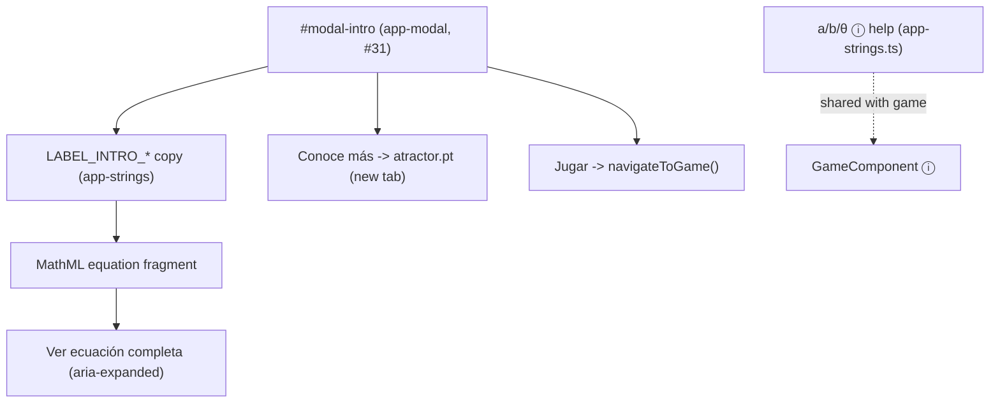

<!-- vt.idd:spec -->
## Specification

## Summary

Rework the initial screen's **welcome pop-up** (`#modal-intro`, on the shared
`<app-modal>` from #31) in one content pass: replace the long, accent-poor copy
with short sentences that also mention the game mode, and put the **shell
equation** where an empty `` now reserves 100 px of
blank space. The app draws Atractor's **Shell Model IV** (*Conchas e Matemática*);
`surfaceFunction()` in `shell-viewer.ts` matches it term for term. The pop-up shows
the equation as **native MathML** — the short helix + ellipse form by default, with
a **"Ver ecuación completa"** expander for the full system — plus a **"Conoce más"**
link crediting Atractor (new tab) and a **"Jugar"** button that opens the game. The
same pass fixes the parameter ⓘ help texts, which swap the ellipse's `a`/`b` axes
and mis-describe `θ`. *(Merged from #4.)*

## User Stories

### US1 — Copy that mentions the game (P1)

A first-time visitor sees the welcome pop-up on load and should learn, in a few
short sentences, both what the app is and that a game mode exists.

- **Given** the page loads, **When** the welcome pop-up opens, **Then** it shows the
  new `LABEL_INTRO_*` copy from the Text table and tells the visitor the game mode
  exists.
- **Given** the pop-up is open, **When** the visitor reads it, **Then** the old
  `LABEL_INTRO_LINE3` placeholder (`/* Mostrar ecuación */`) is gone and the copy has
  correct accents.

### US2 — See the shell equation (P1)

A visitor wants to see the equation that generates the shells, readable on a phone.

- **Given** the pop-up is open, **When** it renders, **Then** the **helix + ellipse**
  form renders as MathML where the empty image was, matching the model (H(θ) and
  r_e(s) written out).
- **Given** the equation is shown collapsed, **When** the visitor taps **"Ver
  ecuación completa"**, **Then** the full Model IV system expands, the button label
  becomes **"Ocultar ecuación completa"** and its `aria-expanded` reads true.
- **Given** the full equation is expanded, **When** the visitor taps **"Ocultar
  ecuación completa"**, **Then** the full system collapses and `aria-expanded` reads
  false.
- **Given** the equation collapsed and expanded, **When** the pop-up renders at
  320×568, 360, 390, 1280 px and 844×390, **Then** the equation is fully readable and
  neither the pop-up nor the page scrolls sideways (only each equation may, inside
  itself; the block around them and the button stay put).
- **Given** a screen reader is active, **When** it reaches the equation, **Then** it
  reads it (MathML semantics or an equivalent text alternative).
- **Given** the full system is expanded, **When** the pop-up closes (✕, Esc, backdrop
  or "Jugar") and opens again, **Then** it is collapsed.

### US3 — Learn more and start playing (P2)

- **Given** the pop-up is open, **When** the visitor taps **"Conoce más"**, **Then**
  Atractor's shells page opens in a new tab (`rel="noopener"`).
- **Given** the pop-up is open, **When** the visitor taps **"Jugar"**, **Then** the
  pop-up closes and the game opens (the same route as the toolbar's game button).
- **Given** a short screen where the pop-up is taller than the viewport, **When** the
  visitor scrolls inside the pop-up, **Then** the close button and **"Jugar"** are
  reachable.

### US4 — Correct parameter help (P2)

A visitor opening a parameter's ⓘ help should read a description that matches the
equation now on screen.

- **Given** the `a` ⓘ help (initial screen and game), **When** it opens, **Then** it
  describes the **horizontal** axis of the ellipse.
- **Given** the `b` ⓘ help, **When** it opens, **Then** it describes the **vertical**
  axis of the ellipse.
- **Given** the `θ` ⓘ help, **When** it opens, **Then** it describes **half-turns**.

### US5 — No regressions (P2)

- **Given** the app, **When** the welcome pop-up opens on load and from the book
  button, **Then** it opens and closes as before (#31).
- **Given** the #5 initial-screen guide is on, **When** it renders, **Then** its
  "Bienvenida" bubble and layout are unchanged.

## Requirements

### Functional Requirements

- **FR-001** (MUST): The welcome pop-up shows the new `LABEL_INTRO_*` copy from the
  Text table, in short sentences with correct accents, and it names the game mode.
- **FR-002** (MUST): `LABEL_INTRO_LINE3` and the empty ``
  (with its 100 px CSS rule in `sandbox.component.css`) are removed.
- **FR-003** (MUST): The shell equation renders as **native MathML** in the pop-up,
  in place of the removed image, showing the helix + ellipse form: H(θ) =
  A·e^(θ·cotα)·(sinβ·cosθ, sinβ·sinθ, −cosβ) and r_e(s) = 1/√((cos s/a)² + (sin s/b)²),
  with C(θ,s) = H(θ) + E(θ,s). No new runtime dependency is added.
- **FR-004** (MUST): A **"Ver ecuación completa"** control expands the full Model IV
  system — x, y, z as in `shell-viewer.ts` (with φ, Ω, μ; D omitted, since the app
  fixes D = 1) — and collapses it again. It carries `aria-expanded` and
  `aria-controls`, and its label switches to **"Ocultar ecuación completa"** while
  expanded. It is collapsed every time the pop-up opens, and closing the pop-up any
  way collapses it (review m5).
- **FR-005** (MUST): Collapsed and expanded, at 320×568, 360, 390, 1280 px and
  844×390, the equation is fully readable and neither the pop-up nor the page scrolls
  horizontally; only each equation (each `<app-equation>`'s `.equation-math`) may scroll
  sideways, inside itself. The block around the equations and the "Ver/Ocultar" button
  never scroll (fixed in f179581). The pop-up may scroll vertically on short screens.
- **FR-006** (MUST): A **"Conoce más"** link opens
  `https://www.atractor.pt/mat/conchas/texto1-_en.html` in a new tab
  (`target="_blank" rel="noopener"`) with the accessible name "Conoce más sobre el
  modelo en Atractor (se abre en una pestaña nueva)".
- **FR-007** (MUST): A **"Jugar"** button in the pop-up closes it and navigates to the
  game route (`['game']`), the same navigation as `#game-button`.
- **FR-008** (MUST): On a screen shorter than the pop-up, the pop-up scrolls
  vertically inside itself (from #31) so the close button and **"Jugar"** stay
  reachable at 320×568 and 844×390.
- **FR-009** (MUST): The screen reader reads the equation — either through MathML
  semantics or an equivalent text alternative — and the expander announces its state.
- **FR-010** (MUST): The parameter ⓘ help texts are corrected: `a` = horizontal axis,
  `b` = vertical axis, `θ` = half-turns, per the Text table. The strings live in
  `app-strings.ts`; `parameter-help.ts` shares the `a` text with the game, so it changes
  there too.
- **FR-011** (MUST): The owner approves the pop-up copy and the ⓘ help wording on this
  issue before merge.
- **FR-012** (SHOULD): Under `prefers-reduced-motion: reduce`, expanding the full
  equation does not animate.
- **FR-013** (MUST): The welcome pop-up still opens on load (`ngOnInit`) and from the
  book/intro button, and closes as before (#31); the #5 "Bienvenida" guide bubble is
  unchanged.
- **FR-014** (SHOULD): The equation degrades gracefully where MathML is unavailable —
  a visually-hidden text alternative (FR-009) conveys it; no separate rendered fallback
  is shipped (D7).

### Key Entities

- **Welcome pop-up** (`#modal-intro` in `sandbox.component.html`): the shared
  `<app-modal>` instance holding this content.
- **`LABEL_INTRO_*`** (`app-strings.ts`): the pop-up copy. `LINE3` removed; `LINE1`,
  `LINE2`, `LINE4`, `LINE5` rewritten; new strings for the equation labels, the
  expander, the credit link and the "Jugar" button.
- **`<app-equation form="short|full">`** (`src/app/equation/`): the equation. Its MathML
  is built as constant strings in `shell-equation.ts` and set through `[innerHTML]`
  (trusted constants only), because Angular 17.3.4 gives template `<math>` the wrong
  namespace. Written to need no math font (CSS italics, one-line tuples, slashes);
  a visually-hidden spoken version for screen readers. Unencapsulated CSS, every rule
  prefixed `app-equation`.
- **`fullEquationOpen`** (`SandboxComponent`): the expander's state; `closeIntro()`
  and opening the pop-up reset it.
- **`LABEL_PARAM_*_HELP_*`** (`app-strings.ts`): the ⓘ help texts for a, b, θ, mapped by
  `parameter-help.ts` (unchanged) on both screens.

## Approach / Architecture

### Technical Summary

Content and markup change on one existing pop-up, plus a small new `<app-equation>`
component (MathML from constant strings, see Key Entities) and string edits. No new dependency, no service-worker change (MathML is inline
markup, styled by existing `--modal-*` tokens). The expander reuses the
`aria-expanded`/`aria-controls` pattern already used by the parameter ⓘ buttons. The
"Jugar" button reuses `SandboxComponent.navigateToGame()`. The a/b/θ fix is a
string-only change in `app-strings.ts`.

### Architecture

### Tech Context

Angular 17, TypeScript, standalone-free NgModule app. No new deps. Native MathML
(supported in current Chromium/Firefox/Safari). Tests: Karma/Jasmine + ChromeHeadless
(single headless run since #18), pinned viewport via `src/testing/viewport.ts`.

### Project Structure Impact

- **Modified**: `src/app/sandbox/sandbox.component.html` (`.modal-centered`, the two
  `<app-equation>`s, expander, lines, Conoce más last, Jugar in the footer; ``
  removed), `sandbox.component.ts` (`fullEquationOpen`, `fullEquationButtonClick`,
  `playButtonClick`, `closeIntro`), `sandbox.component.css` (`#img-intro-equation`
  removed; the block, button and link styles), `app-strings.ts` (copy, spoken
  versions, labels; a/b/θ help), `app.module.ts` (declares `EquationComponent`),
  `sandbox.component.spec.ts` (the `` assertion replaced; #3 specs; #31's
  "no footer" restated), `game.component.spec.ts` (the shared `a` help text).
- **Added**: `src/app/equation/shell-equation.ts`, `equation.component.ts`, `.css`,
  `.spec.ts` (required: Angular's template `<math>` namespace bug).
- **Removed**: `LABEL_INTRO_LINE3`, the empty equation `` and its CSS.

### Applicable Conventions

`CLAUDE.md` (project), the #31 shared-modal pattern, the #5/#6 ⓘ `aria-expanded`
pattern, Spanish UI strings in `app-strings.ts`, viewport-pinned component specs.

### Decisions Made

**D1 — Which equation form (owner, 2026-09-30).**
Options: (A) helix + ellipse by default with a "Ver ecuación completa" expander for
the full Model IV *(selected)*; (B) full Model IV only; (C) Model III (no rotations);
(D) both always visible. Rationale: the full x/y/z system is three long lines that
don't fit a phone and shows φ, Ω, μ the visitor can't change; the short form uses the
slider parameters, and the expander keeps the full truth one tap away.

**D2 — Rendering: native MathML (owner, 2026-09-30).**
Options: (A) native MathML *(selected)*; (B) KaTeX (~270 KB + fonts); (C) SVG image.
Rationale: no dependency, scales with the text, screen-reader readable, works offline,
and #14 can later bind live values into the same markup. Trade-off: Chromium's MathML
doesn't line-break long rows, so the full system's lines are split by hand and the
equations may scroll sideways, each inside itself, at narrow widths (FR-005; since f179581
the scroll is on each `<app-equation>`, not the block around them).

**D3 — Credit link target (owner, 2026-09-30).**
Options: (A) `texto1-_en.html`, the shells series' Model I start *(selected)*; (B)
`texto4-_en.html` (the exact model, but assumes the earlier pages); (C) site home; (D)
Portuguese original. Rationale: the owner asked for the shells "home" so a reader can
start from the beginning; Atractor has no Spanish version. Label: "Conoce más".

**D4 — Mention the game with copy AND a "Jugar" button (owner, 2026-09-30).**
Options: (A) copy + button *(selected)*; (B) copy only. Rationale: a button lets a
visitor jump straight into the game from the first screen they see.

**D5 — Fix a/b/θ help inside this issue (owner, 2026-09-30).**
Options: (A) fix here *(selected)*; (B) separate bug issue; (C) leave. Rationale: the
equation on screen makes the swapped axes visible, so the fix belongs in the same pass.
Note: the `a` help is shared with the game.

**D6 — No parameter legend in the pop-up (owner, 2026-09-30).**
The per-slider ⓘ help already names each parameter; a second legend would duplicate it.

**D7 — MathML browser support and fallback (CLARIFY, autonomous, 2026-09-30).**
Options: (A) rely on native MathML Core (baseline in Chromium 109+, Firefox and
Safari since 2023) with a visually-hidden text alternative for AT and no separate
rendered fallback *(selected)*; (B) ship a KaTeX/SVG fallback for browsers without
MathML; (C) detect support and swap to an image. Rationale: the app already targets
current evergreen browsers (Angular 17, WebXR, service worker); MathML Core is
universally supported there, so a second renderer is dead weight. FR-009's text
alternative covers assistive tech and the rare no-MathML case; the equation is
informational, not interactive, so a plain-text form is an acceptable degradation.

**D8 — Expander mechanism: button + aria-expanded, not native 
 (CLARIFY, autonomous, 2026-09-30).**
Options: (A) a button with `aria-expanded`/`aria-controls` toggling the full system,
matching the parameter ⓘ pattern from #5/#6 *(selected)*; (B) a native
`
/
` element. Rationale: consistency with the existing ⓘ callouts (one
a11y pattern in the app), full control over the label swap ("Ver"/"Ocultar") and over
honouring `prefers-reduced-motion` (FR-012); `
`'s default marker and open
animation would need overriding anyway. FR-004 already specifies this pattern.

**D9 — Lines after the equation, and "Conoce más" last (owner, 2026-09-30, during validation).**
The owner reworded the two lines after the equation button: "Mueve los sliders y diseña todos los
caracoles que imagines." and "¿Listo para el siguiente nivel? En el modo juego te retamos a
reconstruir un caracol ¿te animas?", and moved the "Conoce más" link to the end of the text (it was
right under the equation). "Jugar" stays in the footer. Done in 10821e2; specs pin the wording and the order.

**D10 — Centred pop-up; "¿te animas?" on one line (owner, 2026-09-30, during validation).**
After a preview of left-aligned vs centred, the owner chose centred with the title too, and "Jugar"
centred: the welcome pop-up uses the shared `.modal-centered` variant that ¡Victoria! uses (no new CSS;
the ✕ stays at the right). A no-break space keeps "¿te animas?" together at every width. Done in a44d0e5.

## Risk Assessments

### Security & Vulnerabilities

| Risk | Severity | Description | Mitigation |
|------|----------|-------------|------------|
| External link opens Atractor | Low | New outbound link ("Conoce más") in a new tab. | `rel="noopener"`; fixed, known URL; opens in a new tab so the app is not left. |
| No other new surface | Low | UI/content only; no new input, network, storage or auth. | Standard review. |

### Regression & Quality

| Risk | Severity | Affected Systems | Mitigation |
|------|----------|------------------|------------|
| MathML doesn't line-break on Chromium; full system overflows | Medium | Equations at 320–390 px | Split lines by hand; each equation scrolls sideways, never the pop-up/page (FR-005); verified at the listed sizes. |
| Existing intro spec asserts the `` | Medium | `sandbox.component.spec.ts` (#31 welcome-text spec) | Replace the assertion with the MathML/equation checks in the same PR. |
| Shared `a` help text change ripples to the game | Medium | `GameComponent` ⓘ, #6 specs | Update the game spec's expected `a` text; keep #6 parameter-help specs green. |
| Taller pop-up pushes close/Jugar off short screens | Medium | 320×568, 844×390 | #31's in-pop-up vertical scroll; FR-008 checks both stay reachable. |
| Copy/wording not yet owner-approved | Medium | Merge gate | FR-011; approval recorded on this issue before merge (SC-005). |
| Screen reader can't parse MathML on some AT | Low | Accessibility | MathML semantics + a text alternative fallback (FR-009). |

### Testing Strategy

Karma/Jasmine unit + component specs, ChromeHeadless, viewport pinned via
`src/testing/viewport.ts`. Cover: the new copy is present and `LINE3`/`` are gone;
the MathML equation renders; the expander toggles the full system with correct
`aria-expanded` and label; each equation (not the block, button, pop-up or page) is the only sideways
scroller at the listed sizes; "Conoce más" has the right href, `target`, `rel` and
accessible name; "Jugar" closes the pop-up and calls `navigateToGame()`; the a/b/θ help
texts read correctly on the initial screen and (for `a`) in the game; the pop-up still
opens on load and from the book button (#31); the #5 "Bienvenida" bubble is unchanged.
Manual: screenshots at 390 and 1280 px (collapsed + expanded); a real screen-reader
pass (optional). Regression: #31 modal specs, #5 guide specs, #6 parameter-help specs.

## Verification Matrix

| ID | Acceptance Scenario | Evidence | Status |
|----|---------------------|----------|--------|
| VM-001 | US1 — pop-up opens on load with the new copy and names the game mode | `sandbox.component.spec.ts` "SandboxComponent welcome pop-up (#3) › copy › opens on load with the new copy, which names the game" + "uses the owner's wording…"; owner manual §1–§2 | Pass |
| VM-002 | US1 — LINE3 placeholder gone, accents corrected | `sandbox.component.spec.ts` "SandboxComponent welcome pop-up (#3) › copy › has no equation placeholder and no empty equation image left" + "spells the copy with its accents" | Pass |
| VM-003 | US2 — helix + ellipse form renders as MathML where the image was | `sandbox.component.spec.ts` "SandboxComponent welcome pop-up (#3) › the equation › is written in MathML…" + `equation.component.spec.ts` "EquationComponent (#3) › shows the helix + ellipse form, row by row"; harness browser-check 116/116 @0729355 | Pass |
| VM-004 | US2 — "Ver ecuación completa" expands the full system; label + aria-expanded flip to expanded | `sandbox.component.spec.ts` "SandboxComponent welcome pop-up (#3) › the equation › \"Ver ecuación completa\" shows the full Model IV system…"; `equation.component.spec.ts` "EquationComponent (#3) › shows the full system exactly as surfaceFunction() computes…" | Pass |
| VM-005 | US2 — "Ocultar ecuación completa" collapses it; aria-expanded false | `sandbox.component.spec.ts` "SandboxComponent welcome pop-up (#3) › the equation › \"Ocultar ecuación completa\" collapses it again" (collapsed = hidden + draws nothing, 6d3e53e) | Pass |
| VM-006 | US2 — no horizontal scroll of pop-up/page (only each equation, never the block or button) at 320×568, 360, 390, 1280, 844×390, collapsed and expanded | `sandbox.component.spec.ts` "SandboxComponent welcome pop-up (#3) › the equation › layout › never scrolls the pop-up or the page sideways…" (5 sizes × collapsed/expanded, per-equation scroll); harness browser-check 116/116 @0729355 (7 sizes + 125 % window, touch swipe) | Pass |
| VM-007 | US2 — a screen reader reads the equation (MathML semantics or text alternative) | `sandbox.component.spec.ts` "SandboxComponent welcome pop-up (#3) › the equation › for a screen reader › …" + `equation.component.spec.ts` "EquationComponent (#3) › says what each function applies to…" (d959406); real screen reader not run (manual §12) | Partial |
| VM-008 | US3 — "Conoce más" opens the Atractor URL in a new tab with rel=noopener and the accessible name | `sandbox.component.spec.ts` "SandboxComponent welcome pop-up (#3) › Conoce más and Jugar › opens the start of Atractor's shells pages in a new tab, safely"; harness browser-check 116/116 @0729355 (new tab, no opener) | Pass |
| VM-009 | US3 — "Jugar" closes the pop-up and navigates to the game | `sandbox.component.spec.ts` "SandboxComponent welcome pop-up (#3) › Conoce más and Jugar › \"Jugar\" closes the pop-up and opens the game"; harness browser-check 116/116 @0729355 | Pass |
| VM-010 | US3 — on a short screen the close button and "Jugar" stay reachable by scrolling inside the pop-up | `sandbox.component.spec.ts` "SandboxComponent welcome pop-up (#3) › Conoce más and Jugar › keeps the ✕ and \"Jugar\" on screen at 320×568 / 844×390…"; harness browser-check 116/116 @0729355 | Pass |
| VM-011 | US4 — the `a` ⓘ help says horizontal axis (initial screen and game) | `sandbox.component.spec.ts` "ⓘ a describes horizontal (#3)" + `game.component.spec.ts` "ⓘ a describes the horizontal axis (#3)"; harness browser-check 116/116 @0729355 | Pass |
| VM-012 | US4 — the `b` ⓘ help says vertical axis | `sandbox.component.spec.ts` "ⓘ b describes vertical (#3)"; harness browser-check 116/116 @0729355 | Pass |
| VM-013 | US4 — the `θ` ⓘ help says half-turns | `sandbox.component.spec.ts` "ⓘ theta describes medias vueltas (#3)"; harness browser-check 116/116 @0729355 | Pass |
| VM-014 | US5 — the pop-up opens on load and from the book button and closes as before (#31) | `sandbox.component.spec.ts` #31 pop-up specs (welcome: ✕/Esc/backdrop) + `sandbox.component.spec.ts` "SandboxComponent welcome pop-up (#3) › copy › opens again from the book button…"; owner manual §9 | Pass |
| VM-015 | US5 — the #5 "Bienvenida" guide bubble and layout are unchanged | harness browser-check 116/116 @0729355 "#5 guide bubbles identical (text and position)" at 390×844 and 1280×800; revert guard: only #3 specs fail on dev's pop-up (31) | Pass |
| VM-016 | US2 — expanded, then closed (✕, Esc, backdrop, Jugar) and reopened: collapsed | `sandbox.component.spec.ts` "SandboxComponent welcome pop-up (#3) › the equation › collapses when the pop-up closes, however it closes" + "starts collapsed again each time the pop-up opens" (6d3e53e) | Pass |

## Success Criteria

| ID | Criterion | Evidence | Status |
|----|-----------|----------|--------|
| SC-001 | The welcome pop-up shows short new copy that names the game mode | VM-001, VM-002; owner manual §1–§2 passed 2026-09-30 | Pass |
| SC-002 | The shell equation renders as MathML, with a working "Ver ecuación completa" expander, readable at 320×568/360/390/1280/844×390 without page side-scroll | VM-003–VM-006, VM-016; harness browser-check 116/116 @0729355; revert guard 16/16 mutations caught | Pass |
| SC-003 | The equation is readable by a screen reader | DOM-level: VM-007 (spoken versions, MathML aria-hidden, expander aria-expanded); real screen reader not yet checked (manual §12, optional) | Partial |
| SC-004 | "Conoce más" credits Atractor (new tab) and "Jugar" opens the game | VM-008, VM-009; owner manual §6 passed 2026-09-30 | Pass |
| SC-005 | The pop-up copy and the a/b/θ help wording are approved on this issue before merge | wording is the owner's (D9, D10) and passed in the manual pass (§2, §3, §8, 2026-09-30); the boxes on approval comment 5916660812 are not ticked yet | Partial |
| SC-006 | The a/b/θ parameter help matches the equation (a horizontal, b vertical, θ half-turns) on both screens | VM-011–VM-013 (both screens); owner manual §8 passed 2026-09-30 | Pass |
| SC-007 | #31 (shared modal), #5 (initial-screen guide) and #6 (parameter help) keep working (their specs stay green); before/after screenshots at 390 and 1280 px approved on this issue | 451/451 at 0729355 (#31, #5, #6 specs green; revert guard: only #3 specs fail on dev's pop-up); new compare sheets validaciones/shell_generator/3/capturas/compare-*.png not yet attached/approved on #3 | Partial |

## Complexity Considerations

Low–Medium. One existing pop-up plus a small static MathML fragment and string edits;
no new dependency and no state beyond the expander's open/closed flag. The main care
points are MathML line-breaking at phone widths (D2/FR-005), the shared `a` help text
touching the game, and replacing the existing `` spec assertion. One PR, ~2–3
waves. Open items: owner approval of the copy and ⓘ wording, and the screenshots.

## Post-Mortem

_Filled after merge. Do not complete during specification._

| Category | Finding |
|----------|---------|
| Risks that materialized but were not declared | |
| Declared risks that did not materialize | |
| Review findings the risk assessment missed | |
| Template sections that were not useful | |
| Process improvements for next feature | |

