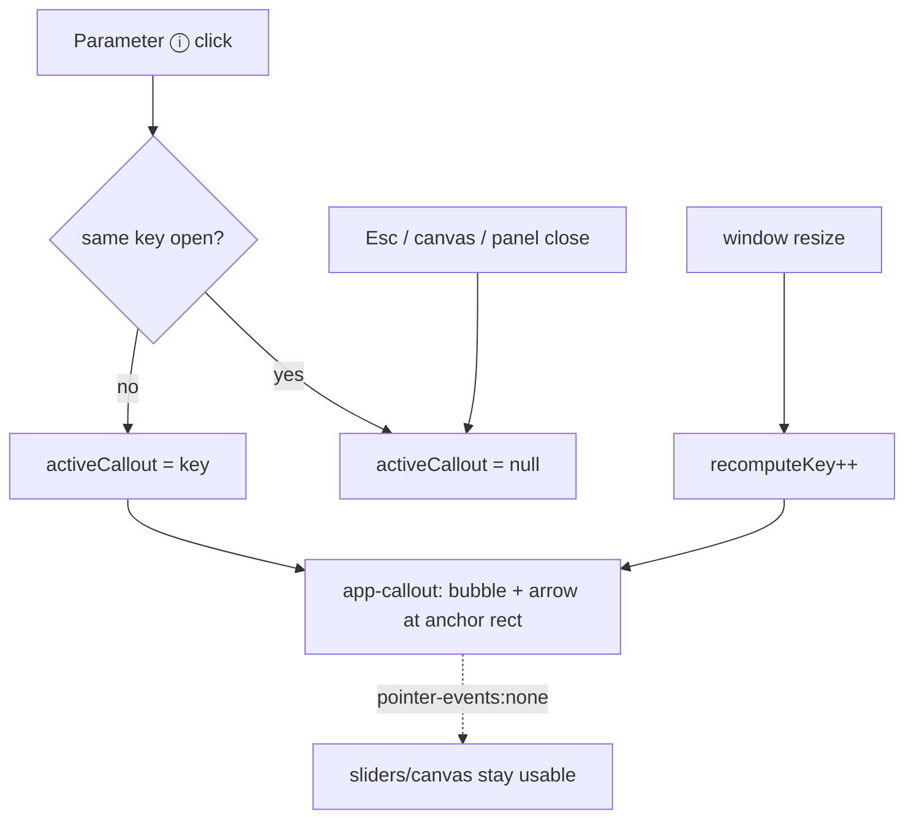

<!-- vt.idd:plan -->
## Implementation Plan

**Generated**: 2026-09-29
**Issue**: #6 - Parameter panels: callout help for every ⓘ + clearer shell panel layout
**Feature ID**: 006-attack_of_the_callouts (drafted as 032-attack_of_the_callouts)
**PR closes**: #6 and #7 (#6 supersedes #7, owner decision 2026-09-29)

### Technical Context

- **Stack**: Angular 17.3 (NgModule app — `app.module.ts` declarations, not standalone), TypeScript 5.4, Karma + Jasmine (`ng test --watch=false --browsers=ChromeHeadless`), ESLint.
- **Shared tokens**: `--modal-*` in `src/styles.css` (white bg, teal `#77aca2`, Lucida, `--modal-duration` 180ms). The `ModalComponent` (`src/app/modal/`) is the reference for token-driven, unencapsulated styling.
- **Port source**: `../gato_magico/src/app/components/cue-overlay/` (Angular 17): live `getBoundingClientRect()` positioning, `placeBubble` (pure, unit-testable), `clampHorizontally`, resize recompute, polite `aria-live` region, absent-anchor skip. Its issue #4 tasks/spec are a working template.
- **Current help path (to replace)**: on both screens the parameter ⓘ handlers set `helpTitle`/`helpContent`/`helpOpen=true`, opening `modal-help` (`<app-modal>`). Grep confirms these handlers are the **only** openers (sandbox: A/α/β/a/b/θ/Resolución; game: A/α/β/a).

### Research Findings

| Topic | Decision | Rationale | Alternatives |
|-------|----------|-----------|--------------|
| Overlay vs one bubble | One on-demand anchored bubble driven by `activeCallout` key | gato_magico shows a fixed 6-cue set always-on; here help is per-ⓘ and one-at-a-time | Port the multi-cue overlay unchanged (rejected: wrong interaction model) |
| Where `<app-callout>` mounts | Once per screen, at component root, outside the translucent panels | Panel has `opacity: 0.8`; a nested bubble would be dimmed (FR-009) | Mount inside the panel (rejected) |
| `modal-help` fate | Remove as dead code on both screens (FR-017) | Only the parameter handlers open it; unused after the change | Leave unused (rejected: two help affordances, stale #31 specs) |
| Resolución overlap | Size `.parameter-label` to text + let `.slider` take remaining width | Fixed 50px label + 96% slider is the root cause | Shrink font (rejected: doesn't generalize) |

### Data Model

- **`CalloutComponent`** (new, `src/app/callout/`): `@Input() active: {title,text,anchorSelector} | null`, `@Input() recomputeKey`. Renders one bubble with an arrow at the anchor's live rect; nothing when `active` is null. Reuses gato_magico's `placeBubble`/`clampHorizontally`/`side` logic. Layer is `pointer-events:none`, `role="region" aria-live="polite"`, bubble `role="note"`.
- **Host state (each screen)**: `activeCallout: string | null` (parameter key). Handlers toggle it: same key → null; different key → switch. Anchor selectors map each key to its ⓘ id (e.g. `#A-help-button`, `#qual-help-button`; game `#A-help-button`…).

### API Contracts

UI-only; no network. Component contract:
- `active=null` → nothing rendered, live region empty.
- `active={…}` → one bubble anchored beside `anchorSelector`, arrow toward it, clamped on-screen.
- Host: clicking an ⓘ toggles its key; Esc / canvas click / panel-close set `activeCallout=null`; slider `change` does not touch it.

### Architecture

### Project Structure

**Add**
- `src/app/callout/callout.component.ts` `.html` `.css` `.spec.ts`
- declaration in `src/app/app.module.ts`

**Modify**
- `src/app/sandbox/sandbox.component.ts` — ⓘ handlers set `activeCallout`; close on canvas/panel-close; drop `helpOpen`/`helpTitle`/`helpContent`
- `src/app/sandbox/sandbox.component.html` — remove `modal-help`; add `<app-callout>`; parameter name labels; anchor ids
- `src/app/sandbox/sandbox.component.css` — `.parameter-label` width; Resolución row; landscape (844×390) fit
- `src/app/game/game.component.ts` / `.html` — same ⓘ→callout swap; remove `modal-help`; add `<app-callout>`
- `src/app/sandbox/sandbox.component.spec.ts`, `src/app/game/game.component.spec.ts` — parameter-help specs move from `modal-help` to callout
- `src/app/app-strings.ts` — typo fix "superfice" → "superficie" in `LABEL_PARAM_QUAL_CONTENT`; every other string unchanged

**Remove**
- `modal-help` `<app-modal>` markup + `helpOpen`/`helpTitle`/`helpContent` on both screens (`ModalComponent` itself stays — still used by intro/how-to/new-game/victory)

### Waves

**Wave 0 — Baseline**
- T001 [W0] Green baseline: `ng lint`, `ng build`, `ng test --watch=false` on 2 cores (taskset).

**Wave 1 — Shared callout + initial-screen help (US1, US2, US6) [P1]**
- T002 [W1][TDD] `CalloutComponent` (ported): one anchored bubble + arrow from live rect; `active`/`recomputeKey` inputs; `placeBubble` pure; clamp on-screen; skip when anchor absent; `pointer-events:none`; `aria-live` polite; `--modal-*` tokens; fade off under `prefers-reduced-motion`. Declare in `app.module.ts`.
- T003 [W1] `callout.component.spec.ts`: open/replace/toggle-closed; `placeBubble` sides; absent-anchor skip; reduced-motion; non-blocking layer.
- T004 [W1][US1] Sandbox: ⓘ handlers (A/α/β/a/b/θ/Resolución) → `activeCallout`; mount `<app-callout>` outside the panel; anchor ids; remove `modal-help` markup + state. Fix the typo "superfice" → "superficie" in `LABEL_PARAM_QUAL_CONTENT` (spec asserts the corrected Resolución text).
- T005 [W1][US2] Sandbox close rules: Esc / canvas click / menu+visualization close → `activeCallout=null`; slider `change` leaves it open; ⓘ `aria-expanded`/`aria-controls`, 44px hit area.
- T006 [P][W1] Rewrite sandbox parameter-help specs → assert callout (title/text, replace, toggle-closed, close rules, slider-doesn't-close, a11y attrs); revert-check: fails on `dev`.
- **Gate**: lint/build/test green on 2 cores.

**Wave 2 — Game-screen help (US3) [P2]**
- T007 [W2][US3] Game: ⓘ handlers (A/α/β/a) → `activeCallout`; mount `<app-callout>`; remove `modal-help` + `helpOpen`/`helpTitle`/`helpContent`.
- T008 [P][W2] Rewrite game parameter-help specs → callout; revert-check.
- **Gate**: green.

**Wave 3 — Panel layout + Resolución overlap (US4, US5) [P2]**
- T009 [W3][US4] Shell parameters panel: show each parameter's name next to its icon; keep every control working.
- T010 [W3][US4] Landscape-phone fit: panel compacts/scrolls so nothing is clipped at 844×390.
- T011 [W3][US5] Fix `.parameter-label` (size to text) + `.slider` (remaining width) so "Resolución" no longer overlaps.
- T012 [P][W3] Layout specs / assertions where feasible; visual cases go to screenshots.
- **Gate**: green; no overlap at 390/1280/844×390.

**Wave 4 — Verification & approval**
- T013 [W4] Full suite green on 2 cores; confirm `modal-help` fully removed (grep clean).
- T014 [W4][US6/SC-006] Before/after screenshots of both initial-screen panels + game parameters menu, a callout open, at 390px / 1280px / 844×390, for owner approval on the issue.

### Constitution Check

No `.vt/memory/constitution.md` present — gate is a no-op (same as #31). No architect triggers fired in CLARIFY. Nothing to flag for the deployment reviewer.

### Gap Analysis

- **Exists**: `ModalComponent` + `--modal-*` tokens (reuse for styling); parameter ⓘ buttons and help strings; gato_magico callout to port; ResizeObserver pattern precedent.
- **To build**: the shared `CalloutComponent`; per-screen `activeCallout` state + close wiring; name labels; landscape fit; Resolución CSS.
- **Conflict/care**: the panel's `opacity:0.8` (mount callout outside it); removing `modal-help` without touching the shared `ModalComponent`; revert-check that new specs fail on `dev`.
