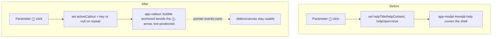

<!-- vt.idd:spec -->
## Specification

## Summary

Replace every parameter **ⓘ help pop-up** on the initial and game screens with a **visual cue callout**: a small speech bubble with an arrow, anchored beside the control it explains, non-blocking and reusable. Also make the initial-screen shell parameters panel clearer (parameter names, fits a landscape phone) and fix the "Resolución" label overlapping its slider.

**Why:** today each ⓘ opens the shared `<app-modal>` (`modal-help`, from #31), a full modal that covers the shell and hides the control the user is asking about. A callout that points at the parameter keeps the shell and the slider visible, so help is read in context. The pattern already exists in the sibling project `gato_magico` (`src/app/components/cue-overlay/`, its issue #4); this ports it as a shared component and applies it consistently.

## User Stories

### US1 — Parameter help as a callout (initial screen) — P1
As someone exploring shells, when I ask what a parameter does I want an explanation next to that parameter, not a pop-up that hides the shell.

- **Given** the shell parameters panel is open, **when** I click/tap the ⓘ next to a parameter (A, α, β, a, b, θ), **then** a callout bubble with that parameter's title and help text appears anchored beside its row, with an arrow pointing at it, and `modal-help` does **not** open.
- **Given** a parameter callout is open, **when** I click/tap the ⓘ of a different parameter, **then** the first callout closes and the second opens (only one at a time).
- **Given** a parameter callout is open, **when** I click/tap the same ⓘ again, **then** the callout closes.

### US2 — Help never blocks the controls — P1
As someone adjusting a shell, I want to keep using the sliders while a help bubble is showing.

- **Given** a parameter callout is open, **when** I drag that parameter's slider, **then** the shell updates and the callout stays open (moving a slider does not close it).
- **Given** a parameter callout is open, **when** I click/tap the canvas, press Esc, or close the panel, **then** the callout closes.
- **Given** a parameter callout is open, **when** I interact with any other control in the panel, **then** that control works normally (the callout layer never intercepts the interaction).
- **Given** a callout is open in a panel that scrolls (a short screen), **when** I scroll the panel, **then** the bubble stays beside its ⓘ, and is hidden while its ⓘ is scrolled out of the panel.
- **Given** a callout covers a slider on a phone, **when** I look at it, **then** the slider shows through the bubble's 80 % background while the text stays solid.

### US3 — Same callout on the game screen — P2
As a player tuning my shell, I want parameter help to behave the same as on the initial screen.

- **Given** the game parameters menu is open, **when** I click/tap the ⓘ next to A, α, β or a, **then** the same callout appears anchored beside that row and `modal-help` does not open.

### US4 — Clearer shell parameters panel — P2
As a first-time user, I want to read each parameter's name without opening its help.

- **Given** the shell parameters panel is open, **when** I look at a slider row, **then** the parameter's name is shown as text next to its icon (A, α, β, a, b, θ).
- **Given** a landscape phone (844×390), **when** the shell parameters panel is open, **then** every control is reachable and nothing is clipped (the panel compacts or scrolls).

### US5 — "Resolución" label no longer overlaps — P2
As a user opening the visualization panel, I want to read the "Resolución" label.

- **Given** the visualization panel is open at 390 px and at 1280 px, **when** I look at the "Resolución" row, **then** the label is fully visible and does not overlap the slider or its handle.

### US6 — Accessible help — P3
As a keyboard or screen-reader user, I want the callout announced and its trigger state exposed.

- **Given** a screen reader is active, **when** a callout opens, **then** its help text is announced (polite live region).
- **Given** I focus a parameter ⓘ, **when** it toggles a callout, **then** the ⓘ exposes `aria-expanded` (and `aria-controls` the callout), and keyboard focus stays on the ⓘ.

## Requirements

### Functional Requirements

- **FR-001** The system MUST provide a shared, reusable callout component (a bubble with an arrow) usable by both the initial and game screens.
- **FR-002** Each parameter ⓘ (initial screen: A, α, β, a, b, θ, Resolución; game screen: A, α, β, a) MUST open its callout instead of the `modal-help` `<app-modal>`.
- **FR-003** The callout MUST display the parameter's existing `LABEL_PARAM_*_HELP_TITLE` and `LABEL_PARAM_*_HELP_CONTENT` strings from `app-strings.ts`, reused as-is; the only wording change is the typo fix "superfice" → "superficie" in `LABEL_PARAM_QUAL_CONTENT`.
- **FR-004** Callouts MUST open on click/tap only — no hover trigger — identically on desktop and touch.
- **FR-005** At most one callout MUST be shown at a time: opening another replaces the current; clicking the same ⓘ again closes it.
- **FR-006** The callout MUST close on Esc, on a click/tap on the canvas, and when its panel closes (menu button, visualization button, or the panel being hidden). Moving a slider MUST NOT close it.
- **FR-007** The callout layer MUST NOT intercept pointer input (`pointer-events: none`, no backdrop, no focus trap); every underlying control stays usable.
- **FR-008** The callout MUST be anchored beside its ⓘ where there is room, and reposition to below/above the row at narrow widths so it stays fully on-screen and readable at 390 px, 1280 px and 844×390, and MUST stay attached to its ⓘ on window resize and when the panel holding its ⓘ scrolls, hiding while that ⓘ is scrolled out of the panel.
- **FR-009** The callout MUST render outside the panel's translucency so it is not dimmed by the panel's `opacity`.
- **FR-010a** The callout's background MUST be 80 % opaque so the sliders under it show through; its text, border and arrow MUST stay solid (owner's request after the manual pass, 2026-09-29).
- **FR-010** The callout MUST use the #31 design tokens (`--modal-*`: white background, teal accent, Lucida font) and MUST disable its open/close animation under `prefers-reduced-motion: reduce`.
- **FR-011** Each ⓘ MUST expose `aria-expanded` reflecting its callout's state and `aria-controls` referencing the callout; the callout MUST be announced to screen readers via a polite live region; focus MUST remain on the ⓘ.
- **FR-012** Each ⓘ MUST present a pointer hit area of at least 44×44 px (the visible icon MAY remain 24 px).
- **FR-013** The shell parameters panel MUST show each parameter's name as text next to its icon (A, α, β, a, b, θ).
- **FR-014** The shell parameters panel MUST keep every control that exists today working as before, with no control overlapping or clipped at 390 px, 1280 px and 844×390.
- **FR-015** The "Resolución" label MUST size to its text and its slider take the remaining row width, so the label never overlaps the slider or handle.
- **FR-016** The side panels MUST keep their current look, position and toggle behaviour (this issue does not restyle them to the #31 dialog look).
- **FR-017** No parameter ⓘ MUST open `modal-help`. Since `helpOpen`/`modal-help` is set **only** by the parameter-help handlers on both screens (sandbox: A/α/β/a/b/θ/Resolución; game: A/α/β/a) and by nothing else, the `modal-help` `<app-modal>` and its `helpOpen`/`helpTitle`/`helpContent` state MUST be removed as dead code on both screens.

### Key Entities

- **Callout** — a single bubble: `anchor` (the ⓘ / control it points at), `title`, `text`, and a resolved `side`/position. Only one is active per screen.
- **CalloutComponent** — the shared Angular component (new, `src/app/callout/`), ported from `gato_magico`'s `CueOverlayComponent`; renders the active callout and positions it from the anchor's live rect.
- **Parameter ⓘ trigger** — the existing `parameter-help-button` inputs whose click handlers switch from setting `helpOpen`/`helpTitle`/`helpContent` to toggling a callout.

## Approach / Architecture

### Technical Summary

Port `gato_magico`'s cue overlay to a shared `CalloutComponent` under `src/app/callout/`. Unlike gato_magico's fixed six-cue set, this callout shows **one anchored bubble on demand**, driven by which ⓘ was clicked. The sandbox and game components stop opening `modal-help` and instead set the active callout (parameter key → title/text + anchor selector). The component computes the bubble position from the anchor's live rect (reused from gato_magico: `placeBubble`, `clampHorizontally`, resize recompute), themed with the shared `--modal-*` tokens.

### Architecture

### Tech Context

Angular 17.3 (standalone-free module app; `app.module.ts` declarations), TypeScript 5.4, Karma + Jasmine unit tests (`ng test --watch=false --browsers=ChromeHeadless`), ESLint. Shared `--modal-*` tokens live in `src/styles.css`. Source of the port: `../gato_magico/src/app/components/cue-overlay/` (Angular 17).

### Project Structure Impact

- **Add:** `src/app/callout/callout.component.ts` `.html` `.css` `.spec.ts` (shared component); declaration + selector wiring in `src/app/app.module.ts`.
- **Modify (initial screen):** `src/app/sandbox/sandbox.component.ts` (ⓘ handlers → callout; close on canvas/panel-close), `.html` (drop `modal-help` usage for parameters; add `<app-callout>`; parameter name labels), `.css` (`.parameter-label` width; Resolución row; landscape-phone fit).
- **Modify (game screen):** `src/app/game/game.component.ts` (`.html`) — parameter ⓘ handlers → callout; add `<app-callout>`.
- **Modify:** `src/app/app-strings.ts`: fix the typo "superfice" → "superficie" in `LABEL_PARAM_QUAL_CONTENT`; add name-label strings only if needed. All other help strings reused unchanged.
- **Modify (tests):** `src/app/sandbox/sandbox.component.spec.ts` and `src/app/game/game.component.spec.ts` — parameter-help specs move from `modal-help` to the callout; add `callout.component.spec.ts`.
- **Possibly remove:** `modal-help` markup/state if unused after the change.

### Applicable Conventions

- Issues in English, branch from `dev`, check `dev` isn't behind `main` (workflow memory). `dev` is currently 124 ahead of `main`, 0 behind — safe.
- Reuse the #31 `<app-modal>`/token conventions; keep Lucida fonts and teal `#77aca2` accents.
- Revert-check habit: new callout specs must fail against `dev` (the behaviour doesn't exist there yet).
- No harness / live-instance steps unless the owner asks.

### Decisions Made

- **Callout scope** — options: (a) shell params only; (b) all initial-screen ⓘ; (c) all ⓘ on both screens. **Selected: (c)** — the owner chose initial A/α/β/a/b/θ + Resolución and game A/α/β/a, so `modal-help` becomes unused. Rationale: one consistent help affordance everywhere; delivers #7's goal.
- **Trigger** — options: click/tap only vs hover-on-desktop. **Selected: click/tap only** (owner). Rationale: predictable next to sliders; a hover bubble could pop while reaching for a control.
- **Layout depth** — options: names + landscape fit only vs also presets section vs also #31 restyle. **Selected: names + landscape fit only** (owner). Rationale: smallest change that makes rows readable; restyling side panels is out of scope.
- **Resolución overlap** — options: fix in #6 vs separate bug. **Selected: fix in #6** (owner) — it lives in the shared row CSS this issue already touches.
- **#7 and help text** (owner, 2026-09-29) — options: (a) keep #7 open for a hover tooltip; (b) #6 supersedes #7 and the PR closes it. **Selected: (b).** #7's hover trigger and close-on-pointer-leave are replaced by #6's click/tap rules. Help text: reuse every string unchanged except the typo fix "superfice" → "superficie" (options considered: keep text frozen; rewrite copy; fix only the typo — selected).
- **Bubble background** (owner, 2026-09-29, after the manual pass) — options: (a) solid white; (b) translucent background, solid text. **Selected: (b) 80 %.** The sliders under a bubble worked but couldn't be seen; 80 % (gato_magico uses 75 %) lets them show through while the dark text keeps about 7:1 contrast.
- **Component reuse** — options: one shared component vs per-screen. **Selected: shared** — ported once from gato_magico, reused by both screens and future issues.
- **`modal-help` fate** (CLARIFY, autonomous) — options: (a) leave it in place unused; (b) remove it as dead code. **Selected: (b) remove.** Rationale: a codebase grep confirms `helpOpen`/`modal-help` is set only by the parameter-help handlers on both screens and by nothing else, so once every ⓘ uses the callout it is fully unused. Removing it avoids two divergent help affordances and keeps the #31 modal specs honest.

## Risk Assessments

### Security & Vulnerabilities

| Risk | Severity | Description | Mitigation |
|------|----------|-------------|------------|
| Help text injection | Low | Callout renders static `app-strings.ts` constants via interpolation | Angular interpolation escapes; no `innerHTML` |

### Regression & Quality

| Risk | Severity | Affected Systems | Mitigation |
|------|----------|------------------|------------|
| `modal-help` removal breaks other openers | Medium | sandbox + game components, #31 specs | Grep all `helpOpen`/`modal-help` callers; keep or remove deliberately; specs cover both screens |
| Callout mispositioned / clipped at 390 px or 844×390 | Medium | initial + game panels | Reuse gato_magico clamp + resize recompute; screenshots at 390/1280/844×390 before merge |
| Callout dimmed by panel `opacity: 0.8` | Medium | initial-screen panels | Render callout outside the panel (FR-009); assert in spec/screenshot |
| Slider interaction closes callout by accident | Low | both screens | FR-006 explicitly excludes slider input; spec covers it |
| Landscape-phone layout change regresses portrait | Low | shell parameters panel | Screenshots at all three sizes; keep existing portrait layout |

### Testing Strategy

- **Unit (Karma/Jasmine):** new `callout.component.spec.ts` (open/replace/toggle-closed, close on Esc/canvas/panel-close, slider does not close, `aria-expanded`/`aria-controls`, `placeBubble` positioning, absent-anchor skip). Rewrite the parameter-help blocks in `sandbox.component.spec.ts` and `game.component.spec.ts` to assert the callout, not `modal-help`.
- **Revert check:** the new specs must fail on `dev`.
- **Visual (owner approval):** before/after screenshots of both initial-screen panels and the game parameters menu, a callout open, at 390 px, 1280 px and 844×390.
- Keep the full suite green on 2 cores.

## Verification Matrix

| ID | Acceptance Scenario | Evidence | Status |
|----|---------------------|----------|--------|
| VM-001 | ⓘ (A/α/β/a/b/θ) opens an anchored callout with its title+text; `modal-help` stays closed | [pending] | Pending |
| VM-002 | Clicking a second ⓘ replaces the open callout | [pending] | Pending |
| VM-003 | Clicking the same ⓘ again closes the callout | [pending] | Pending |
| VM-004 | Dragging a slider updates the shell and leaves the callout open | [pending] | Pending |
| VM-005 | Esc / canvas click / panel close all close the callout | [pending] | Pending |
| VM-006 | Other controls work while a callout is open (layer non-blocking) | [pending] | Pending |
| VM-007 | Game-screen ⓘ (A/α/β/a) opens the same callout; `modal-help` stays closed | [pending] | Pending |
| VM-008 | Each shell-panel slider row shows its parameter name | [pending] | Pending |
| VM-009 | Shell parameters panel not clipped at 844×390 | [pending] | Pending |
| VM-010 | "Resolución" label fully visible, not overlapping its slider, at 390 px and 1280 px | [pending] | Pending |
| VM-011 | Callout announced to screen readers (polite live region) | [pending] | Pending |
| VM-012 | ⓘ exposes `aria-expanded`/`aria-controls`; focus stays on the ⓘ | [pending] | Pending |
| VM-013 | Scrolling the panel keeps the callout beside its ⓘ; it hides while the ⓘ is scrolled out | [pending] | Pending |
| VM-014 | A slider under the callout shows through its 80 % background; the text stays solid | [pending] | Pending |

## Success Criteria

| ID | Criterion | Evidence | Status |
|----|-----------|----------|--------|
| SC-001 | No parameter ⓘ opens a modal; every one shows an anchored callout on both screens | [pending] | Pending |
| SC-002 | The shell and the adjusted control stay visible while its help is shown | [pending] | Pending |
| SC-003 | Parameter names are readable in the shell panel without opening help | [pending] | Pending |
| SC-004 | No control (incl. the "Resolución" label) overlaps or is clipped at 390 px, 1280 px, 844×390 | [pending] | Pending |
| SC-005 | Callout help is reachable by keyboard and announced by a screen reader | [pending] | Pending |
| SC-006 | Owner approves before/after screenshots of both panels + game menu at the three sizes | [pending] | Pending |

## Complexity Considerations

Medium. One new shared component (ported, not invented), plus edits to two screens and their specs. Main risks are positioning at small sizes and cleanly retiring `modal-help`. The draft's one open question — whether `modal-help` is fully removable — is resolved (CLARIFY): a codebase grep confirms it is opened only by the parameter-help handlers, so it is dead code once every ⓘ uses the callout (FR-017).

## Post-Mortem
_Filled after merge. Do not complete during specification._

| Category | Finding |
|----------|---------|
| Risks that materialized but were not declared | |
| Declared risks that did not materialize | |
| Review findings the risk assessment missed | |
| Template sections that were not useful | |
| Process improvements for next feature | |

