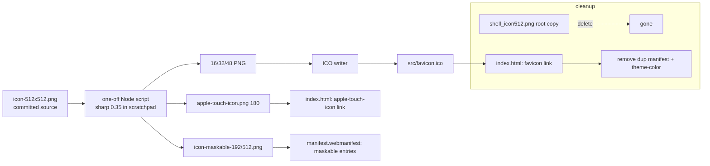

<!-- vt.idd:plan -->
## Implementation Plan

**Generated**: 2026-09-23
**Issue**: #8 - [App] Replace Angular favicon and unify app icons from shell_icon512.png

### Technical Context

- **Stack**: Angular 17.3 PWA (`@angular/service-worker`), Node 20.
- **Assets**: `angular.json` copies `src/favicon.ico`, `src/assets`, `src/manifest.webmanifest` into `dist/`. `ngsw-config.json` prefetches `/favicon.ico` and lazy-caches `/assets/**` + image globs.
- **Source image**: `src/assets/icons/icon-512x512.png` (512×512 RGBA, navy bg, slight bottom clip). Byte-identical to the untracked root `shell_icon512.png` (same md5 `56ce68b9…`).
- **Tooling**: no ImageMagick/Pillow/pip installed. `sharp` 0.35 is installed in a scratchpad folder outside the repo. `sharp` cannot emit ICO → a small Node script assembles the ICO container from 16/32/48 PNGs. Nothing added to `package.json`.

### Research Findings

- **ICO format**: `favicon.ico` is currently a 28×30 PNG mislabeled `.ico`. A valid ICO is an `ICONDIR` header + one `ICONDIRENTRY` per size + PNG (or BMP) payloads. PNG-in-ICO is supported by all current browsers, so the writer embeds three PNG blobs (16/32/48) — no BMP encoding needed. `file` must report "MS Windows icon resource - 3 icons".
- **Maskable safe zone**: Android keeps the central ~80% (min-safe circle radius 40% of canvas). A shell centered at ~70% would sit inside it, but the source's flat bottom cut would then float inside the icon. As shipped, the shell is 70% of the canvas width, centered horizontally, with its cut row flush with the canvas bottom: no straight edge inside, but 21% of the shell's pixels fall outside the minimum safe circle, so a circular mask trims the bottom along a curve (apex and sides stay inside). Approved on #8.
- **Favicon cache**: browsers and the service worker cache favicons aggressively. Verification must use a fresh/private context or a hard reload after unregistering the SW, else a stale Angular logo masquerades as failure.
- **manifest `purpose`**: `"maskable any"` on one asset is discouraged (a maskable-padded image looks shrunken as a normal icon, and vice-versa). Split into distinct `any` and `maskable` entries.

### Data Model

No application data model. Asset inventory (state transition = generated from source):

| Asset | Size(s) | Crop | Purpose |
|-------|---------|------|---------|
| favicon.ico | 16,32,48 | tight | tab |
| apple-touch-icon.png | 180 | full source framing, flattened onto navy (opaque) | iOS home |
| icon-{72..512}.png (existing) | 72–512 | source | manifest `any` |
| icon-maskable-{192,512}.png | 192,512 | 70% width, centered, cut row flush with canvas bottom | manifest `maskable` |

### API Contracts

None — no endpoints, no runtime code paths change.

### Architecture

### Project Structure

**Added**
- `src/assets/icons/apple-touch-icon.png`
- `src/assets/icons/icon-maskable-192x192.png`
- `src/assets/icons/icon-maskable-512x512.png`

**Modified**
- `src/favicon.ico` (real multi-size ICO)
- `src/index.html` (add apple-touch-icon link; remove duplicate manifest link + theme-color meta)
- `src/manifest.webmanifest` (`any` entries + separate `maskable` entries)

**Removed**
- `shell_icon512.png` (untracked root copy — deleted, never committed)

**Not committed**
- generation script (scratchpad only)

### Gap Analysis

- Regular PWA icons already render the shell → no regeneration needed (spec FR-003 keeps them, only re-tags `purpose`).
- Only real gaps vs. current state: favicon (Angular default), apple-touch-icon (absent), maskable icons (absent), and the mislabeled `purpose` + duplicated head tags.
- No conflict with existing architecture; `angular.json`/`ngsw-config.json` globs already cover the new files (`/assets/**`, `favicon.ico`), so no build-config edits required — confirmed as a verification step, not a change.

### Implementation Waves

**Wave 1 — Generate assets** (scratchpad script)
1. Write one-off `gen-icons.mjs` in scratchpad: reads the committed source, uses `sharp` (installed in the scratchpad) for the tight-crop favicon PNGs (16/32/48), the 180 apple-touch, and the maskable 192/512 (70% width, cut row flush with the canvas bottom).
2. Assemble `favicon.ico` from the three PNGs via the ICO container writer.

**Wave 2 — Wire into the app**
3. Replace `src/favicon.ico`; add the three PNGs under `src/assets/icons/`.
4. Edit `src/index.html`: add `<link rel="apple-touch-icon" href="assets/icons/apple-touch-icon.png">`; remove the duplicate `<link rel="manifest">` and duplicate `<meta name="theme-color">`.
5. Edit `src/manifest.webmanifest`: existing icons → `"purpose": "any"`; append two `"purpose": "maskable"` entries.
6. Delete the untracked root `shell_icon512.png`.

**Wave 3 — Verify** (see Testing)
7. `ng build`; confirm `dist/` has favicon.ico, apple-touch-icon.png, both maskable icons.
8. `ng test` green.
9. `file src/favicon.ico` → 3-icon ICO.
10. DevTools → Application → Manifest: maskable preview clean; no `maskable any` left.
11. Fresh-context tab screenshot of the 16px favicon → post to issue for approval.

### Testing Strategy

No unit tests (static assets). Verification maps 1:1 to the spec's Verification Matrix (VM-001..005) and Success Criteria (SC-001..006): build output, `ng test`, `file` on the ICO, DevTools manifest/maskable preview, and the approval screenshot in a fresh context.

### Constitution Check

No `.vt/memory/constitution.md` present → no gates to evaluate. No new dependencies, no data-flow/deployment/agent changes. PASS (vacuous).
