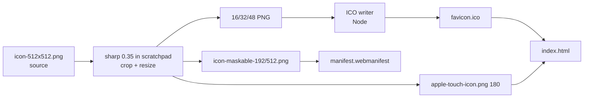

<!-- vt.idd:spec -->
## Specification

## Summary

Replace the leftover Angular-default favicon with the app's shell render and make the icon set coherent across the browser tab, PWA install, and iOS home screen. The source is the already-committed `src/assets/icons/icon-512x512.png` (a 512×512 navy-background shell). A real multi-size `favicon.ico`, an `apple-touch-icon`, and proper `any`/`maskable` PWA entries replace the current single mislabeled `"maskable any"` set. No colors or app names change. Icons are generated by a one-off, uncommitted script (`sharp` 0.35, installed in a scratchpad folder outside the repo, plus a small Node ICO writer); the project gains no new dependency.

## User Stories

**US-1 (P1) — Recognizable browser tab.** As a user, I want the browser tab to show the shell so the app is identifiable among open tabs.
- Given the app is loaded in a fresh browser context, When I look at the tab, Then it shows the shell render, not the Angular logo.
- Given the 16px favicon, When rendered at tab size, Then the shell is still recognizable as a shell.

**US-2 (P2) — Coherent installed icon.** As a user who installs the PWA, I want the home-screen/app icon to show the shell and fill the icon frame correctly.
- Given an Android install, When the launcher applies its mask, Then the maskable icon shows the shell with no straight cut edge visible inside the safe zone.
- Given an iOS "Add to Home Screen", When the icon is placed, Then it shows the shell (not a page screenshot).

**US-3 (P3) — Clean HTML head.** As a maintainer, I want no duplicate branding tags in `index.html`.
- Given `src/index.html`, When inspected, Then there is exactly one `<link rel="manifest">` and one `<meta name="theme-color">`.

## Requirements

### Functional Requirements

- **FR-001** The app MUST ship `src/favicon.ico` as a real ICO containing 16, 32, and 48px images, cropped tightly from the source so the shell fills the frame and the bottom cut sits on the image edge.
- **FR-002** The app MUST provide `src/assets/icons/apple-touch-icon.png` at 180×180 and link it from `src/index.html` via `<link rel="apple-touch-icon">`.
- **FR-003** The manifest MUST list the existing `icon-{72,96,128,144,152,192,384,512}x*.png` as `"purpose": "any"` (no `"maskable any"` entries remain).
- **FR-004** The app MUST provide `icon-maskable-{192,512}x*.png` on the same navy background with the shell scaled to ~70% of the canvas, cropped so no straight cut edge shows inside the icon, listed as separate `"purpose": "maskable"` entries.
- **FR-005** `src/index.html` MUST contain exactly one `<link rel="manifest">` and one `<meta name="theme-color">`.
- **FR-006** The untracked root `shell_icon512.png` MUST NOT be committed (it is a byte-identical copy of the source and is deleted).
- **FR-007** Icon generation MUST NOT add a dependency to `package.json`; it runs from an uncommitted one-off script.
- **FR-008** `theme_color`, `background_color`, and app names (`shell-generator`/`ShellGenerator`) MUST remain unchanged.

### Key Entities

- **Source icon** — `src/assets/icons/icon-512x512.png`, 512×512 RGBA, navy background, slight bottom clip.
- **favicon.ico** — multi-size ICO (16/32/48), tight crop.
- **apple-touch-icon.png** — 180×180.
- **Maskable icons** — 192/512, padded, cut edge on the crop boundary.
- **manifest.webmanifest** — icon list with correct `purpose` values.

## Approach / Architecture

### Technical Summary

Pure static-asset work: regenerate/derive image files from one committed source and adjust three declarative files (`favicon.ico`, `index.html`, `manifest.webmanifest`). No application code, no runtime behavior change. Generation is a throwaway Node script using `sharp` (0.35, installed in a scratchpad folder outside the repo) for raster crop/resize and a minimal ICO container writer (sharp cannot emit ICO).

### Architecture

### Tech Context

Angular 17 PWA (`@angular/service-worker`). Assets served from `src/assets` and `src/favicon.ico` per `angular.json`; cached by `ngsw-config.json`. Node 20 available; `sharp` 0.35 installed in a scratchpad folder (not a project dependency). No ImageMagick/Pillow/pip on the machine.

### Project Structure Impact

- Modified: `src/favicon.ico`, `src/index.html`, `src/manifest.webmanifest`.
- Added: `src/assets/icons/apple-touch-icon.png`, `src/assets/icons/icon-maskable-192x192.png`, `src/assets/icons/icon-maskable-512x512.png`.
- Removed (untracked): `shell_icon512.png` (repo root).
- Not committed: the generation script (kept in scratchpad).

### Applicable Conventions

- Branch `008-*` from `dev`, PR back into `dev` ([[workflow-issues-and-branching]]).
- Test layout claims at 390px and 1280px where relevant; require before/after screenshot approval for subjective visuals (the 16px favicon screenshot).
- No new project dependencies.

### Decisions Made

- **Source image**: (a) commit root `shell_icon512.png`, (b) reuse committed `icon-512x512.png`. Selected **(b)** — files are byte-identical (same md5); avoids a redundant commit. Root copy deleted.
- **ICO generation**: (a) add a dev dependency, (b) `sharp` installed outside the repo + tiny ICO writer, (c) ImageMagick/Pillow. Selected **(b)** — sharp can't write ICO and (c) isn't installed; keeps `package.json` clean.
- **Bottom clip handling**: (a) accept visible cut in maskable, (b) crop so cut is on the edge. Selected **(b)** — a floating straight edge inside a masked icon reads as a defect.
- **Colors / names**: leave `theme_color`, `background_color`, and app names unchanged (deferred to a possible separate issue).
- **Maskable placement** (decided during implementation, approved on #8 2026-09-23): (a) shell centered at ~70% so it sits fully inside the safe zone — the source's flat bottom cut then floats inside the icon as a straight edge; (b) shell at 70% of the canvas width, centered horizontally, cut row flush with the canvas bottom. Selected **(b)** — the cut sits on the image edge like the favicon's. Trade-off: the shell isn't entirely inside the minimum safe zone (21% of its pixels fall outside the 40%-radius circle), so a circular mask trims its bottom along a curve; the apex and both sides stay inside.
- **apple-touch-icon framing** (approved 2026-09-23): full source framing (the flat cut floats near the bottom, accepted as for the regular icons), flattened onto the navy background so the file is fully opaque (review m1).

## Risk Assessments

### Security & Vulnerabilities

| Risk | Severity | Description | Mitigation |
|------|----------|-------------|------------|
| Malformed ICO breaks tab rendering | Low | Hand-written ICO container could be invalid | `file` reports a valid MS Windows icon resource with 3 images; visual check in a fresh context |
| Generator depends on an external npm package | Low | Supply-chain surface via `sharp` | `sharp` pinned at 0.35 and installed in a scratchpad folder outside the repo; the script isn't committed and never runs in CI |

### Regression & Quality

| Risk | Severity | Affected Systems | Mitigation |
|------|----------|------------------|------------|
| Service worker serves stale old favicon | Medium | PWA cache / `ngsw-config.json` | Verify in a private window or after hard reload; note in acceptance |
| Build drops new assets | Low | `angular.json` asset globs | `ng build`, then confirm `dist/` contains the new files |
| Manifest parse error from bad `purpose` split | Low | PWA install | Validate in Chrome DevTools → Application → Manifest |

### Testing Strategy

No unit tests (static assets). Verification is: `ng build` success + `dist/` contents; `ng test` still green; `file` inspection of `favicon.ico`; DevTools manifest/maskable preview; a fresh-context tab screenshot posted for approval.

## Verification Matrix

| ID | Acceptance Scenario | Evidence | Status |
|----|---------------------|----------|--------|
| VM-001 | US-1: fresh context tab shows the shell, not Angular logo | Real Chrome tab-strip capture, fresh profile, production build: [approval comment](https://github.com/C3Idea/shell-generator/issues/8#issuecomment-5804536714) | Pass |
| VM-002 | US-1: 16px favicon still reads as a shell | 16 px favicon approved by the requester as recognizable: [approval comment](https://github.com/C3Idea/shell-generator/issues/8#issuecomment-5804536714) | Pass |
| VM-003 | US-2: Android maskable preview shows no straight cut edge in the safe zone | Circle and rounded-square mask previews in [approval comment](https://github.com/C3Idea/shell-generator/issues/8#issuecomment-5804536714); shell pixels touch only the canvas bottom row (`af464cd`). The DevTools preview itself wasn't scripted | Pass |
| VM-004 | US-2: iOS add-to-home shows the shell via apple-touch-icon | `src/index.html:9` link; the 180×180 icon decodes in Chrome and is opaque RGB (`5b4ec53`). Not tried on an iOS device | Partial |
| VM-005 | US-3: index.html has exactly one manifest link and one theme-color meta | `src/index.html:10-11`; Chrome DOM check found 1 of each ([approval comment](https://github.com/C3Idea/shell-generator/issues/8#issuecomment-5804536714)) | Pass |

## Success Criteria

| ID | Criterion | Evidence | Status |
|----|-----------|----------|--------|
| SC-001 | Browser tab shows the shell in a fresh context | [approval comment](https://github.com/C3Idea/shell-generator/issues/8#issuecomment-5804536714) | Pass |
| SC-002 | `file src/favicon.ico` reports a real ICO with 16/32/48px images | `file src/favicon.ico` → "MS Windows icon resource - 3 icons" (16/32/48 PNG payloads; `09e193e`) | Pass |
| SC-003 | Manifest has no `"maskable any"` entries; each icon is `any` or `maskable` | Chrome `Page.getAppManifest`: 0 errors, 8 `any` + 2 `maskable` (`8379698`) | Pass |
| SC-004 | `ng build` succeeds and `dist/` contains favicon.ico, apple-touch-icon.png, and both maskable icons | `ng build` OK after the review fixes; `dist/shell-generator/` holds all four files (PR #27 fix summary) | Pass |
| SC-005 | `ng test` passes | `ng test`: 62/62 SUCCESS after the review fixes (PR #27 fix summary) | Pass |
| SC-006 | `shell_icon512.png` is not added to the repo | `git ls-files` has no `shell_icon512.png`; the untracked root copy was deleted (T006) | Pass |

## Complexity Considerations

Small, single-subsystem change (~5-6 files, ~1 wave). Main non-obvious risks are favicon caching and hand-rolled ICO validity. No open questions — all decisions locked with the requester on 2026-09-23.

## Post-Mortem

_Filled after merge. Do not complete during specification._

| Category | Finding |
|----------|---------|
| Risks that materialized but were not declared | |
| Declared risks that did not materialize | |
| Review findings the risk assessment missed | |
| Template sections that were not useful | |
| Process improvements for next feature | |
