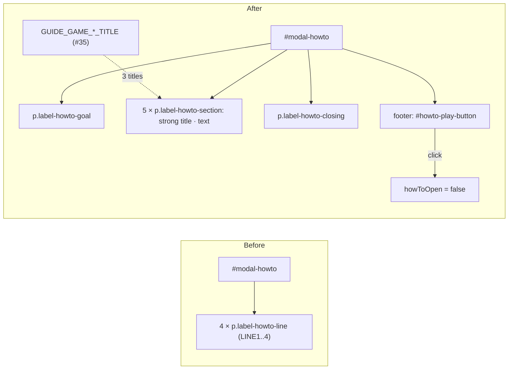

<!-- vt.idd:plan -->
## Implementation Plan

**Generated**: 2026-09-30
**Issue**: #10 - [Game] Rearrange the how-to pop-up text into short sections

### Technical Context

Angular 17.3.4 NgModule app, TypeScript, Karma/Jasmine in ChromeHeadless (a single
headless run), viewport pinned with `src/testing/viewport.ts`. The how-to pop-up is
`<app-modal id="modal-howto">` (#31) in `game.component.html:207`, opened by
`showHowToWindow()` from `ngOnInit` and the book button (`game.component.ts:527-534`),
which also closes the "?" guide (#35). No new dependency.

### Research Findings

- **Current content**: four `
` bound to
  `LABEL_HOWTO_WINDOW_LINE1..4` (`app-strings.ts:72-75`). No CSS targets
  `.label-howto-line` or `#modal-howto`; the pop-up uses #31's defaults.
- **Specs that pin the old text**: `game.component.spec.ts:660` (the heat-bar
  "welcome text points at the bottom of the screen") and `:835` ("keeps the how-to
  text as paragraphs"). Both are replaced.
- **Guide titles to reuse (D5)**: `GUIDE_GAME_PARAMETERS_TITLE` "Parámetros",
  `GUIDE_GAME_SWITCH_TITLE` "Usuario / Objetivo", `GUIDE_GAME_HEAT_TITLE` "Progreso"
  (`app-strings.ts:107-116`).
- **Footer pattern**: `<footer modal-footer>` with a button, as in the Nuevo juego
  pop-up (`game.component.html:187`) and the welcome pop-up's "Jugar" (#3).
- **Heat bar direction**: `.heat-range` is `direction: rtl`, and `distance()` is 0 at
  a match, so the thumb moves toward ✓ as the shell gets closer. The Progreso text
  is accurate.
- **Target colour**: `targetShellColor = "#D2B478"` (`game.component.ts:101`), a tan
  gold, so "dorado" (D2).
- **Focus**: `<app-modal>` focuses the ✕ by default; only Nuevo juego sets
  `initialFocus`. The how-to keeps the default (D7).

### Data Model

No data model. Strings in `AppStrings`:

| Constant | Value |
|----------|-------|
| `LABEL_HOWTO_WINDOW_TITLE` | ¡Bienvenido al juego! *(unchanged)* |
| `LABEL_HOWTO_GOAL` | Te mostramos un caracol objetivo. ¿Puedes reconstruirlo? |
| `LABEL_HOWTO_PARAMETERS_BEFORE` | Abre |
| `LABEL_HOWTO_GEAR` | ⚙︎ *(U+2699 U+FE0E)* |
| `LABEL_HOWTO_PARAMETERS_AFTER` | y mueve los sliders para cambiar tu caracol. |
| `LABEL_HOWTO_SWITCH` | Cambia la vista entre tu caracol (blanco) y el objetivo (dorado). |
| `LABEL_HOWTO_PROGRESS` | La barra avanza hacia ✓ mientras más te acercas. Cuando tu caracol sea casi idéntico, ¡ganas! |
| `LABEL_HOWTO_NEW_GAME_SHARE_TITLE` | Nuevo juego y Compartir |
| `LABEL_HOWTO_NEW_GAME_SHARE` | Empieza otra partida, o copia el enlace para retar a alguien con este caracol. |
| `LABEL_HOWTO_WHERE_TITLE` | ¿Dónde está cada cosa? |
| `LABEL_HOWTO_WHERE` | Toca ? para verlo en la pantalla. |
| `LABEL_HOWTO_CLOSING` | ¡Suerte y diviértete! |
| `LABEL_HOWTO_PLAY` | ¡A jugar! |

Removed: `LABEL_HOWTO_WINDOW_LINE1..4`. As built, the Parámetros text is split around
the glyph (`_BEFORE` / `_GEAR` / `_AFTER`) so the template can wrap the gear in its own
``. That span was `aria-hidden` at first; review M1 made it
`role="img"` labelled `GUIDE_GAME_PARAMETERS_TITLE`, read as "Abre Parámetros y mueve…".

### API Contracts

None (no endpoints). Component surface:

- `GameComponent.howToPlayButtonClick()`: sets `howToOpen = false`.
- Template: `#modal-howto` gains `
`, five
  `
<strong>…</strong> · …
`,
  `
`, and `<footer modal-footer>` with
  `<button type="button" id="howto-play-button">`.

### Architecture

### Project Structure

- **Modify** `src/app/app-strings.ts`: add the `LABEL_HOWTO_*` strings above, remove
  `LINE1..4`.
- **Modify** `src/app/game/game.component.html`: the goal, sections, closing and footer.
- **Modify** `src/app/game/game.component.ts`: `howToPlayButtonClick()`.
- **Modify** `src/app/game/game.component.css`: spacing between sections only if the
  #31 paragraph margins look cramped at 390 px.
- **Modify** `src/app/game/game.component.spec.ts`: replace the two old-text specs with
  a `how-to pop-up (#10)` block covering VM-001–VM-009.

**Waves**
1. Strings, template, the close handler and CSS (FR-001–FR-006, FR-008, FR-011).
2. Specs: content, order, titles equal to the guide's, no position words or
   "amarillo", "¡A jugar!" and ✕/Esc/backdrop, reopening from the book turns the guide
   off, no sideways scroll at 360/390/1280/844×390 and footer reachable at 844×390;
   full suite green; before/after screenshots at 390 and 1280 px for approval (FR-010).

*Note (review D1):* `tasks.json` splits these two waves into six (W0 setup, W1
strings, W2 sections, W3 ¡A jugar!, W4 sizes, W5 polish), which is why the
"Deployment Started" comment says 4 tasks in 2 waves and the dashboard says 6/6.

### Constitution Check

`.vt/memory/constitution.md` is not present in this repo; nothing to evaluate.
Project conventions applied instead: Spanish UI strings in `app-strings.ts`, the #31
shared pop-up slots, the #3 footer-button pattern, viewport-pinned specs. No
new dependencies, services, storage or network calls. **Result: pass.**
