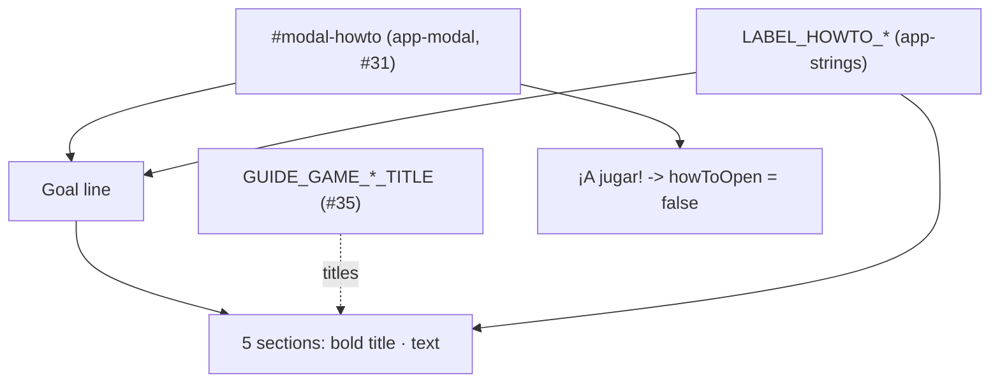

<!-- vt.idd:spec -->
## Specification

## Summary

Rewrite the game's **how-to pop-up** (`#modal-howto`, on the shared `<app-modal>`
from #31) from four long paragraphs into **short sections, one per control or
concept**, each opening with a **bold title**. The new text adds what the old one
leaves out: how to change your shell (⚙ Parámetros), how you win, what Compartir
does, and that the **"?"** guide (#35) shows where each control is. It stops
locating controls by screen position, which is wrong on phones, and calls the
target shell **dorado** like the "?" guide does (the shell is `#D2B478`). A
**"¡A jugar!"** footer button closes the pop-up, like "Jugar" in the welcome
pop-up (#3).

## User Stories

### US1 — Find each instruction quickly (P1)

A player opening the game reads the how-to and should find what each control does
without reading long paragraphs.

- **Given** the game loads, **When** the how-to pop-up opens, **Then** it shows the
  goal line followed by the sections Parámetros, Usuario / Objetivo, Progreso,
  Nuevo juego y Compartir and ¿Dónde está cada cosa?, in that order, then
  "¡Suerte y diviértete!".
- **Given** the pop-up is open, **When** the player reads a section, **Then** it
  opens with a bold title, and the titles for Parámetros, Usuario / Objetivo and
  Progreso are the same words the "?" guide uses for those controls.

### US2 — Learn the whole game from the pop-up (P1)

- **Given** the pop-up is open, **When** the player reads it, **Then** it explains the
  goal, how to change the shell (⚙), the Usuario/Objetivo switch and its two
  colours (blanco / dorado), the heat bar, how to win, Nuevo juego, Compartir and
  the "?" guide.
- **Given** the pop-up is open, **When** the player reads it, **Then** no sentence
  locates a control by screen position ("en la parte inferior") and the target is
  never called "amarillo".

### US3 — Start playing (P2)

- **Given** the pop-up is open, **When** the player taps **"¡A jugar!"**, **Then** the
  pop-up closes and the game is ready to play.
- **Given** the pop-up is open, **When** the player closes it with ✕, Esc or the
  backdrop, **Then** it closes as before (#31).
- **Given** the pop-up was closed, **When** the player taps the book button, **Then**
  the how-to opens again with the same sections and the "?" guide turns off (#35).

### US4 — Readable on every screen (P2)

- **Given** the pop-up is open, **When** it renders at 320×568, 360, 390, 1280 px and 844×390,
  **Then** neither the pop-up nor the page scrolls sideways.
- **Given** a short screen (320×568 or 844×390) where the pop-up is taller than the viewport,
  **When** the player scrolls inside the pop-up, **Then** ✕ and "¡A jugar!" are
  reachable.

## Requirements

### Functional Requirements

- **FR-001** (MUST): The how-to pop-up shows, in order: the goal line, the five
  sections from the Text table, and the closing line "¡Suerte y diviértete!".
- **FR-002** (MUST): Each section is one paragraph that opens with its title in bold
  (`<strong>`), then " · " and the text. The pop-up title stays
  "¡Bienvenido al juego!". The text is left-aligned.
- **FR-003** (MUST): The Parámetros, Usuario / Objetivo and Progreso titles are the
  "?" guide's `GUIDE_GAME_PARAMETERS_TITLE`, `GUIDE_GAME_SWITCH_TITLE` and
  `GUIDE_GAME_HEAT_TITLE`, referenced rather than copied, so they can't drift.
- **FR-004** (MUST): The text covers the goal, the ⚙ parameters, Usuario/Objetivo with
  "blanco" and "dorado", the heat bar moving toward ✓, how you win, Nuevo juego,
  Compartir, and the "?" guide.
- **FR-005** (MUST): No how-to text locates a control by screen position, and none
  calls the target "amarillo".
- **FR-006** (MUST): A **"¡A jugar!"** button in the pop-up's footer closes it. The ✕,
  Esc and the backdrop still close it (#31).
- **FR-007** (MUST): At 320×568, 360, 390, 1280 px and 844×390 neither the pop-up nor
  the page scrolls horizontally. The pop-up may scroll vertically inside itself, and ✕
  and "¡A jugar!" stay reachable at 320×568 and 844×390.
- **FR-008** (MUST): The new strings live in `app-strings.ts`. The old
  `LABEL_HOWTO_WINDOW_LINE1..4` are removed, and the specs that checked them are
  updated.
- **FR-009** (MUST): The pop-up still opens on game load and from the book button, and
  opening it still turns the "?" guide off (#35).
- **FR-010** (MUST): The owner approves the wording plus before/after screenshots at
  390 and 1280 px on this issue before merge.
- **FR-011** (SHOULD): The ⚙ glyph renders as text, not as a colour emoji (U+2699 with
  the text variation selector U+FE0E), and screen readers read it as "Parámetros"
  (`role="img"` + `aria-label` = `GUIDE_GAME_PARAMETERS_TITLE`), so "Abre … y mueve…"
  still says what to open (D6, amended in review).

### Text

| Part | Title | Text |
|------|-------|------|
| Goal | — | Te mostramos un caracol objetivo. ¿Puedes reconstruirlo? |
| Parámetros | `GUIDE_GAME_PARAMETERS_TITLE` | Abre ⚙ y mueve los sliders para cambiar tu caracol. |
| Usuario / Objetivo | `GUIDE_GAME_SWITCH_TITLE` | Cambia la vista entre tu caracol (blanco) y el objetivo (dorado). |
| Progreso | `GUIDE_GAME_HEAT_TITLE` | La barra avanza hacia ✓ mientras más te acercas. Cuando tu caracol sea casi idéntico, ¡ganas! |
| Nuevo juego y Compartir | new | Empieza otra partida, o copia el enlace para retar a alguien con este caracol. |
| ¿Dónde está cada cosa? | new | Toca ? para verlo en la pantalla. |
| Closing | — | ¡Suerte y diviértete! |
| Footer button | — | ¡A jugar! |

### Key Entities

- **How-to pop-up** (`#modal-howto` in `game.component.html`): the shared
  `<app-modal>` instance holding this content.
- **`LABEL_HOWTO_*`** (`app-strings.ts`): the pop-up copy. `LINE1..4` removed; new
  strings for the goal, each section's text, the two new titles, the closing line
  and the button.
- **`GUIDE_GAME_*_TITLE`** (`app-strings.ts`, from #35): the "?" guide's titles,
  reused as section titles.
- **`howToOpen`** (`GameComponent`): the pop-up's open flag; "¡A jugar!" sets it false.

## Approach / Architecture

### Technical Summary

A content and markup change on one existing pop-up, plus string edits. Sections are
`
<strong>{{title}}</strong> · {{text}}
` inside
`#modal-howto`, with a `<footer modal-footer>` holding "¡A jugar!", the same pattern
as the welcome pop-up's "Jugar" (#3) and the Nuevo juego pop-up. No new component,
dependency or state.

### Architecture

### Tech Context

Angular 17.3.4, TypeScript, NgModule app. No new dependencies. Tests: Karma/Jasmine
in ChromeHeadless (a single headless run since #18), viewport pinned via
`src/testing/viewport.ts`.

### Project Structure Impact

- **Modified**: `src/app/game/game.component.html` (sections and footer),
  `game.component.ts` (`howToPlayButtonClick()` closing the how-to),
  `src/app/app-strings.ts`
  (new `LABEL_HOWTO_*`, `LINE1..4` removed), `game.component.spec.ts` (the two
  specs that pin the old text replaced by #10 specs). CSS: none needed, the #31
  paragraph margins were enough (review D3).
- **Added**: none.
- **Removed**: `LABEL_HOWTO_WINDOW_LINE1..4`.

### Applicable Conventions

`CLAUDE.md` (project), the #31 shared-modal pattern (`modal-title` / `modal-footer`
slots), #3's footer-button pattern, Spanish UI strings in `app-strings.ts`,
viewport-pinned component specs.

### Decisions Made

**D1 — Sections and their order (owner, 2026-09-30).**
Options: (A) the four topics the old text covers (goal, switch, heat bar, new game);
(B) those plus Parámetros, how to win, Compartir and a "?" pointer *(selected)*.
Rationale: the old text never says how to change your shell, which is the game's
core action, or how you win; Compartir and the "?" guide are part of the game screen now.

**D2 — The target is "dorado" (owner, 2026-09-30).**
Options: (A) "dorado", matching the #35 guide and the real `#D2B478` *(selected)*;
(B) keep "amarillo" and change the guide. Rationale: one name everywhere, and the
closer one to the colour on screen.

**D3 — Bold lead-in, not headings (owner, 2026-09-30).**
Options: (A) one paragraph per section opening with a bold title *(selected)*;
(B) an `<h3>` above each paragraph; (C) headings plus the control's icon.
Rationale: compact on phones; the pop-up is short enough that heading navigation
adds little.

**D4 — "¡A jugar!" footer button (owner, 2026-09-30).**
Options: (A) a footer button that closes the pop-up, the ✕ kept *(selected)*;
(B) ✕ only. Rationale: matches "Jugar" in the welcome pop-up (#3) and gives a clear
end to the reading.

**D5 — Section titles referenced from the "?" guide (CLARIFY, autonomous, 2026-09-30).**
Options: (A) reference `GUIDE_GAME_*_TITLE` in the template *(selected)*; (B) copy the
words into new `LABEL_HOWTO_*` strings. Rationale: the issue says the pop-up and the
guide share wording; referencing keeps them identical if either changes.

**D6 — ⚙ as a text glyph (CLARIFY, autonomous, 2026-09-30).**
Options: (A) U+2699 plus U+FE0E inside the string, `aria-hidden` *(selected)*;
(B) inline the toolbar button's SVG; (C) no icon, the word only. Rationale: keeps
the sentence in one string; U+FE0E stops phones drawing a colour emoji; the section
title already names the control for screen readers.
*Amended in review (PR #38 M1, 2026-09-30):* `aria-hidden` left screen readers with
"Abre y mueve los sliders…", which never says what to open. The gear is now
`role="img"` labelled with `GUIDE_GAME_PARAMETERS_TITLE`, read as "Abre Parámetros y
mueve…"; the visible text is unchanged.

**D7 — Left-aligned, focus stays on ✕ (CLARIFY, autonomous, 2026-09-30).**
Options: (A) left-aligned, first focus on ✕ as in every other pop-up *(selected)*;
(B) centred like the welcome pop-up (D10 on #3); (C) first focus on "¡A jugar!".
Rationale: a list of sections reads better left-aligned; keeping the #31 focus
default avoids a keyboard user skipping the text.

**D8 — Out of scope: "no volver a mostrar" (owner, 2026-09-30).**
The pop-up keeps opening on each game load. A "don't show again" option would be
a separate issue.

## Risk Assessments

### Security & Vulnerabilities

| Risk | Severity | Description | Mitigation |
|------|----------|-------------|------------|
| No new surface | Low | Text and one button; no input, network, storage or auth. Strings are bound with interpolation, not `innerHTML`. | Standard review. |

### Regression & Quality

| Risk | Severity | Affected Systems | Mitigation |
|------|----------|------------------|------------|
| Specs pin the old text | Medium | `game.component.spec.ts` ("keeps the how-to text as paragraphs"; the heat-bar "welcome text points at the bottom" spec) | Replace both with #10 specs in the same PR. |
| Taller pop-up hides ✕ or "¡A jugar!" on a sideways phone | Medium | 844×390 | #31's in-pop-up vertical scroll; FR-007 checks both stay reachable. |
| ⚙ drawn as a colour emoji or missing | Low | Android/iOS fonts | U+FE0E text presentation; the section title names the control anyway. |
| Opening the how-to no longer turns off the "?" guide | Low | #35 | FR-009; the #35 specs stay green. |
| Wording not yet owner-approved | Medium | Merge gate | FR-010; approval recorded on this issue before merge. |

### Testing Strategy

Karma/Jasmine component specs in ChromeHeadless with a pinned viewport. Cover: the
sections, their order and bold titles; the titles equal the "?" guide's titles; the
exact text of each section; no position words and no "amarillo"; the old strings
are gone; "¡A jugar!" closes the pop-up; ✕/Esc/backdrop still close it; the pop-up
opens on load and from the book button and turns the "?" guide off; no horizontal
scroll at 320×568, 360, 390, 1280 and 844×390, and ✕ and "¡A jugar!" reachable at
320×568 and 844×390.
Manual: before/after screenshots at 390 and 1280 px approved on this issue.
Regression: #31 modal specs, #35 guide specs, the ¡Victoria! and Nuevo juego pop-ups.

## Verification Matrix

| ID | Acceptance Scenario | Evidence | Status |
|----|---------------------|----------|--------|
| VM-001 | US1 — on load the how-to shows the goal, the five sections in order, then the closing line | ✅ `how-to pop-up (#10) › opens on load with the goal, the five sections in order, then the closing line` (c1ae293) | Pass |
| VM-002 | US1 — each section opens with a bold title; three titles match the "?" guide | ✅ `… opens each section with a bold title; three are the "?" guide's` (c1ae293) | Pass |
| VM-003 | US2 — the text covers goal, ⚙, switch + blanco/dorado, heat bar, winning, Nuevo juego, Compartir, "?" | ✅ `… explains the goal, ⚙, the switch and its colours, the bar, winning, Nuevo juego, Compartir and "?"` (c1ae293) | Pass |
| VM-004 | US2 — no text locates a control by position; the target is never "amarillo" | ✅ `… never locates a control by screen position, and never calls the target "amarillo"` (c1ae293) | Pass |
| VM-005 | US3 — "¡A jugar!" closes the pop-up | ✅ `… ¡A jugar! › closes the pop-up and leaves the game ready to play` (c1ae293) | Pass |
| VM-006 | US3 — ✕, Esc and the backdrop still close it (#31) | ✅ #31 block `how-to › closes with the ✕ / Esc / a click on the backdrop` (game.component.spec.ts:904-925, c1ae293) | Pass |
| VM-007 | US3 — the book button reopens it with the same sections and turns the "?" guide off | ✅ `… comes back with the same sections from the book button, turning the "?" guide off` (c1ae293) | Pass |
| VM-008 | US4 — no horizontal scroll of the pop-up or page at 320×568, 360, 390, 1280 px and 844×390 | ✅ `… never scrolls the pop-up or the page sideways at 320×568/360×800/390×844/1280×800/844×390` (c1ae293) | Pass |
| VM-009 | US4 — at 320×568 and 844×390, ✕ and "¡A jugar!" are reachable by scrolling inside the pop-up | ✅ `… keeps the ✕ and "¡A jugar!" on screen at 320×568 / 844×390, the text scrolling between them` (overflow asserted, c1ae293) | Pass |

## Success Criteria

| ID | Criterion | Evidence | Status |
|----|-----------|----------|--------|
| SC-001 | A player finds each control's instruction in its own short, titled section | ✅ VM-001/VM-002: five titled sections (c1ae293) | Pass |
| SC-002 | The how-to explains the whole game, including how to change the shell, how to win, Compartir and the "?" guide | ✅ VM-003 (c1ae293) | Pass |
| SC-003 | The how-to names controls consistently with the "?" guide and never locates them by position | ✅ VM-002 titles = GUIDE_GAME_*_TITLE, VM-004 no position words (c1ae293) | Pass |
| SC-004 | "¡A jugar!" closes the pop-up, and the pop-up fits every listed screen size without sideways scrolling | ✅ VM-005, VM-008, VM-009 (c1ae293) | Pass |
| SC-005 | The wording and before/after screenshots at 390 and 1280 px are approved on this issue before merge | [pending] | Pending |
| SC-006 | #31 (shared pop-up) and #35 ("?" guide) keep working; their specs stay green | ✅ 470/470 incl. the #31 pop-up and #35 guide blocks, lint, build (6f80672) | Pass |

## Complexity Considerations

Low. One existing pop-up, string edits and one closing button; no new component,
dependency or state. Care points: replacing the two specs that pin the old text,
the pop-up's height on a sideways phone, and the ⚙ glyph on phone fonts. One PR,
about two waves. Open item: owner approval of the wording and screenshots.

## Post-Mortem

_Filled after merge. Do not complete during specification._

| Category | Finding |
|----------|---------|
| Risks that materialized but were not declared | |
| Declared risks that did not materialize | |
| Review findings the risk assessment missed | |
| Template sections that were not useful | |
| Process improvements for next feature | |
