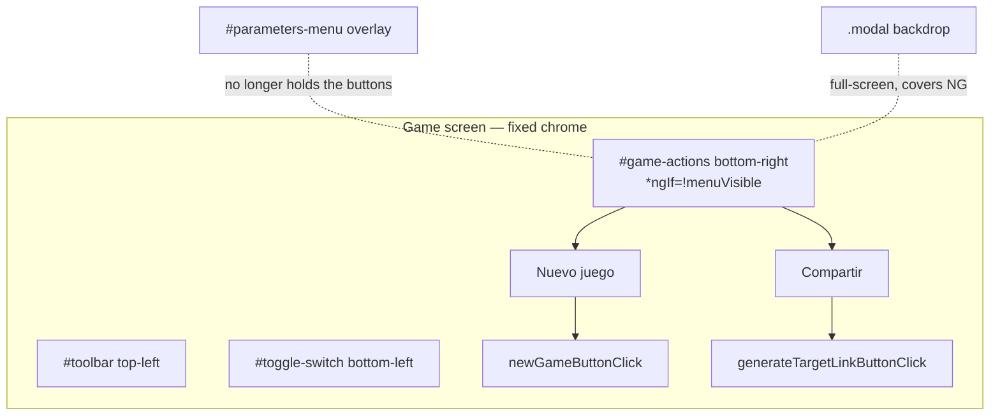

<!-- vt.idd:plan -->
<!-- vt.idd:plan -->
## Implementation Plan

**Generated**: 2026-09-23
**Issue**: #11 - [Game] Move New Game and share-link buttons out of the gear menu

### Technical Context

Angular 17 (NgModule app), three.js, Karma + Jasmine, no backend. Pure layout + copy in the `game` subsystem. The game screen has fixed chrome: `#toolbar` (`top/left: 5px`), `#toggle-switch` (`position: fixed; bottom: 5px; left: 5px`), the `#parameters-menu` overlay (`top: 75px; left: 5px; width: 300px`, and `width/height: 96%` under the small-screen media queries), and four `.modal` full-screen pop-ups. The two buttons live in `#menu-button-row` inside the menu as `.menu-action-button` (75×50) and call `newGameButtonClick` / `generateTargetLinkButtonClick`.

### Research Findings

- **Decision:** anchor a new group `bottom: 5px; right: 5px` (mirror of `#toggle-switch`). **Rationale:** the switch is fixed bottom-left, so a bottom-right group never collides horizontally at wide widths and stacks just above the switch at narrow widths.
- **Decision:** hide the group with `*ngIf="!menuVisible"` (or `[hidden]`). **Rationale:** FR-010; `menuVisible` already tracks the gear menu, and at phone width the open menu is ~96% of the screen. `newGameButtonClick` calls `hideMenu()`, so the group reappears when a new game starts from it.
- **Decision:** keep the existing handlers verbatim. **Rationale:** #23's pop-up (`newGameButtonClick` → `openNewGamePopup`) and #12's share (`generateTargetLinkButtonClick`) are unchanged; only the buttons' DOM location and the share label/tooltip move.
- **Decision:** style as toolbar-palette text buttons (teal border, cream text, hover `#e2c16e`/`#468189`), distinct from `.menu-action-button` and `.new-game-button`. **Rationale:** FR-007; they sit on the 3D canvas, not on a white pop-up.
- **Copy:** `LABEL_SHARE_GAME` "Link" → "Compartir"; `BUTTON_SHARE_GAME_TITLE` "Copiar enlace del objetivo" → a tooltip about sharing the player's own shell (final wording approved on the issue).

### Data Model

No persistent data. One existing component field is read in the template: `menuVisible: boolean` (already maintained by `menuButtonClick` / `showMenu` / `hideMenu`). No new fields.

### API Contracts

No network endpoints. Template event bindings (all handlers already exist):

| Control | Event | Method (unchanged) |
|---|---|---|
| **Nuevo juego** (new location) | `(click)` | `newGameButtonClick($event)` → #23 pop-up; hides the menu if open |
| **Compartir** (new location) | `(click)` | `generateTargetLinkButtonClick($event)` → copy link / alert / prompt (#12) |

### Architecture

### Project Structure

- **Modify** `src/app/game/game.component.html` — remove `#menu-button-row` (and its two buttons) from inside `#parameters-menu`; add `#game-actions` before `
` of `#main-container`, holding the two buttons with the same handlers, `*ngIf="!menuVisible"`, `BUTTON_*_TITLE` tooltips.
- **Modify** `src/app/game/game.component.css` — remove `#menu-button-row` / `.menu-action-button` rules; add `#game-actions` (`position: fixed; bottom: 5px; right: 5px; display: flex; gap`) and its buttons in the toolbar palette; ensure it sits below `.modal` (default stacking is fine — `.modal` is later/fixed) and wraps above the switch at narrow width (the switch is anchored bottom-left, so no explicit media query is needed unless they'd collide — verify at 390 px and add a `max-width` rule only if they touch).
- **Modify** `src/app/app-strings.ts` — `LABEL_SHARE_GAME`, `BUTTON_SHARE_GAME_TITLE`.
- **Modify** `src/app/game/game.component.spec.ts` — specs in a new `#11` describe block.

### Anticipated Waves / Tasks (preview — TASKS mode finalizes)

1. **Move the buttons + copy (RED first).** Add `#game-actions`, remove `#menu-button-row`, update the two strings. RED: with the view rendered, both buttons exist **outside** `#parameters-menu`; `#parameters-menu` has no action button but still renders sliders + heat bar; the share label is `LABEL_SHARE_GAME` = "Compartir" and its `title` has no "objetivo".
2. **Behaviour + hide-with-menu (RED).** RED: clicking the new **Nuevo juego** opens the #23 pop-up (and closes the menu if open); clicking **Compartir** calls the clipboard path (spy); the group is absent from the DOM while `menuVisible` is true and present when false.
3. **CSS + visual pass.** Style `#game-actions` in the toolbar palette; verify at 390 px and 1280 px: visible with the menu closed, no overlap with the switch/toolbar/each other, ≥ 5 px from edges, labels fit, a pop-up backdrop covers them, group hidden while the menu is open. Screenshots for #11 (SC-002, SC-005). Full suite green; `ng lint` no new problems vs `dev`; `ng build` OK.
4. **Validation harness** (`validaciones/shell_generator/11/`): local CI (lint/test/build vs `dev`), revert guard (the new specs fail on `dev`'s code), and an e2e/visual layer (buttons visible menu-closed at both widths, hidden menu-open, handlers fire, backdrop covers them). Max 2 cores.

Single feature branch `011-...` from `dev`; ~5 tasks, one wave, TDD (RED→GREEN) per the repo's relaxed enforcement.

### Constitution Check

No `.vt/memory/constitution.md` in this repo — no MUST/SHOULD rules to gate against, and CLARIFY's architect gate fired no triggers. No Critical/Security concerns: a client-only layout/copy change; no data/network/auth/dependency surface, and the existing handlers are untouched. Flag for the deployment reviewer: none.

