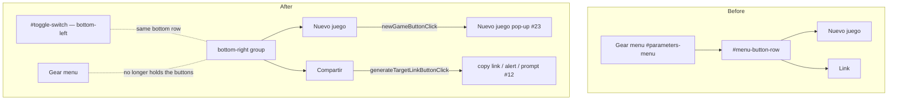

<!-- vt.idd:spec -->
## Specification

<!-- vt.idd:spec -->
## Specification

## Summary

The **Nuevo juego** and share-link buttons live inside `#menu-button-row`, at the bottom of the gear (settings) menu, so a player only finds them after opening the gear and scrolling past the sliders and heat bar. Move both out to the **bottom-right** of the game screen as labelled buttons, across from the **Usuario / Objetivo** switch, so they're visible with the menu closed. While moving the share button, rename it **"Compartir"** and correct its tooltip: it currently says "Copiar enlace del objetivo", but since #12 the link shares the player's **current** shell as a challenge, not the target.

## User Stories

### US-1 (P1) — Find New Game and share without opening the menu

As a player, I want to start a new game or share a challenge without hunting inside the gear menu, so the two main actions are always in reach.

- **S1** — Given the game with the gear menu **closed**, When I look at the screen at 1280 px, Then **Nuevo juego** and **Compartir** are visible at the bottom-right, and the gear menu contains neither.
- **S2** — Given the game at **390 px** with the menu closed, When I look at the screen, Then both buttons are visible on a row directly above the Usuario / Objetivo switch, neither clipped nor overlapping the switch or each other.
- **S3** — Given the bottom-right buttons, When I press **Nuevo juego**, Then the "Nuevo juego" pop-up (#23) opens, exactly as it does from inside the menu today.
- **S4** — Given the bottom-right buttons, When I press **Compartir**, Then the share link (the player's current shell, #12) is copied and "Enlace copiado al portapapeles." is shown; if copying fails, the link is shown in the browser prompt.

### US-2 (P2) — Understand what the share button does

As a player, I want the share button to say what it does, so I know I'm sharing my own shell as a challenge.

- **S5** — Given the game, When I read the share button, Then it is labelled **"Compartir"** and its tooltip describes sharing the player's current shell (not "del objetivo").

## Requirements

### Functional Requirements

- **FR-001** The **Nuevo juego** and share buttons MUST be removed from `#menu-button-row` inside `#parameters-menu`, and `#menu-button-row` MUST be removed from the gear menu. The menu's sliders, colour inputs and heat bar MUST be unchanged.
- **FR-002** Both buttons MUST be rendered on the game screen, visible when the gear menu is closed, anchored to the **bottom-right**. Above 560 px they share the bottom row with the Usuario / Objetivo switch (switch left, buttons right); at 560 px and below (covering 390 px) they move to their own row directly **above** the switch.
- **FR-003** Neither button MUST overlap the switch, the top toolbar, or the other button, and neither MUST touch the viewport edge (≥ 5 px margin, matching the toolbar and switch), at 390 px and 1280 px. Both labels MUST fit fully inside their buttons.
- **FR-004** **Nuevo juego** MUST open the "Nuevo juego" pop-up (#23) via the existing `newGameButtonClick`, and MUST still hide the gear menu if it is open. Its label and tooltip are unchanged.
- **FR-005** The share button MUST call the existing `generateTargetLinkButtonClick` (copy the link, show "Enlace copiado…", or fall back to the prompt), unchanged. Only its label and tooltip change.
- **FR-006** The share button's label MUST be **"Compartir"** and its tooltip MUST no longer say "del objetivo"; it MUST describe sharing the player's own shell as a challenge. All copy MUST live in `app-strings.ts`.
- **FR-007** The buttons MUST be styled as game controls in the toolbar's palette (teal `#77aca2` border, cream `#f4e9cd` text, `#e2c16e` / `#468189` on hover), not as browser-default buttons.
- **FR-008** When any game pop-up is open ("¡Bienvenido al juego!", "¡Victoria!", "Nuevo juego", parameter help), its `.modal` backdrop MUST cover the two buttons; the buttons MUST NOT be clickable through the backdrop.
- **FR-009** Both buttons MUST be real `<button type="button">` elements with visible text as their accessible name, reachable with `Tab` and activated with `Enter`.
- **FR-010** The bottom-right button group MUST be hidden while the gear menu is open (`menuVisible`), and shown again when it closes. This keeps the phone-width gear menu (which fills ~96% of the screen) from covering the buttons, and matches the framing that these buttons are the menu-closed surface.

### Key Entities

- **`GameComponent`** (`src/app/game/game.component.ts`) — unchanged handlers `newGameButtonClick` and `generateTargetLinkButtonClick`; only the buttons' place in the template and their labels/tooltips move.
- **New bottom-right button group** — a container in `game.component.html` fixed to the bottom-right, holding the two buttons; the CSS row that pairs it with `#toggle-switch` at wide widths and stacks it above at narrow widths.
- **`AppStrings`** (`src/app/app-strings.ts`) — `LABEL_SHARE_GAME` changes ("Link" → "Compartir") and `BUTTON_SHARE_GAME_TITLE` changes to an accurate tooltip; `LABEL_NEW_GAME` / `BUTTON_NEW_GAME_TITLE` unchanged.

## Approach / Architecture

### Technical Summary

Pure layout and copy: no game logic changes. The two `<button>`s move from `#menu-button-row` (inside `#parameters-menu`) to a new fixed-position group anchored bottom-right, styled like the existing `.toolbar-button`s but with text. `#toggle-switch` is already `position: fixed; bottom: 5px; left: 5px`; the new group uses `bottom: 5px; right: 5px`, so the two never collide horizontally at wide widths and stack cleanly at narrow ones (the group sits just above the switch). Both buttons keep their existing click handlers, so #23's pop-up and #12's share flow are untouched. The `.modal` backdrop is already `position: fixed` full-screen with a higher stacking context, so it covers the buttons (FR-008) as it does the toolbar today.

### Architecture

### Tech Context

Angular 17 (NgModule app), three.js. The game screen is a fixed viewport with `position: fixed` chrome: `#toolbar` top-left, `#toggle-switch` bottom-left, `#parameters-menu` as an overlay panel, and four `.modal` pop-ups. Buttons today: `.menu-action-button` (75×50) inside `#menu-button-row` (`display:flex`). Strings in `app-strings.ts`. No backend, no routing change.

### Project Structure Impact

- Modified: `src/app/game/game.component.html` (move the two buttons out of `#menu-button-row` into a new bottom-right group; remove `#menu-button-row`)
- Modified: `src/app/game/game.component.css` (styles for the new group + its responsive row with `#toggle-switch`; remove `#menu-button-row` rules)
- Modified: `src/app/app-strings.ts` (`LABEL_SHARE_GAME` → "Compartir"; `BUTTON_SHARE_GAME_TITLE` → accurate tooltip)
- Modified: `src/app/game/game.component.spec.ts` (specs: buttons outside `#parameters-menu`; menu has no action buttons; handlers still fire)

### Applicable Conventions

- Existing fixed-chrome pattern: `#toolbar` / `#toggle-switch` are `position: fixed` with a 5 px edge margin; the new group follows it (`right: 5px`; `bottom: 7px`, which lines up with the switch's visible edge: `bottom: 5px` + `margin: 2px`).
- Toolbar palette (teal `#77aca2` / cream `#f4e9cd` / hover `#e2c16e` `#468189`) for game controls.
- All user-facing copy in `AppStrings`; English issues, Spanish UI.
- Test convention (#18/#21/#23): components built via `TestBed`; query the rendered DOM and call handlers directly.
- Branching: from `dev` (0 commits behind `main`); PR back into `dev`.

### Decisions Made

- **Placement: bottom-right labelled buttons vs. toolbar icons vs. top-right.** Options: (a) labelled buttons bottom-right, sharing the switch's row; (b) two more 64 px icons in the top toolbar; (c) labelled buttons top-right. **Selected: (a).** Rationale: two more toolbar icons (~408 px) don't fit a 390 px screen and icons are less discoverable; top-right needs its own row at 390 px that eats into the shell view. Bottom-right reuses the empty corner opposite the switch. Recorded with the requester on 2026-09-23.
- **Share button copy: "Compartir" + corrected tooltip vs. keep "Link".** Options: (a) rename to "Compartir" and fix the tooltip; (b) keep "Link", fix only the tooltip; (c) no copy change. **Selected: (a).** Rationale: "Link" doesn't say what the button does, and the tooltip is factually wrong since #12. Final wording is approved on the issue before merge.
- **Native share alert/prompt: keep vs. replace now.** Options: (a) leave the native `alert`/`prompt`; (b) replace with in-app feedback in this issue. **Selected: (a).** Rationale: keeps #11 to the move; in-app feedback is tracked in #25.
- **Buttons while the gear menu is open (CLARIFY).** Options: (a) hide the bottom-right group whenever the gear menu is open, and show it when closed; (b) keep it shown and rely on z-order. **Selected: (a).** Rationale: at ≤ a small width the open gear menu is `width/height: 96%` and would sit over the bottom-right corner; hiding the group avoids the overlap and matches the issue's framing ("visible with the gear menu closed"). Opening **Nuevo juego** already closes the menu, so the group reappears then.
- **Narrow-width breakpoint.** Options: (a) a `max-width` media query set from measured widths, with headroom; (b) a shared flex row with `flex-wrap`; (c) a fixed 390/1280 split. **Selected: (a), at 560 px.** Rationale: measured on the branch, the switch ends at 237 px and the button group is 236 px wide, so one row needs ~491 px. A first cut at 480 px left only 3 px between them at 481 px (review finding M2). At 560 px the one-row gap is ≥ 80 px, room for longer labels or a wider font. (b) would mean restructuring `#toolbar`, which holds the switch.

## Risk Assessments

### Security & Vulnerabilities

| Risk | Severity | Description | Mitigation |
|------|----------|-------------|------------|
| None identified | Low | Client-only layout/copy change; no data, auth, network, or dependency surface. | N/A |

### Regression & Quality

| Risk | Severity | Affected Systems | Mitigation |
|------|----------|------------------|------------|
| Buttons overlap the switch or the shell at some width | Medium | Game layout / mobile | FR-002/FR-003 + specs and manual checks at 390 px and 1280 px; the 560 px breakpoint leaves ≥ 80 px on one row (measured 320–1280 px). |
| Buttons clickable through a pop-up backdrop | Medium | Game UX | FR-008: the `.modal` backdrop is full-screen fixed above the buttons; a spec/manual check that a click on the backdrop area over the buttons doesn't trigger them. |
| Handlers wired to the wrong element after the move | High | New Game / share | FR-004/FR-005 + specs assert `newGameButtonClick` opens the pop-up and `generateTargetLinkButtonClick` runs from the new buttons. |
| Removing `#menu-button-row` disturbs the menu layout | Low | Gear menu | FR-001 + a spec that the menu still renders its sliders and heat bar; manual look at the menu. |
| Tooltip/label left stale or hard-coded outside AppStrings | Low | i18n / copy | FR-006 + a spec that the share button text is `LABEL_SHARE_GAME` and the tooltip no longer contains "objetivo". |

### Testing Strategy

- **Unit (Karma/Jasmine):** with the view rendered, the two buttons exist **outside** `#parameters-menu` (query the DOM); `#parameters-menu` contains no New Game/share button and still renders its sliders + heat bar; clicking the new **Nuevo juego** opens the #23 pop-up; clicking **Compartir** calls the share path (spy on clipboard); the share label equals `LABEL_SHARE_GAME` = "Compartir" and its `title` has no "objetivo".
- **Static/CI:** `ng lint` no new problems vs `dev`; `ng build` succeeds.
- **Manual/visual (2 cores):** at 390 px and 1280 px, both buttons visible with the menu closed, no overlap or clipping, ≥ 5 px from edges; a pop-up's backdrop covers them; before/after screenshots posted to the issue for approval, and the final tooltip wording approved.

## Verification Matrix

| ID | Acceptance Scenario | Evidence | Status |
|----|---------------------|----------|--------|
| VM-001 | Menu closed at 1280 px → both buttons visible bottom-right; the gear menu holds neither. | [pending] | Pending |
| VM-002 | Menu closed at 390 px → both buttons on a row above the switch, not clipped or overlapping. | [pending] | Pending |
| VM-003 | Pressing **Nuevo juego** (new location) opens the "Nuevo juego" pop-up (#23). | [pending] | Pending |
| VM-004 | Pressing **Compartir** copies the link and shows "Enlace copiado…" (prompt fallback on failure). | [pending] | Pending |
| VM-005 | The share button is labelled "Compartir" and its tooltip doesn't say "del objetivo". | [pending] | Pending |

## Success Criteria

| ID | Criterion | Evidence | Status |
|----|-----------|----------|--------|
| SC-001 | With the gear menu closed, both buttons are visible on the game screen at 390 px and 1280 px, and neither is inside `#parameters-menu`; while the gear menu is open they are hidden. | [pending] | Pending |
| SC-002 | Neither button overlaps the switch, the toolbar, or the other button, and neither touches the viewport edge (≥ 5 px), at 390 px and 1280 px; both labels fit. | [pending] | Pending |
| SC-003 | The buttons behave exactly as before the move: New Game opens the #23 pop-up; share copies the #12 link with the same success/fallback messages. | [pending] | Pending |
| SC-004 | When a game pop-up is open, its backdrop covers the buttons; they can't be clicked through it. | [pending] | Pending |
| SC-005 | The share button reads "Compartir" with an accurate tooltip; the new strings live in `app-strings.ts`, and the wording is approved on the issue. | [pending] | Pending |
| SC-006 | Both buttons are keyboard-reachable (`Tab`) and activate with `Enter`. | [pending] | Pending |

## Complexity Considerations

Small single-subsystem layout + copy change: ~3 production files + specs, an estimated single wave of ~5 tasks. No new dependencies, no logic change. The only judgement is the responsive placement (the switch and two labelled buttons on one row at desktop, stacked at phone width), resolved in Decisions Made and checked at both widths. Open questions: none — the material decisions were made with the requester before drafting; the exact tooltip wording is approved on the issue before merge.

## Post-Mortem

_Filled after merge. Do not complete during specification._

| Category | Finding |
|----------|---------|
| Risks that materialized but were not declared | |
| Declared risks that did not materialize | |
| Review findings the risk assessment missed | |
| Template sections that were not useful | |
| Process improvements for next feature | |

