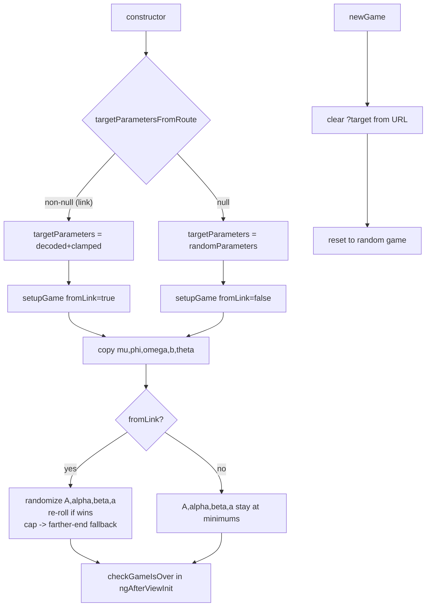

<!-- vt.idd:plan -->
## Implementation Plan

**Generated**: 2026-09-22
**Issue**: #12 - [Game] Shared challenge link can start the game already won

### Technical Context

- **Language/Framework**: TypeScript, Angular (standalone `GameComponent`).
- **Files in play**: `src/app/game/game.component.ts` (all changes), `src/app/shell-parameters.ts` (read static ranges + `randomWithGenerator`), `src/util.ts` (existing `randomWithGenerator`).
- **Routing**: hash routing; `Router` and `ActivatedRoute` already injected into `GameComponent`.
- **Win logic**: `checkParametersAreSimilar()` compares A, α, β, a, b, θ against fixed per-key thresholds; `setupGame()` copies μ, φ, ω, b, θ from target into the player shell (so those always match). A/α/β/a are the only player-controlled dimensions.
- **Testing**: manual (unit tests out of scope by user choice).

### Research Findings

- **Decision — where "link vs no-link" is known**: the constructor already computes `this.targetParametersFromRoute() ?? ShellParameters.randomParameters()`. `targetParametersFromRoute()` returns non-null only for a valid `?target=` link. Thread a boolean (`fromLink`) from there into `setupGame()` so the random-start branch runs only for link games. *Alternative rejected*: re-reading the query param inside `setupGame()` duplicates parsing.
- **Decision — random helper**: reuse `randomWithGenerator(min, max, Math.random)` (already imported path via `ShellParameters`) for per-key randomization; no seeding needed for the recipient's start. *Alternative rejected*: a seeded generator — the recipient start is intentionally non-deterministic.
- **Decision — attempt cap**: fixed constant (e.g. `MAX_START_ATTEMPTS = 20`). With four independent uniform dimensions and margins far smaller than the ranges, the odds of 20 consecutive wins are negligible; the deterministic fallback guarantees termination regardless.
- **Decision — clamp location**: clamp in `decodeTargetParameters()` after `parseFloat`/NaN check, before assignment. Keeps malformed-link behavior (null → random game) intact.
- **Decision — clear `?target`**: use `router.navigate([], { relativeTo: route, queryParams: {} })` (or replace-state dropping the param) inside `newGame()`. Preserves the hash route, only drops the query.

### Data Model

No schema changes. Uses existing `ShellParameters` static bounds:
`A[5,13] · α[80,90] · β[0,85] · a[1,6]` (player-controlled). μ, φ, ω, b, θ remain copied from target.

### API Contracts

No API/endpoint changes. Internal method signature change only:
- `setupGame(fromLink: boolean)` — gains a parameter (default preserves non-link behavior).

### Architecture

### Project Structure

**Modify** `src/app/game/game.component.ts`:
1. `setupGame(fromLink = false)` — after copying μ/φ/ω/b/θ, when `fromLink`, randomize A/α/β/a within ranges; re-roll while `checkParametersAreSimilar()` is true, capped at `MAX_START_ATTEMPTS`; on cap, set each of A/α/β/a to the slider end farther from the corresponding target value.
2. Update the two callers (`constructor`, `newGame`) to pass the correct `fromLink` flag.
3. `decodeTargetParameters()` — clamp each parsed value to `[keyMin, keyMax]` before assignment.
4. `newGame()` — strip `?target=` from the URL via the injected `Router`/`ActivatedRoute`.

**No** changes to `getShareableGameLink()` / `encodeTargetParameters()` (sharing the current shell as challenge is correct).

### Constitution Check

No `.vt/memory/constitution.md` or `foundational-principles.md` defined — gate not applicable. No architect triggers. Scope is a single-file, additive bug fix with a provably terminating loop; no security or data-integrity concerns.
