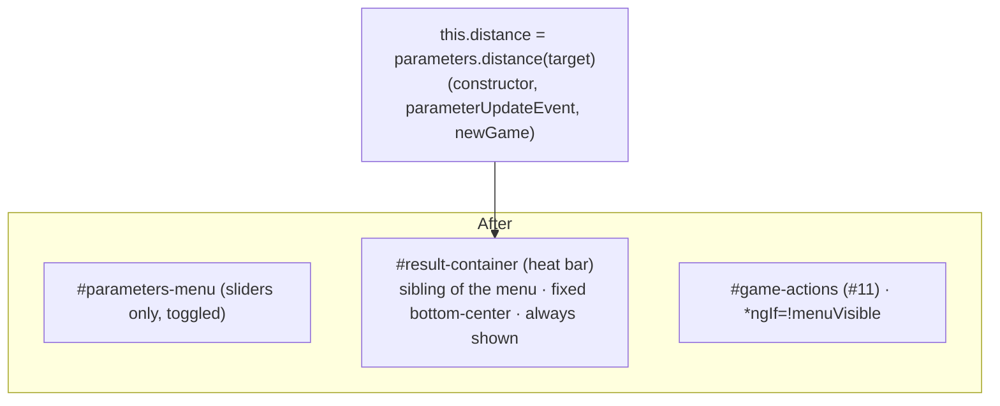

<!-- vt.idd:plan -->
## Implementation Plan

**Generated**: 2026-09-23
**Issue**: #15 - [Game] Move the heat bar out of the gear menu

### Technical Context

- **Stack**: Angular 17.3, `GameComponent` (`src/app/game/game.component.{html,ts,css,spec.ts}`), `AppStrings` (`src/app/app-strings.ts`), `ShellParameters` (`src/app/shell-parameters.ts`).
- **Heat bar today**: `#result-container` is the last child of `<form #menu id="parameters-menu">` (`game.component.html:130-138`): a ✗ image, the disabled `#distance-range` (`class="heat-range"`, `direction: rtl`, blue→red track, `[(ngModel)]="this.distance"`), and a ✓ image. The menu is `display:none` until `showMenu()`, so the bar only shows with the menu open.
- **Value source**: `this.distance = this.parameters.distance(this.targetParameters)`, set in the constructor, `parameterUpdateEvent` (slider `change`), and `newGame`. No event wiring changes.
- **Layout**: fixed-position controls. `#toolbar` top-left (y 7–71); `#toggle-switch` bottom-left (`bottom:5px; left:5px`); `#game-actions` (#11) fixed `bottom:7px; right:5px`, `*ngIf="!this.menuVisible"`, with a `@media (max-width:560px)` rule lifting it to `bottom:56px`. `#parameters-menu` fixed `top:75px; left:5px; width:300px`.

### Research Findings

- **Measured on `dev` (2026-09-23, headless Chrome)**: at 1280 px the switch ends at x 237 and `#game-actions` is x 1039–1275; at 390 px the buttons are on their own row (x 149–385, y 748–788) above the switch (y 797–837). The open menu is x 5–309, y 75–387. So a bottom-center bar has room between the switch (right edge ~237) and the buttons: at 1280 px that gap is ~800 px; the buttons move to their own row at ≤560 px today.
- **Breakpoint**: the bar needs a min width (target ~220–260 px, matching today's 240 px). Between the switch and the buttons on one row, the usable center width shrinks as the viewport narrows. The bar gets its own row (above `#game-actions`) below a breakpoint chosen so the one-row bar never drops under its min width or overlaps either neighbor — measured during EXECUTE at 390/768/1280, expected ~760 px. Recorded on the issue.
- **Menu-open coupling**: `#game-actions` uses `*ngIf`, so it leaves the DOM when the menu opens. The bar must NOT use `menuVisible`; placing it as a sibling with its own fixed position keeps it stable when the buttons vanish.
- **Software-WebGL note (verification only)**: on WSL headless Chrome, `page.click` on the gear didn't register under swiftshader; `element.click()` via `evaluate` + a ~2.5 s wait works. The `/game` route shows the welcome pop-up on load.

### Data Model

No data model. Binding unchanged: `#distance-range` ↔ `this.distance` (number, `distMin`=0..`distMax`=100).

### API Contracts

None — no endpoints, no new component inputs/outputs.

### Architecture

### Project Structure

**Modified**
- `src/app/game/game.component.html` — move `#result-container` out of `<form #menu>` to a top-level sibling; add `aria-label` to `#distance-range`.
- `src/app/game/game.component.css` — new fixed bottom-center rule for `#result-container`; responsive rule giving it its own row below the breakpoint; delete unused `.heat-range.blue` / `.heat-range.read` blocks.
- `src/app/game/game.component.ts` — delete the unused `distanceRange` getter (`:116-118`) and its `@ViewChild('distanceRange')` (`:70-71`).
- `src/app/app-strings.ts` — replace `LABEL_HOWTO_WINDOW_LINE3`.
- `src/app/game/game.component.spec.ts` — update the #11 spec (`:477`, "leaves the gear menu with its sliders and heat bar…") so it no longer expects the bar inside the menu; add tests for the new placement/visibility/update.

**No** new files or dependencies.

### Gap Analysis

- The bar's markup and binding already exist; the work is relocation + CSS + string + dead-code + tests. No TS logic for updates changes (the same `this.distance` binding).
- Conflict to handle: `game.component.spec.ts:481` asserts `menu().querySelector('#distance-range')` is non-null — it will be null after the move and must be rewritten (part of FR + testing).
- The `@ViewChild('distanceRange')` is referenced only by the unused getter; grep confirms no other reader, so removing both is safe.
- Out of scope (guarded): win check untouched; distance scale is #28.

### Implementation Waves

**Wave 0 — Foundational: relocate the bar**
1. Move `#result-container` out of `#parameters-menu` to a top-level sibling; add `aria-label`. Base CSS so it renders fixed bottom-center and no longer depends on the menu.

**Wave 1 — US1/US2: visible and updating, both views, menu open**
2. Ensure the bar shows with the menu closed and stays put when the menu opens (no `menuVisible` coupling); confirm it updates on slider `change` and shows in the Objetivo view.

**Wave 2 — US3: responsive, no collisions**
3. Add the breakpoint rule (its own row above `#game-actions` below ~760 px; one row otherwise); verify no overlap/clipping at 390/768/1280 px and clear of the top-right #13 corner; keep `.modal` above. Record breakpoint + width on the issue.

**Wave 3 — US4 + cleanup**
4. Rewrite `LABEL_HOWTO_WINDOW_LINE3`; delete `.heat-range.blue`/`.read` and the `distanceRange` getter + `@ViewChild`.

**Wave 4 — Tests & verification**
5. Update the #11 spec; add unit tests (bar outside menu; visible closed and while open; updates on `change`; LINE3 text; `aria-label`). `ng build` + `ng test` (2 cores). Before/after screenshots at 390/768/1280 px for approval.

### Testing Strategy

Karma unit tests as above; layout verified with before/after screenshots at 390/768/1280 px (menu open and closed, both views) approved on the issue. Maps to VM-001..007 and SC-001..006.

### Constitution Check

No `.vt/memory/constitution.md` → no gates. No new deps, no data/deployment/agent changes. PASS (vacuous).
