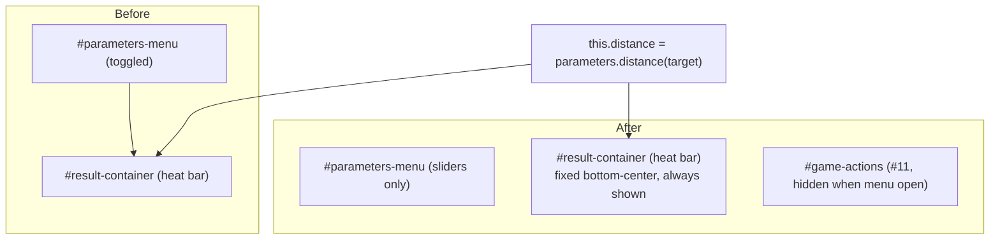

<!-- vt.idd:spec -->
## Specification

## Summary

Move the **heat bar** (`#result-container`, the disabled `#distance-range` slider between ✗ and ✓ that the app calls "barra de calor") out of the gear menu so players see their progress toward the target without opening settings. It lands bottom-center: on wide screens in the switch's row between the Usuario/Objetivo switch and the #11 buttons; at 800 px and below (measured) on its own row above those buttons. It stays visible while the gear menu is open and in both the Usuario and Objetivo views. The welcome pop-up's stale line is rewritten, small dead code is removed, and an `aria-label` is added. No change to when the bar updates (parameter slider release) or to the win check.

## User Stories

**US-1 (P1) — See progress without the menu.** As a player, I want the heat bar visible while I adjust parameters so I can tell how close I am without opening settings.
- Given the game screen with the gear menu closed, When I look at the screen, Then the heat bar is visible (outside `#parameters-menu`).
- Given I release a parameter slider, When its value changes, Then the bar's position updates (same event as today).
- Given I open the gear menu, When the sliders and the #11 buttons rearrange, Then the bar stays visible and in the same position.

**US-2 (P1) — Progress visible in both views.** As a player, I want the bar in both the Usuario and Objetivo views.
- Given the Objetivo view is active, When I look at the screen, Then the heat bar is still visible.

**US-3 (P2) — No layout collisions.** As a player on any screen, I want the bar not to cover or be covered by other controls.
- Given widths 390 px, 768 px and 1280 px, When the screen renders, Then the bar doesn't overlap the toolbar, the switch, the #11 buttons or the open gear menu, isn't clipped by the viewport, and stays out of the top-right corner reserved for #13.
- Given a pop-up (`.modal`) opens, When it renders, Then it sits above the bar.

**US-4 (P2) — Accurate help text.** As a new player, I want the welcome pop-up to describe where the bar actually is.
- Given the welcome pop-up, When I read the third line, Then it reads "En la parte inferior de la pantalla encontrarás una barra de calor que te indica qué tan cerca estás de lograrlo."

## Requirements

### Functional Requirements

- **FR-001** The heat bar (`#result-container` with `#distance-range`) MUST be rendered outside `#parameters-menu`, in a bottom-center position.
- **FR-002** The bar MUST be visible with the gear menu closed, in both the Usuario and Objetivo views.
- **FR-003** The bar MUST stay visible and keep its position when the gear menu opens (the #11 buttons hide via `*ngIf="!menuVisible"`; the bar must not depend on `menuVisible`).
- **FR-004** On wide screens the bar sits in the switch's row, centered between the switch and the #11 buttons; at 800 px and below (measured; ~760 px was the estimate) it sits on its own row above the #11 buttons. The breakpoint and bar width MUST be recorded on the issue.
- **FR-005** At 390 px, 768 px and 1280 px the bar MUST NOT overlap the toolbar, the switch, the #11 buttons, or the open gear menu, MUST NOT be clipped by the viewport, and MUST stay clear of the top-right corner reserved for #13.
- **FR-006** Pop-ups (`.modal`, z-index 1) MUST remain above the bar.
- **FR-007** The bar MUST update on the same event as today — a parameter slider `change` (release) via `parameterUpdateEvent`.
- **FR-008** `AppStrings.LABEL_HOWTO_WINDOW_LINE3` MUST read exactly: "En la parte inferior de la pantalla encontrarás una barra de calor que te indica qué tan cerca estás de lograrlo."
- **FR-009** The bar MUST carry `aria-label="Qué tan cerca estás del objetivo"`.
- **FR-010** The unused `.heat-range.blue` / `.heat-range.read` thumb styles and the unused `distanceRange` getter and its `@ViewChild` MUST be removed.
- **FR-011** The win check (`checkParametersAreSimilar`) and its thresholds MUST be unchanged. The distance scale is out of scope (tracked in #28).

### Key Entities

- **Heat bar** — `#result-container`: ✗ image, `#distance-range` (disabled range bound to `this.distance`, `direction: rtl`, blue→red track), ✓ image.
- **`this.distance`** — `parameters.distance(targetParameters)`, recomputed in `parameterUpdateEvent`, `newGame`, and the constructor.
- **Gear menu** — `#parameters-menu`, toggled by `menuVisible`.
- **#11 buttons** — `#game-actions`, `*ngIf="!menuVisible"`, fixed bottom-right.

## Approach / Architecture

### Technical Summary

Move the `#result-container` block from inside `<form #parameters-menu>` to a top-level element in the game template, add a fixed-position layout for it, and stop it depending on `menuVisible`. `[(ngModel)]="this.distance"` continues to drive it, so no TS logic changes for updates. Remove dead CSS/TS. Rewrite one string. Update the #11 spec that asserted the bar lived in the menu and add tests for the new placement.

### Architecture

### Tech Context

Angular 17 standalone-less module app. Game UI is `GameComponent` (`game.component.{html,ts,css,spec.ts}`) plus `AppStrings` (`app-strings.ts`) and `ShellParameters` (`shell-parameters.ts`). Layout is fixed-position CSS with `@media` breakpoints; unit tests run on Karma/ChromeHeadless (pinned to 2 cores).

### Project Structure Impact

- Modified: `game.component.html` (move the block, add `aria-label`), `game.component.css` (bar position + row breakpoint; delete `.blue`/`.read`), `game.component.ts` (delete `distanceRange` getter + `@ViewChild`), `app-strings.ts` (LINE3), `game.component.spec.ts` (update #11 assertion, add placement tests).
- No new files, no new dependencies.

### Applicable Conventions

- Branch `015-*` from `dev`, PR into `dev` ([[workflow-issues-and-branching]]).
- Check layout at 390/768/1280 px; before/after screenshots approved on the issue before merge; record the breakpoint and bar width on the issue.
- Run builds/tests pinned to 2 cores (`taskset -c 0,1`, `NG_BUILD_MAX_WORKERS=2`).

### Decisions Made

- **Placement**: (a) bottom-center, (b) top below toolbar, (c) top-center. Selected **(a)** — clear of the menu (which opens top-left), matches the welcome copy's "parte inferior", and leaves the top-right free for #13. (Decided with the user 2026-09-23.)
- **Move vs duplicate**: move the bar out entirely (selected) vs keep a copy in the menu — move avoids two elements bound to the same value.
- **Menu-open visibility**: stays visible and fixed (selected) vs hide with the buttons — a player dragging sliders wants live feedback.
- **Scope split**: the bar's scale (never reaches ✗; β dominates) is deferred to #28, not fixed here.

## Risk Assessments

### Security & Vulnerabilities

| Risk | Severity | Description | Mitigation |
|------|----------|-------------|------------|
| None | Low | UI-only move; no data, auth, or input handling changes | n/a |

### Regression & Quality

| Risk | Severity | Affected Systems | Mitigation |
|------|----------|------------------|------------|
| Bar overlaps switch or #11 buttons at some width | Medium | `game.component.css` | Measure at 390/768/1280 px; before/after screenshots approved on the issue |
| Bar keeps updating only when the menu is open | Medium | binding to `this.distance` | Test that the value updates on a slider `change` with the menu closed |
| #11 spec breaks (asserts bar inside menu) | Medium | `game.component.spec.ts:477` | Update that spec as part of this work |
| Bar covered by pop-ups or the shell canvas | Low | z-index stacking | Keep `.modal` above; verify visually |

### Testing Strategy

Unit tests (Karma): bar is outside `#parameters-menu`; visible with menu closed and while open; value updates on a slider `change`; `LABEL_HOWTO_WINDOW_LINE3` matches; `aria-label` present. Update the #11 spec. Manual: screenshots at 390/768/1280 px approved on the issue, menu open and closed, both views.

## Verification Matrix

| ID | Acceptance Scenario | Evidence | Status |
|----|---------------------|----------|--------|
| VM-001 | US-1: bar visible with the gear menu closed, outside the menu | [pending] | Pending |
| VM-002 | US-1: bar updates on a parameter slider release | [pending] | Pending |
| VM-003 | US-1: bar stays visible and in place when the menu opens | [pending] | Pending |
| VM-004 | US-2: bar visible in the Objetivo view | [pending] | Pending |
| VM-005 | US-3: no overlap/clipping at 390/768/1280 px; clear of the #13 corner | [pending] | Pending |
| VM-006 | US-3: pop-ups render above the bar | [pending] | Pending |
| VM-007 | US-4: welcome pop-up line 3 matches the new copy | [pending] | Pending |

## Success Criteria

| ID | Criterion | Evidence | Status |
|----|-----------|----------|--------|
| SC-001 | The heat bar is visible on the game screen without opening the gear menu, in both views | [pending] | Pending |
| SC-002 | At 390/768/1280 px the bar overlaps no other control and isn't clipped | [pending] | Pending |
| SC-003 | The bar updates on parameter slider release | [pending] | Pending |
| SC-004 | The welcome pop-up shows the new third line; `aria-label` present; dead code removed | [pending] | Pending |
| SC-005 | `ng test` passes, including the updated #11 spec and new placement tests | [pending] | Pending |
| SC-006 | The chosen breakpoint and bar width are recorded on the issue | [pending] | Pending |

## Complexity Considerations

Small, single-component change (~5 files, no new deps). The only non-obvious parts are the responsive breakpoint (measured, not guessed) and keeping the bar decoupled from `menuVisible`. Open question resolved: scale/normalization is #28's scope, not this issue's.

## Post-Mortem

_Filled after merge. Do not complete during specification._

| Category | Finding |
|----------|---------|
| Risks that materialized but were not declared | |
| Declared risks that did not materialize | |
| Review findings the risk assessment missed | |
| Template sections that were not useful | |
| Process improvements for next feature | |
