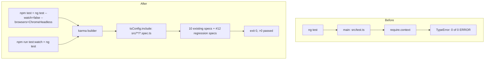

<!-- vt.idd:plan -->
## Implementation Plan

**Generated**: 2026-09-22
**Issue**: #18 - [App] Unit test suite never runs (require.context on Angular 17; npm test never exits)

### Technical Context

- **Stack**: Angular 17.3, Karma 6.3 + Jasmine 4.1, `@angular-devkit/build-angular:karma` builder, TypeScript 5.4, ChromeHeadless available (`~/.cache/ms-playwright` unrelated; system `google-chrome` present).
- **Base branch**: `dev` (level with `main` at `6fb91ce`).
- **Files**: `src/test.ts` (delete), `angular.json` (`projects.*.architect.test.options`), `tsconfig.spec.json`, `package.json` (`scripts`), `README.md`, `src/app/app.component.spec.ts`, `src/app/game/game.component.spec.ts`, `src/app/sandbox/sandbox.component.spec.ts`, and a new #12-regression block in `game.component.spec.ts`.
- **Constraint**: all test runs pinned to 2 cores (`taskset -c 0,1`, `NG_BUILD_MAX_WORKERS=2`) per the user's standing rule.

### Research Findings

Proven on a throwaway `git archive` of `origin/dev` (not committed):

- **Decision — spec discovery**: the Angular 17 `karma` builder auto-discovers specs from `tsConfig.include` (`src/**/*.spec.ts`) when the `test` target has no `main` and `polyfills: ["zone.js", "zone.js/testing"]`. `src/test.ts`'s `require.context` is a webpack-only API the esbuild-based builder doesn't provide. *Alternative rejected*: keep `src/test.ts` and shim `require.context` — brittle, fights the builder.
- **Decision — result**: after the discovery fix, 10 specs execute (was 0). Two fail as stale: `GameComponent` → `No provider for ActivatedRoute` (constructor injects `Router`, `ActivatedRoute`); `SandboxComponent` → `Can't bind to 'ngModel'` (template uses `[(ngModel)]`). Adding `FormsModule` + `RouterTestingModule` to those two specs → 10/10 pass; three.js/WebGL renders in ChromeHeadless.
- **Decision — `npm test` single-run**: `ng test --watch=false --browsers=ChromeHeadless` exits 0; `npm run test:watch` = `ng test` keeps watch mode. This is what unblocks the VT checkpoints. *Alternative rejected*: flip `singleRun`/`browsers` in `karma.conf.js` — that would also change the interactive `test:watch` experience.
- **Decision — #12 specs test through the component**: the link logic (`decodeTargetParameters`, `randomizePlayerStart`, `getShareableGameLink`) is `private` and runs in the constructor. Provide `{ provide: ActivatedRoute, useValue: { snapshot: { queryParamMap: convertToParamMap({ target: '…' }) } } }`, construct the component **without** `fixture.detectChanges()` (no `ngAfterViewInit`, no canvas/WebGL), and read `component.parameters` / `component.targetParameters`. Call private helpers via `component['getShareableGameLink']()`. Force the fallback with `spyOn(Math, 'random')` — `random()` in `src/util` calls the global. *Alternative rejected*: extract a pure module — refactors code #12 just shipped (out of scope by decision).
- **Decision — regression guard**: acceptance requires the #12 specs to fail on `git revert -m 1 6fb91ce` and pass without it (VM-006). Verified during EXECUTE on a temp branch, not committed.

### Data Model

No application data model. Test-config only.

### API Contracts

No API changes. `package.json` script surface:
- `test` → `ng test --watch=false --browsers=ChromeHeadless` (was `ng test`)
- `test:watch` → `ng test` (new)

### Architecture

### Project Structure

**Remove**: `src/test.ts`.

**Modify**:
- `angular.json` — `test` target: remove `options.main`; set `options.polyfills = ["zone.js", "zone.js/testing"]`.
- `tsconfig.spec.json` — drop `src/test.ts` from `files` (keep `src/polyfills.ts`).
- `package.json` — `scripts.test` → single headless run; add `scripts.test:watch`.
- `README.md` — "Running unit tests" documents `npm test` (headless, once) and `npm run test:watch`.
- `src/app/app.component.spec.ts` — give `should render title` a real assertion (title text in the DOM) or delete that `it`.
- `src/app/game/game.component.spec.ts` — add `FormsModule` + `RouterTestingModule`; then a `describe('shared challenge link (#12)')` block with the four regression areas.
- `src/app/sandbox/sandbox.component.spec.ts` — add `FormsModule`.

**Waves**: single wave, ~5 tasks (config+scripts+README; fix stale specs; #12 regression specs; run + revert-guard verification; lint check).

### Constitution Check

No `.vt/memory/constitution.md` — gate not applicable. No architect triggers: no new deps (all test tooling already in `package.json`), no data/deployment/agent changes. Test-only, additive; risk is low. CI is explicitly out of scope (#19).
