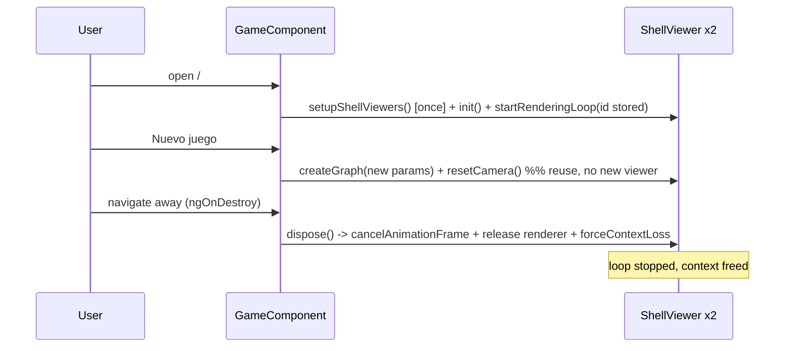

<!-- vt.idd:plan -->
## Implementation Plan

**Generated**: 2026-09-23
**Issue**: #21 - [Game] 3D render loops never stop: each New Game and page visit adds more (CPU grows, tests starve)

### Technical Context

- **Language/Framework**: TypeScript, Angular 17 (NgModule app), three.js `^0.143.0` (`OrbitControls`, `ParametricGeometry`).
- **Tests**: Karma + Jasmine. `npm test` = single headless run (since #18); `npm run test:watch` = watch mode.
- **Platform**: Browser SPA, no backend. Routes `""` (sandbox) and `game`, default `RouteReuseStrategy` (components destroyed on navigation).
- **Constraints**: 2-core cap for local/validation runs; no production rendering-behaviour change; no new dependencies.

### Research Findings

- **Leak source**: `ShellViewer.startRenderingLoop()` (`src/app/shell-viewer.ts:51-58`) runs a self-scheduling IIFE `requestAnimationFrame` with no stored id and no cancel. **Decision**: store the id; cancel in `dispose()`.
- **Accumulation points**: `GameComponent.ngAfterViewInit → setupShellViewers()` (2 viewers), `GameComponent.newGame()` calls `setupShellViewers()` again (+2 every round), `SandboxComponent.ngAfterViewInit` (1 per visit). No `ngOnDestroy` anywhere.
- **WebGL context reuse**: a second `WebGLRenderer` on the same canvas shares the context; `forceContextLoss()` on the old one breaks the new one. **Decision**: New Game reuses viewers (rebuild graph + reset camera), never recreates renderers; `forceContextLoss()` runs only in `ngOnDestroy`.
- **Test teardown**: Angular TestBed destroys each fixture (calls `ngOnDestroy`) after its spec. The 12 #12 specs never render, so `viewer`/`targetViewer` are `undefined`; the sandbox `helper` exists but is never `init()`ed. **Decision**: `dispose()` guards on undefined renderer/controls; `ngOnDestroy` tolerates missing viewers.
- **Existing disposal pattern**: `ShellViewer` already has `disposeGraphElements()` and per-resource disposers — `dispose()` extends the same style to controls + renderer.
- **Frame counting in specs**: spy on `requestAnimationFrame` to queue callbacks, pump frames manually, count `renderer.render` calls — deterministic, real WebGL, no fake timers. Replaces the #18 M1 blanket stub.

### Data Model

No persistent data. In-memory objects only:
- `ShellViewer`: adds `frameId: number | undefined` (the `requestAnimationFrame` handle).
- `GameComponent` / `SandboxComponent`: no new fields; add lifecycle method.

### API Contracts

No HTTP/API surface. Internal contract changes on `ShellViewer`:
- `dispose(): void` — cancels the pending frame, disposes controls/graph/renderer, forces context loss; idempotent; safe before `init()`.
- `resetCamera(): void` (or equivalent) — returns the camera to the default view; called by New Game.
- `newGame()` no longer calls `setupShellViewers()`; instead rebuilds graphs on the existing viewers and resets their cameras.
- `ngOnDestroy()` on both components → `dispose()` each viewer, guarding undefined.

### Architecture

### Project Structure

**Modified**
- `src/app/shell-viewer.ts` — `frameId` field; `dispose()`; `resetCamera()`; store id in `startRenderingLoop()`.
- `src/app/game/game.component.ts` — `implements OnDestroy`; `ngOnDestroy()`; `newGame()` reuse + camera reset.
- `src/app/sandbox/sandbox.component.ts` — `implements OnDestroy`; `ngOnDestroy()`.
- `src/app/game/game.component.spec.ts` — remove M1 rAF stub; add teardown/reuse/frame-count specs.
- `src/app/sandbox/sandbox.component.spec.ts` — remove M1 rAF stub; add teardown spec.
- `src/app/shell-viewer.spec.ts` — add `dispose()` cases (cancel, before-init, double-dispose).

**Added**: none (existing spec files extended).
**Removed**: none.

### Anticipated Waves / Tasks (preview — TASKS mode finalizes)

1. `ShellViewer.dispose()` + `frameId` + `resetCamera()` (RED spec first: dispose cancels frame; before-init/double-dispose safe).
2. `GameComponent` `ngOnDestroy` + `newGame()` reuse + camera reset (RED: New Game keeps 2 viewers, camera resets; destroy stops loops; never-rendered destroy safe).
3. `SandboxComponent` `ngOnDestroy` (RED: destroy stops the viewer).
4. Remove #18 M1 stubs; update the #21 source comment; full-suite green.
5. Validation harness (`validaciones/shell_generator/21/`): draw-calls/frame constant, game↔sandbox ×20 no context warning, watch-mode idle CPU; local CI (lint/test/build) vs `dev`.

Single wave likely; ~5 tasks, TDD (RED-GREEN) per the repo's relaxed enforcement.

### Constitution Check

No `.vt/memory/constitution.md` in this repo — no MUST/SHOULD rules to gate against, and no architect triggers fired in CLARIFY. No Critical/Security concerns: the change is client-only lifecycle/test hygiene with no data, auth, network, or dependency surface. Flag for the deployment reviewer: none.
