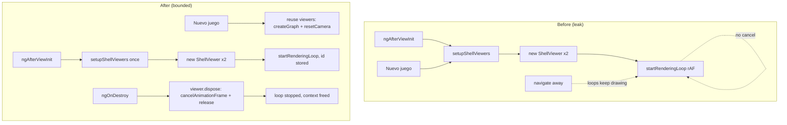

<!-- vt.idd:spec -->
## Specification

## Summary

Every 3D shell viewer in the app starts a `requestAnimationFrame` render loop that is never cancelled. Loops accumulate: two per game load, two more on every **Nuevo juego**, and a fresh set on every navigation between the sandbox and the game. The game gets slower with each New Game (WebGL draw calls per frame grow from 4 to 16 after three New Games), detached components keep drawing into dead canvases, new `WebGLRenderer`s leak WebGL contexts (which browsers cap), and the leftover loops make the unit suite fragile on a busy machine.

This is a **bug fix** in the shared 3D layer. It gives `ShellViewer` a way to stop and dispose itself, makes `GameComponent` and `SandboxComponent` tear their viewers down in `ngOnDestroy`, and makes **Nuevo juego** reuse the existing viewers instead of stacking new ones. No production rendering behaviour (look, camera defaults, materials) changes; the camera still resets to the default view on New Game.

Found while validating #18 / PR #20. Identical on `dev` and the merged #18 branch, so it predates both.

## User Stories

### US-1 (P1) — New Game stays responsive
As a player pressing **Nuevo juego** repeatedly, I want the game to stay as smooth as it was on the first load, so long sessions don't heat up my device or drain the battery.

- **Given** the game page is open with the two shells rendering, **When** I press **Nuevo juego** any number of times, **Then** the number of viewers actually rendering stays at two and WebGL draw calls per frame stay at the fresh-load value (4 with the current scene).
- **Given** I have played several rounds, **When** a new round starts, **Then** the camera is back at the default view (unchanged from today's behaviour).
- **Given** I have started a new round, **When** I drag on the canvas to rotate, **Then** only the current shell rotates (no hidden older viewer reacts to the drag).

### US-2 (P1) — Leaving a screen releases its resources
As a player moving between the initial screen and the game, I want the screen I left to stop consuming CPU and graphics resources, so the app doesn't slow down or hit the browser's WebGL context limit over a session.

- **Given** I am on the game page, **When** I navigate to the sandbox and back, **Then** the destroyed game's viewers render zero further frames.
- **Given** I navigate between the sandbox and the game many times (20+), **When** I keep going, **Then** the browser never logs "Too many active WebGL contexts" and the app keeps rendering.

### US-3 (P2) — The unit suite is stable and idle-clean
As a developer, I want the render loops started by the component specs to stop when each spec's fixture is destroyed, so the suite is reliable on a busy machine and watch mode returns the CPU to idle between runs.

- **Given** the unit suite runs the component `should create` specs, **When** each fixture is destroyed after its spec, **Then** its render loop stops and no loop survives into later specs.
- **Given** `npm run test:watch` has completed a run, **When** it sits idle waiting for the next change, **Then** headless Chrome's CPU use drops back to idle instead of staying busy.

## Requirements

### Functional Requirements

- **FR-001** `ShellViewer` MUST store the id returned by `requestAnimationFrame` and expose a public `dispose()` that cancels the pending frame via `cancelAnimationFrame`, so a stopped viewer schedules no further frames.
- **FR-002** `ShellViewer.dispose()` MUST release the viewer's resources: dispose the `OrbitControls`, the surface/wireframe geometries and materials, and the `WebGLRenderer`, then force the WebGL context to be released (`renderer.forceContextLoss()`), because the owning canvas is being destroyed.
- **FR-003** `ShellViewer.dispose()` MUST be safe to call before `init()` (no renderer/controls yet) and safe to call more than once, without throwing.
- **FR-004** `ShellViewer` MUST expose a way to reset its camera to the default view, used by New Game.
- **FR-005** `GameComponent.newGame()` MUST reuse the existing `viewer` and `targetViewer` — rebuilding their graphs and resetting their cameras — and MUST NOT create additional `ShellViewer` instances or renderers.
- **FR-006** `GameComponent` MUST implement `ngOnDestroy` and dispose both `viewer` and `targetViewer`; it MUST tolerate the case where the viewers were never created or never initialised (e.g. a test that does not render).
- **FR-007** `SandboxComponent` MUST implement `ngOnDestroy` and dispose its `helper` viewer, tolerating a viewer that was never initialised.
- **FR-008** The `requestAnimationFrame` stubs added to `game.component.spec.ts` and `sandbox.component.spec.ts` in #18 (review fix M1, `18d9aa5`) MUST be removed, and the source comment referencing #21 updated, since `ngOnDestroy` now stops the loops through normal fixture teardown.
- **FR-009** The change MUST NOT alter rendering output (surface, wireframe, colours, camera defaults) or the app's visible behaviour beyond stopping the leaked loops.

### Key Entities

- **`ShellViewer`** (`src/app/shell-viewer.ts`) — wraps a three.js scene, camera, renderer, controls and the shell meshes for one canvas. Currently starts a self-scheduling render loop with no handle and no teardown. Gains a frame-id field, `dispose()`, and a camera reset.
- **`GameComponent`** (`src/app/game/game.component.ts`) — owns two viewers (player + target). Currently recreates both on every New Game. Gains `ngOnDestroy`; `newGame()` switches to reuse.
- **`SandboxComponent`** (`src/app/sandbox/sandbox.component.ts`) — owns one `helper` viewer. Gains `ngOnDestroy`.

## Approach / Architecture

### Technical Summary

The root cause is a fire-and-forget IIFE render loop in `ShellViewer.startRenderingLoop()` with no stored frame id and no disposal path. The fix is standard three.js lifecycle hygiene: keep the frame id, add an idempotent `dispose()` that cancels it and releases GPU resources plus the WebGL context, and call `dispose()` from Angular's `ngOnDestroy`. New Game is switched from "create new viewers" to "reuse viewers, rebuild geometry, reset camera", which both removes the per-round leak and sidesteps the WebGL-context pitfall of putting a second `WebGLRenderer` on a canvas that already has one.

### Architecture

### Tech Context

Angular 17 (standalone-free NgModule app), three.js `^0.143.0` with `OrbitControls` and `ParametricGeometry`. Karma + Jasmine unit tests (single headless run via `npm test`, watch via `npm run test:watch`) since #18. No backend. Two routes: `""` (sandbox) and `game` (`src/app/app-routing.module.ts`), default `RouteReuseStrategy` (components are destroyed on navigation).

### Project Structure Impact

- Modified: `src/app/shell-viewer.ts` (frame id, `dispose()`, camera reset)
- Modified: `src/app/game/game.component.ts` (`ngOnDestroy`, `newGame()` reuse)
- Modified: `src/app/sandbox/sandbox.component.ts` (`ngOnDestroy`)
- Modified: `src/app/game/game.component.spec.ts`, `src/app/sandbox/sandbox.component.spec.ts` (remove M1 stubs; add teardown/reuse specs)
- Modified: `src/app/shell-viewer.spec.ts` (add `dispose()`/`resetCamera()` lifecycle specs next to the existing smoke test)

### Applicable Conventions

- Existing `ShellViewer` disposal helpers (`disposeGraphElements` and friends) — extend the same pattern for controls/renderer.
- #18's test conventions: specs construct components through `TestBed`; the manual `requestAnimationFrame` pump for frame counting keeps them deterministic without fake timers.
- Branching: from `dev` (0 commits behind `main`); issues in English.

### Decisions Made

- **New Game: reuse viewers vs. dispose-and-recreate.** Options: (a) reuse the two viewers and only rebuild geometry + reset camera; (b) dispose the old viewers and create new ones. **Selected: (a).** Rationale: recreating a `WebGLRenderer` on the same canvas reuses the same WebGL context, and disposing the old one with `forceContextLoss()` would leave the new one with a lost context; reuse avoids renderer churn entirely.
- **Camera after New Game: reset vs. keep.** Options: (a) reset to the default view; (b) keep the player's rotation/zoom. **Selected: (a).** Rationale: matches today's behaviour (new controls currently reset the view); keeping it would be an unintended, user-visible change.
- **Teardown depth on destroy: full release vs. dispose-only.** Options: (a) cancel frame + dispose controls/geometry/materials/renderer + `forceContextLoss()`; (b) dispose resources but leave the context to the GC. **Selected: (a).** Rationale: browsers cap active WebGL contexts; the canvas is going away on destroy, so releasing the context is correct there (and only there, never on New Game).
- **#18 M1 stubs: remove vs. keep.** Options: (a) remove the `requestAnimationFrame` stubs; (b) keep them and rely on separate frame control in new specs. **Selected: (a).** Rationale: with `ngOnDestroy` in place, TestBed's fixture teardown stops the loops, so the component specs can render normally and exercise the fix.

## Risk Assessments

### Security & Vulnerabilities

| Risk | Severity | Description | Mitigation |
|------|----------|-------------|------------|
| None identified | Low | Test-and-lifecycle change in a client-only app; no data, auth, network, or dependency surface touched. | N/A |

### Regression & Quality

| Risk | Severity | Affected Systems | Mitigation |
|------|----------|------------------|------------|
| Reusing viewers on New Game leaves stale geometry or wrong colours | Medium | Game rendering | `createGraph()` already disposes and rebuilds surface/wireframe; specs assert the graph rebuilds and the scene still shows two meshes. |
| `dispose()` throws when a viewer was never initialised (the #12 specs never render) | High | Unit suite (12 #12 specs destroyed by TestBed) | FR-003 makes `dispose()` guard on undefined renderer/controls; a spec asserts `dispose()` before `init()` and a double `dispose()` do not throw. |
| `forceContextLoss()` on New Game would break the live canvas | High | Game rendering | Decision: context release happens only in `ngOnDestroy`, never in `newGame()`; New Game reuses viewers. |
| Camera behaviour drifts (view not reset) after New Game | Medium | Game UX | FR-004 + explicit reset; a spec asserts the camera is at the default view after New Game. |
| Removing M1 stubs re-exposes watch-mode flakiness if teardown is incomplete | Medium | Watch mode / CI | Validation re-runs the watch-mode edit/re-run cycle and asserts 0 disconnects and idle CPU. |

### Testing Strategy

- **Unit (Karma/Jasmine):** `ShellViewer.dispose()` cancels the stored frame and is safe before `init()` / when doubled; a destroyed or replaced viewer schedules and renders 0 further frames (manual `requestAnimationFrame` pump counts `renderer.render` calls); New Game keeps the same two `ShellViewer` instances (so no hidden old controls stay on the canvas, VM-003), keeps the rendering-viewer count at two and resets the camera; destroying `GameComponent`/`SandboxComponent` stops their viewers; destroying a component that never rendered does not throw. All new specs MUST fail on current code and pass with the fix.
- **Static/CI:** `ng lint` shows no new problems vs `dev`; `ng build` succeeds; production bundle unchanged except the intended source edits.
- **Manual/measured (out-of-repo harness, 2 cores):** draw calls per frame stay at 4 after N New Games; after a real mouse drag and New Game, the camera is at the default view and the game still holds its original two viewers (VM-002, VM-003); game↔sandbox ×20 logs no WebGL-context warning; watch-mode CPU returns to idle.

## Verification Matrix

| ID | Acceptance Scenario | Evidence | Status |
|----|---------------------|----------|--------|
| VM-001 | New Game any number of times → rendering viewers stay at 2, draw calls/frame stay at 4. | e2e (harness): 4 draws / 2 loops per frame after 3× Nuevo juego (dev 16/8); unit `New Game keeps the same two viewers instead of creating more` | Pass |
| VM-002 | After New Game → camera is at the default view. | unit `New Game puts both cameras back at the default view`; e2e: camera back at default after a real drag + New Game; manual pass 2026-09-23 | Pass |
| VM-003 | After New Game → dragging rotates only the current viewer. | unit `New Game keeps the same two viewers…` (viewer identity, no hidden controls); e2e: original 2 viewers after 3 New Games; manual pass 2026-09-23 | Pass |
| VM-004 | Navigate game → sandbox → game → the destroyed game's viewers render 0 frames. | e2e: 4 draws / 2 loops back in the game after game → sandbox → game (dev 22/11); unit `destroying the game stops both render loops` | Pass |
| VM-005 | Navigate game ↔ sandbox 20+ times → no "Too many active WebGL contexts" warning. | e2e: 20 round trips, 0 "Too many active WebGL contexts" warnings (dev 49); manual pass 2026-09-23 | Pass |
| VM-006 | Each component spec fixture destroyed → its render loop stops, none survive into later specs. | unit `destroying the game stops both render loops`, `destroying the initial screen stops its render loop`; `npm test` 35/35, no disconnects @ `8a482ab` | Pass |
| VM-007 | `npm run test:watch` idle after a run → headless Chrome CPU returns to idle. | watch layer: Karma CPU 4% of a core after a run (dev without #18 stubs 199%), 4 green runs, 0 disconnects | Pass |

## Success Criteria

| ID | Criterion | Evidence | Status |
|----|-----------|----------|--------|
| SC-001 | On the game page, WebGL draw calls per frame are constant across any number of New Games (4 with the current scene). | see VM-001: 4 draws/frame after any number of New Games (e2e), same-viewer unit spec | Pass |
| SC-002 | Destroyed components (navigation away) render 0 frames and release their WebGL context; 20+ navigations produce no context-limit warning. | see VM-004/VM-005: destroyed pages render 0 frames; 0 context warnings in 20 round trips (dev 49) | Pass |
| SC-003 | `ShellViewer.dispose()` cancels the animation frame, releases the renderer and context, and is safe before `init()` and when called twice. | `src/app/shell-viewer.spec.ts` `ShellViewer lifecycle (#21)`: dispose cancels frame, releases controls/renderer/context, safe before init() and twice | Pass |
| SC-004 | New specs fail on current code and pass with the fix; the #18 M1 stubs are removed and `npm test` passes headless. | revert guard @ `8a482ab`: 4 #21 component specs fail and the viewer spec doesn't compile on dev's code, 28/28 pass on the PR; stubs removed in `8eeddb2`; `npm test` 35/35 | Pass |
| SC-005 | `npm run test:watch` re-runs after edits with no browser disconnects and returns CPU to idle between runs. | watch layer: 4 green runs (3 edit-triggered), 0 disconnects, CPU back to 4% idle | Pass |

## Complexity Considerations

Small, well-bounded fix in one subsystem (~3 production files + specs), estimated a single wave of ~5–6 tasks. The only subtlety is the WebGL-context lifecycle (reuse on New Game, release on destroy), already resolved in Decisions Made. Open questions: none — the four material decisions were made with the requester before drafting.

## Post-Mortem
_Filled after merge. Do not complete during specification._

| Category | Finding |
|----------|---------|
| Risks that materialized but were not declared | |
| Declared risks that did not materialize | |
| Review findings the risk assessment missed | |
| Template sections that were not useful | |
| Process improvements for next feature | |
