<!-- vt.idd:plan -->
<!-- vt.idd:plan -->
## Implementation Plan

**Generated**: 2026-09-23 (re-scan)
**Issue**: #23 - [Game] "Nuevo juego" opens a pop-up: "Aleatorio" or "Introducir clave"

### Technical Context

Angular 17 (NgModule app), three.js `^0.143.0`, Karma + Jasmine, no backend. All work is in the `game` subsystem. The game already ships three modals (`#modalWindow` victory, `#modalHelpWindow`, `#modalHowToWindow`) built on one pattern: a full-screen `.modal` backdrop wrapping a rounded content box, shown/hidden via `style.display` on a `@ViewChild` `ElementRef`, and dismissed by `modalMouseDown($event)` when the backdrop itself is the click target. The new **Nuevo juego** pop-up (`#modalNewGame`) is a fourth instance of that pattern. Seeding is unchanged: `ShellParameters.randomParameters(seed?)` → `Math.random` when `seed === undefined`, else an FNV-1a-seeded generator (`hashStringToSeed`, `src/util.ts`).

### Research Findings

- **Decision:** funnel both actions through the existing `newGame(seed?)`. **Rationale:** it already clears `?target` (`clearTargetFromUrl`, #12), reuses the viewers and resets the cameras (#21), so the post-start guarantees (FR-008) come for free. `newGame(undefined)` = random, `newGame(trimmedKey)` = seeded. **Alternatives:** a new start method — rejected as duplicate logic.
- **Decision:** the empty-key bug is `newGame("")`, because `""` is truthy-as-defined and hashes to a fixed seed. **Rationale/Fix:** trim, then pass `undefined` (not `""`) when empty — the only correct way to reach the `Math.random` branch. **Alternatives:** special-casing `""` inside `randomParameters` — rejected; keeps the fix at the call site and out of shared code the sandbox also uses.
- **Decision:** reveal the key field with a component boolean (e.g. `keyEntryVisible`) rather than a second modal. **Rationale:** one pop-up, matches the issue; focus set via `@ViewChild` on the input after reveal.
- **Decision:** track the pop-up's `origin` (`'menu' | 'victory'`) so cancel can restore "¡Victoria!". **Rationale:** the victory modal (`#modalWindow`) and the new modal are independent elements; on cancel-from-victory, leave `#modalWindow` shown.

### Data Model

No persistent data. Component state added to `GameComponent`:

- `keyEntryVisible: boolean` — whether the key field is shown inside the pop-up.
- `newGameKey: string` — two-way bound to the key field; reset to `""` on every open.
- `newGameOrigin: 'menu' | 'victory'` — where the pop-up was opened from.
- `gameId` (existing) — set to the trimmed key on a keyed start, `""` on random (CLARIFY decision 2); the field itself still opens empty.

### API Contracts

No network endpoints (client-only). Component method contracts:

| Action (template event) | Method | Behavior |
|---|---|---|
| Gear → **Nuevo juego** | `newGameButtonClick($event)` | Hide the gear menu; `newGameOrigin='menu'`; open `#modalNewGame` with buttons only (`keyEntryVisible=false`, `newGameKey=''`). No `window.prompt`. |
| **Jugar** (victory) | `newGameButtonClick($event)` | `newGameOrigin='victory'`; open `#modalNewGame` (leave `#modalWindow` shown underneath). |
| **Aleatorio** | `randomGameButtonClick($event)` | `startNewGameFromPopup(undefined)`. |
| **Introducir clave** | `enterKeyButtonClick($event)` | `keyEntryVisible=true`; focus the input. |
| Confirm (button or `Enter`) | `confirmKeyButtonClick($event)` | `const k = newGameKey.trim(); startNewGameFromPopup(k === '' ? undefined : k)`. |
| Close (button / `Esc` / backdrop) | `closeNewGameButtonClick` / `@HostListener('document:keydown.escape')` / `modalMouseDown` | Close `#modalNewGame` only; if `origin==='victory'` leave `#modalWindow` shown; the gear menu stays hidden; no `newGame` call. |
| — | `startNewGameFromPopup(seed?)` | `gameId = seed ?? ''`; `closeModalWindow()`; close `#modalNewGame`; `newGame(seed)`. |

### Architecture

```mermaid
flowchart TD
  A[Gear → Nuevo juego] -->|origin=menu, hide menu| M[#modalNewGame]
  B[¡Victoria! → Jugar] -->|origin=victory| M
  M -->|Aleatorio| SP[startNewGameFromPopup&#40;undefined&#41;]
  M -->|Introducir clave| K[keyEntryVisible=true, focus input]
  K -->|confirm / Enter| T{newGameKey.trim&#40;&#41;}
  T -->|empty| SP
  T -->|non-empty key| SPK[startNewGameFromPopup&#40;key&#41;]
  SP --> NG[gameId, close popup+Victoria, newGame&#40;seed?&#41;]
  SPK --> NG
  M -->|close / Esc / backdrop| CX{origin?}
  CX -->|menu| IDLE[unchanged]
  CX -->|victory| VB[#modalWindow stays shown]
```

### Project Structure

- **Modify** `src/app/game/game.component.html` — add `#modalNewGame` (`.modal` backdrop + rounded content box, `role="dialog"`, `aria-modal`, `aria-labelledby`; title, `Aleatorio` / `Introducir clave` buttons, a `*ngIf`/hidden key field with a label + confirm button); wire the events above; the `Jugar` button in `#modalWindow` keeps calling `newGameButtonClick`.
- **Modify** `src/app/game/game.component.ts` — new state + handlers + `startNewGameFromPopup`; `newGameButtonClick` opens the pop-up instead of `window.prompt`; `Esc` HostListener scoped to when `#modalNewGame` is open; `modalMouseDown` handles the new backdrop; extend `@ViewChild` refs for the modal and the input.
- **Modify** `src/app/game/game.component.css` — styles for `#modalNewGame` reusing the existing modal look (rounded box, button bar, key row); verify fit at 390 px and 1280 px.
- **Modify** `src/app/app-strings.ts` — add `LABEL_NEWGAME_TITLE`, `LABEL_RANDOM`, `LABEL_ENTER_KEY`, `LABEL_KEY_CONFIRM`, `PLACEHOLDER_KEY` (Spanish copy); remove the `"Clave de juego"` literal.
- **Modify** `src/app/game/game.component.spec.ts` — behavioural specs (see Waves), each failing on current code.

### Anticipated Waves / Tasks (preview — TASKS mode finalizes)

1. **Strings + pop-up skeleton (RED first).** Add `AppStrings` entries; add `#modalNewGame` markup and open/close wiring; `newGameButtonClick` opens the pop-up, no `window.prompt`. RED: opening from the gear shows the pop-up; `grep` finds no `window.prompt("Clave de juego"`.
2. **Aleatorio + key path (RED).** `randomGameButtonClick` → unseeded (two in a row differ); `enterKeyButtonClick` reveals+focuses the field; `confirmKeyButtonClick` trims → seeded, empty→random. RED: same key ⇒ same target; `randomParameters("reto1")` parity; `" abc "`==`"abc"`, `"abc"`!=`"ABC"`; empty/whitespace ⇒ two differ; field empty on reopen.
3. **Cancel + Victoria origin + a11y (RED).** close button / `Esc` / backdrop ⇒ no new game, state unchanged; from `Jugar`, cancel leaves `#modalWindow` shown, start closes both; assert `role/aria` attributes present. RED specs for each.
4. **CSS + visual pass.** Style `#modalNewGame`; confirm fit at 390 px and 1280 px; capture before/after screenshots for the issue (SC-002, SC-007). Full suite green; `ng lint` no new problems vs `dev`; `ng build` OK.
5. **Validation harness** (`validaciones/shell_generator/23/`): local CI (lint/test/build vs `dev`), a revert guard (the new specs fail on `dev`'s code), and a small e2e/manual check that no `window.prompt` fires and the two targets differ. Max 2 cores.

Single feature branch `023-...` from `dev`; ~6–7 tasks, one wave, TDD (RED→GREEN) per the repo's relaxed enforcement.

### Constitution Check

No `.vt/memory/constitution.md` in this repo — no MUST/SHOULD rules to gate against, and CLARIFY's architect gate fired no triggers. No Critical/Security concerns: a client-only UI change; the key is hashed locally as today, no data/network/auth/dependency surface. The one High regression risk (trimming changing a shared key's target) is bounded by FR-005 + spec S5 (space-free keys seed identically to today). Flag for the deployment reviewer: none.

