<!-- vt.idd:spec -->
## Specification

<!-- vt.idd:spec -->
## Specification

## Summary

**Nuevo juego** (in the gear menu) and **Jugar** (in the "¡Victoria!" pop-up) open the browser's `window.prompt("Clave de juego", …)`. Two problems: (1) getting a random game isn't obvious — the player has to know the prompt takes a seed; and (2) a real bug — accepting the prompt with an empty key runs `newGame("")`, and because `hashStringToSeed("")` is a fixed number, an empty key always produces the **same** challenge (regression since `a48eef8`, "competitivo"). This feature replaces the prompt with an in-app **"Nuevo juego"** pop-up offering **"Aleatorio"** (random) and **"Introducir clave"** (seeded), fixing the empty-key bug and moving the hardcoded Spanish text into `app-strings.ts`.

## User Stories

### US-1 (P1) — Start a random game without a key

As a player, I want a one-tap way to start a fresh random game, so I don't have to understand game keys.

- **S1** — Given the game, When I open the gear menu → **Nuevo juego** and press **Aleatorio**, Then a new random (unseeded) game starts, the pop-up and gear menu close, the camera is at the default view, and `?target` is gone from the URL.
- **S2** — Given the pop-up, When I press **Aleatorio** twice in a row (two separate games), Then the two targets differ.

### US-2 (P1) — Start a keyed game to compete on a challenge

As a player, I want to enter a key so I and a friend can play the same challenge.

- **S3** — Given the pop-up, When I press **Introducir clave**, Then a text field appears (empty and focused) with a confirm button.
- **S4** — Given a key typed in the field, When I confirm (button or `Enter`), Then a game seeded by the trimmed key starts, and entering the same key again yields the same target (parameters equal to 2 decimals).
- **S5** — Given the key `reto1` (no surrounding spaces), When I confirm, Then the target equals `ShellParameters.randomParameters("reto1")` — the same target today's prompt gives (backward compatible).
- **S6** — Given the keys `" abc "` and `"abc"`, When each is confirmed, Then both yield the same target; and `"abc"` vs `"ABC"` yield different targets (trimmed, case-sensitive).
- **S7** — Given an empty or whitespace-only key, When I confirm, Then a random unseeded game starts, and doing it twice in a row yields different targets (today it always gives the same one).
- **S8** — Given the field was just used for a keyed game, When the pop-up reopens, Then the field is empty again.

### US-3 (P2) — Cancel without disturbing the current game

As a player, I want to dismiss the pop-up without losing my current game.

- **S9** — Given the pop-up open (from the gear menu), When I close it via the close button, `Esc`, or a click on the backdrop, Then no new game starts and the current game, target and sliders are unchanged.

### US-4 (P2) — Play again from "¡Victoria!"

As a player who just won, I want the same New Game choices from the victory pop-up.

- **S10** — Given "¡Victoria!" is shown, When I press **Jugar**, Then the New Game pop-up opens.
- **S11** — Given the pop-up opened from **Jugar**, When I close it without starting a game, Then "¡Victoria!" is still open behind it.
- **S12** — Given the pop-up opened from **Jugar**, When I start a game (either button), Then both the pop-up and "¡Victoria!" close.

## Requirements

### Functional Requirements

- **FR-001** The game MUST provide an in-app **"Nuevo juego"** pop-up with two primary actions, **"Aleatorio"** and **"Introducir clave"**, replacing the `window.prompt("Clave de juego", …)` call. No browser prompt may appear for starting a game.
- **FR-002** Both entry points MUST open this pop-up: **Nuevo juego** in the gear menu, and **Jugar** in the "¡Victoria!" pop-up.
- **FR-003** **Aleatorio** MUST start a new game with an **unseeded** random target (`ShellParameters.randomParameters()` with no argument), so consecutive uses give different targets.
- **FR-004** **Introducir clave** MUST reveal a text field (inside the same pop-up) and a confirm button. Confirming MUST start a game seeded with the entered key **after trimming leading/trailing whitespace**. A key that is empty after trimming MUST start an unseeded random game (as Aleatorio) and MUST NOT be passed as a seed.
- **FR-005** Key handling MUST be **case-sensitive**, and a key with no surrounding whitespace MUST seed identically to today (`ShellParameters.randomParameters(key)`), so previously shared keys still resolve to the same target.
- **FR-006** The key field MUST start **empty** every time the pop-up opens (no pre-fill of the current game's key). When the field is revealed it MUST receive focus, and pressing `Enter` in it MUST confirm.
- **FR-007** The player MUST be able to close the pop-up without starting a game via a close button, the `Esc` key, or a click on the backdrop; doing so MUST leave the current game, target and sliders unchanged. If the pop-up was opened from **Jugar**, closing it MUST leave "¡Victoria!" open; starting a game from it MUST close both.
- **FR-008** Once a game starts from either button, the existing New Game behaviour MUST be preserved: `?target` removed from the URL (#12), the two viewers reused and their cameras reset (#21), and the "¡Victoria!" pop-up closed.
- **FR-009** All new copy — pop-up title, both button labels, the confirm-button label, and the field placeholder — MUST live in `app-strings.ts`.
- **FR-010** The pop-up box MUST expose `role="dialog"`, `aria-modal="true"`, and `aria-labelledby` referencing its title, and the key field MUST have an accessible label (not only a placeholder).
- **FR-011** The change MUST NOT alter the game's other behaviour (rendering, sliders, share link, the gear menu's open/close, the other pop-ups).

### Key Entities

- **`GameComponent`** (`src/app/game/game.component.ts`) — owns the game. `newGameButtonClick()` currently calls `window.prompt`; it becomes the opener of the new pop-up. Gains handlers for the two actions, a "reveal key field" state, and close/`Esc` handling. `newGame(seed?)` is unchanged and is the shared entry both actions call.
- **New "Nuevo juego" modal** — a `#modalNewGame` block in `game.component.html`, styled with the existing `.modal` (backdrop) + a rounded content box like `.modal-help-content`/`.modal-howto-content`.
- **`AppStrings`** (`src/app/app-strings.ts`) — holds the new labels/title/placeholder; the hardcoded `"Clave de juego"` string is removed.
- **`ShellParameters.randomParameters(seed?)`** (`src/app/shell-parameters.ts`) — unchanged; called with no argument for random and with the trimmed key for seeded.

## Approach / Architecture

### Technical Summary

The pop-up follows the game's existing modal pattern (a `.modal` full-screen backdrop wrapping a rounded content box, shown/hidden via `style.display`, dismissed by `modalMouseDown` when the backdrop is the event target). A component flag toggles the key field's visibility inside the pop-up. Both **Aleatorio** and **Introducir clave** funnel into the existing `newGame(seed?)` — `newGame(undefined)` for random, `newGame(trimmedKey)` for a non-empty key — so the post-start behaviour (clear `?target`, reuse viewers, reset camera, close Victoria) is inherited unchanged. An `origin` flag records whether the pop-up was opened from the gear menu or from **Jugar**, so cancelling can restore "¡Victoria!".

### Architecture

```mermaid
flowchart TD
  G[Gear → Nuevo juego] --> P[Open New Game pop-up<br/>origin = menu]
  V[¡Victoria! → Jugar] --> P2[Open New Game pop-up<br/>origin = victory]
  P --> M{New Game pop-up}
  P2 --> M
  M -->|Aleatorio| RG[newGame&#40;&#41; unseeded]
  M -->|Introducir clave| KF[reveal key field, focus]
  KF -->|confirm / Enter| TR{trim key}
  TR -->|empty| RG
  TR -->|non-empty| KG[newGame&#40;trimmedKey&#41;]
  RG --> DONE[clear ?target, reuse viewers,<br/>reset camera, close pop-up + Victoria]
  KG --> DONE
  M -->|close / Esc / backdrop| C{origin?}
  C -->|menu| IDLE[current game unchanged]
  C -->|victory| VB[¡Victoria! stays open]
```

### Tech Context

Angular 17 (NgModule app), three.js `^0.143.0`. The game already has three modals (`#modalWindow` victory, `#modalHelpWindow`, `#modalHowToWindow`) driven by `@ViewChild` refs and `style.display`, dismissed via `modalMouseDown($event)`. Strings live in `src/app/app-strings.ts`. Seeding uses `ShellParameters.randomParameters(seed?)` with an FNV-1a hash (`hashStringToSeed`) in `src/util.ts`. Karma + Jasmine unit tests. No backend.

### Project Structure Impact

- Modified: `src/app/game/game.component.html` (new `#modalNewGame` block; no more prompt-triggering handler wiring)
- Modified: `src/app/game/game.component.ts` (open/close handlers, key-field reveal + trim logic, `origin` flag, `Esc` handling; `newGameButtonClick` no longer calls `window.prompt`)
- Modified: `src/app/game/game.component.css` (styles for the new pop-up, reusing the existing modal look)
- Modified: `src/app/app-strings.ts` (new labels/title/placeholder; remove `"Clave de juego"` literal)
- Modified: `src/app/game/game.component.spec.ts` (specs for the two actions, trim/case, empty-key-random, cancel, Victoria origin)

### Applicable Conventions

- Existing modal pattern: `.modal` backdrop + rounded content box; `@ViewChild` ref; `style.display`; `modalMouseDown` backdrop-dismiss. The new pop-up reuses it so #17 (Victoria redesign) and #11 (buttons out of the gear menu) can follow the same look.
- All user-facing copy in `AppStrings`; English issues, Spanish UI.
- Test convention (#18/#21): components built via `TestBed`; call `newGame`/handlers directly and assert on `targetParameters`.
- Branching: from `dev` (0 commits behind `main`); PR back into `dev`.

### Decisions Made

- **Key field pre-fill: empty vs. pre-filled with the current key.** Options: (a) always empty with a placeholder; (b) pre-fill the current game's key like today's prompt. **Selected: (a).** Rationale: a pre-fill invites confirming without editing, which replays the same challenge — exactly the empty-key bug this issue fixes.
- **Whitespace in keys: trim (case-sensitive) vs. use verbatim vs. trim + case-fold.** Options: (a) trim, keep case; (b) verbatim (today); (c) trim and lowercase. **Selected: (a).** Rationale: phone keyboards often append a trailing space that silently changes today's challenge; trimming fixes that while a space-free key still seeds exactly as before. Case-folding was rejected because it would change the target for every already-shared key containing uppercase.
- **Aleatorio and the key feature: unseeded vs. generate-and-show a key.** Options: (a) unseeded random, no key shown; (b) generate a random key, seed with it, and display it for sharing. **Selected: (a).** Rationale: keeps #23 scoped to the pop-up; surfacing/sharing the current key is a separate enhancement.
- **Cancelling from Jugar: restore Victoria vs. dismiss both.** Options: (a) leave "¡Victoria!" open behind the pop-up; (b) close both. **Selected: (a).** Rationale: matches today, where cancelling the prompt leaves "¡Victoria!" up; the player hasn't chosen to leave the won game.
- **Esc scope: this pop-up only vs. all game pop-ups.** Options: (a) add `Esc` handling only to the New Game pop-up; (b) add it to every game modal. **Selected: (a).** Rationale: the other modals have no `Esc` handling today; broadening it is unrelated scope (noted as out of scope).
- **Gear-menu visibility when the pop-up opens (CLARIFY).** Options: (a) hide the gear menu when the New Game pop-up opens from it, and leave it hidden after a game starts or the pop-up is closed; (b) leave the gear menu open behind the pop-up. **Selected: (a).** Rationale: a cleaner screen while choosing, and it matches VM-001 (menu closed after a game starts) and a fresh game's state; opening from **Jugar** is unaffected (the gear menu isn't involved there).
- **Storing the confirmed key (CLARIFY).** Options: (a) set `this.gameId` to the trimmed key on a keyed start and to `""` on a random start, while the field itself still opens empty (FR-006); (b) stop tracking `gameId` at all. **Selected: (a).** Rationale: keeps the existing `gameId` field meaningful for a future "show/share current key" enhancement without reintroducing the pre-fill that caused the empty-key bug; low cost, no user-visible effect today.

## Risk Assessments

### Security & Vulnerabilities

| Risk | Severity | Description | Mitigation |
|------|----------|-------------|------------|
| None identified | Low | Client-only UI change; the key is hashed locally as today, no new data/network/auth surface. | N/A |

### Regression & Quality

| Risk | Severity | Affected Systems | Mitigation |
|------|----------|------------------|------------|
| Trimming changes the target for a previously shared key | High | Seeded games / shared challenges | FR-005 + spec S5: a key with no surrounding whitespace seeds identically to `randomParameters(key)`; only surrounding whitespace is stripped. |
| Post-start behaviour lost when routing through the new pop-up (e.g. `?target` not cleared, Victoria left open) | Medium | Game state / URL | FR-008: both actions call the unchanged `newGame(seed?)`; specs assert `?target` cleared and Victoria closed. |
| Backdrop/`Esc`/close paths accidentally start or alter a game | Medium | Game UX | FR-007 + spec S9/S11: cancel leaves game, target and sliders unchanged; origin flag restores Victoria. |
| Empty-key regression persists (empty seed still used) | High | New Game (the bug being fixed) | FR-004 + spec S7: empty-after-trim starts unseeded; two empty confirms give different targets. |
| Focus/keyboard handling breaks on mobile or leaves stale focus | Low | Accessibility | FR-006/FR-010: field focused on reveal, `Enter` confirms, `Esc` closes, dialog ARIA attributes; manual check at 390 px. |

### Testing Strategy

- **Unit (Karma/Jasmine):** open pop-up state from both entry points; **Aleatorio** → unseeded game (two in a row differ); **Introducir clave** → key field revealed; confirm with a key → seeded game, same key ⇒ same target to 2 decimals, and `randomParameters("reto1")` parity; trim + case (`" abc "` == `"abc"`, `"abc"` != `"ABC"`); empty/whitespace key → unseeded (two differ); field empty on reopen; close (button/`Esc`/backdrop) → no new game and unchanged target; opened-from-Jugar close → Victoria still flagged open, start → both closed. New behavioural specs MUST fail on current code and pass with the change.
- **Static/CI:** `ng lint` no new problems vs `dev`; `ng build` succeeds; `grep -n 'window.prompt("Clave de juego"' src/` returns nothing.
- **Manual/visual (2 cores):** pop-up renders with the game's modal styling; buttons and field fit with no overflow at 390 px and 1280 px; before/after screenshots posted to the issue for approval.

## Verification Matrix

| ID | Acceptance Scenario | Evidence | Status |
|----|---------------------|----------|--------|
| VM-001 | Gear → Nuevo juego → Aleatorio starts an unseeded game; pop-up + menu close; camera default; `?target` gone. | [pending] | Pending |
| VM-002 | Aleatorio twice in a row → different targets. | [pending] | Pending |
| VM-003 | Introducir clave reveals an empty, focused text field with a confirm button. | [pending] | Pending |
| VM-004 | Confirming a key starts a seeded game; the same key again gives the same target (2 decimals). | [pending] | Pending |
| VM-005 | Key `reto1` (no spaces) → target equals `randomParameters("reto1")` (backward compatible). | [pending] | Pending |
| VM-006 | `" abc "` == `"abc"` (same target); `"abc"` != `"ABC"` (trimmed, case-sensitive). | [pending] | Pending |
| VM-007 | Empty/whitespace key → unseeded game; two in a row differ. | [pending] | Pending |
| VM-008 | Field is empty again when the pop-up reopens after a keyed game. | [pending] | Pending |
| VM-009 | Closing (button/`Esc`/backdrop) from the gear menu → no new game; game, target, sliders unchanged. | [pending] | Pending |
| VM-010 | ¡Victoria! → Jugar opens the New Game pop-up. | [pending] | Pending |
| VM-011 | Closing the pop-up opened from Jugar → ¡Victoria! stays open. | [pending] | Pending |
| VM-012 | Starting a game from the pop-up opened from Jugar → both pop-up and ¡Victoria! close. | [pending] | Pending |

## Success Criteria

| ID | Criterion | Evidence | Status |
|----|-----------|----------|--------|
| SC-001 | No `window.prompt` is used to start a game (`grep -n 'window.prompt("Clave de juego"' src/` is empty). | [pending] | Pending |
| SC-002 | Both buttons and the text field fit fully inside the pop-up at 390 px and 1280 px (no overflow or clipping). | [pending] | Pending |
| SC-003 | An empty/whitespace key is never used as a seed: repeated Aleatorio or empty-key confirms produce different targets. | [pending] | Pending |
| SC-004 | The pop-up is keyboard-operable: the key field is focused on reveal, `Enter` confirms, `Esc` closes. | [pending] | Pending |
| SC-005 | Accessibility attributes present: `role="dialog"`, `aria-modal="true"`, `aria-labelledby` to the title, and a labelled key field. | [pending] | Pending |
| SC-006 | All new copy lives in `app-strings.ts`; the `"Clave de juego"` literal is gone. | [pending] | Pending |
| SC-007 | Before/after screenshots of the pop-up are posted and approved on this issue before merge. | [pending] | Pending |

## Complexity Considerations

Single-subsystem UI feature (game): ~4 production files + specs, an estimated single wave of ~6–7 tasks. No new dependencies, no backend, no data model. The only subtleties — trim/case seeding parity and the Victoria-origin cancel path — are resolved in Decisions Made. Open questions: none; the four material decisions were made with the requester before drafting.

## Post-Mortem

_Filled after merge. Do not complete during specification._

| Category | Finding |
|----------|---------|
| Risks that materialized but were not declared | |
| Declared risks that did not materialize | |
| Review findings the risk assessment missed | |
| Template sections that were not useful | |
| Process improvements for next feature | |

