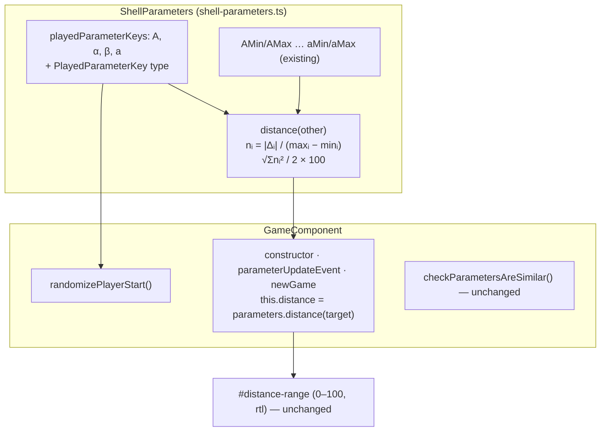

<!-- vt.idd:plan -->
## Implementation Plan

**Generated**: 2026-09-24
**Issue**: #28 - [Game] Heat bar: normalize the distance so it spans ✗ to ✓ and every parameter counts equally

### Technical Context

- **Stack**: Angular 17.3, TypeScript, Karma + Jasmine (ChromeHeadless). Run pinned to 2 cores (`taskset -c 0,1`, `NG_BUILD_MAX_WORKERS=2`).
- **Distance today**: `ShellParameters.distance(other)` (`src/app/shell-parameters.ts:127-140`) returns √(Σ diff²) over all 9 parameters (d excluded), with no scaling.
- **Callers**: only `GameComponent`: the constructor (`game.component.ts:147`), `parameterUpdateEvent` on slider `change` (`:242`) and `newGame` (`:350`). The value binds to `#distance-range` (`game.component.html:136-141`, `min=distMin` 0, `max=distMax` 100, default `step` 1, `direction: rtl`).
- **Played parameters**: `GameComponent.playerParameterKeys` (`:38-40`, private, typed `'A' | 'alpha' | 'beta' | 'a'`) is used by `randomizePlayerStart` (`:182-199`) with `GameComponent.parameterRanges` (`:24-35`), which already reads the `ShellParameters` min/max statics.
- **Win check**: `checkParametersAreSimilar()` (`:299-330`). Not touched.

### Research Findings

- **Today's maximum**: √(8² + 10² + 85² + 5²) = √7414 ≈ 86.1. β's share of the squared maximum: 7225/7414 ≈ 97%.
- **New formula**: nᵢ = |Δᵢ| / (maxᵢ − minᵢ) for A (range 8), α (10), β (85), a (5); bar = √(Σnᵢ²) / 2 × 100. Every range is non-zero, so there's no division by zero. With values inside the ranges, nᵢ ∈ [0, 1], so the bar ∈ [0, 100].
- **Link targets**: `decodeTargetParameters` (`:472-489`) clamps each value to its range, so link games can't push the bar past 100.
- **Typical start** (attempt at the minimums, uniform random target, 200k samples): mean ≈ 56, 10th–90th percentile ≈ 38–73.
- **Win zone reading**: at the threshold corner (A 1.5, α 1.5, β 8, a 1) the bar reads ≈ 16.3. With only β off by 8.01, it reads ≈ 4.7 and there's no win. Accepted (see Decisions Made).
- **Existing specs**: the #15 bar spec (`game.component.spec.ts:586-600`) only checks that the value changes and that the bar matches `component.distance` within 0.5. Moving β from end to end changes the new value by 50, so it still holds. The #12 link-start specs (`:104-160`) call `checkParametersAreSimilar()` and don't depend on the distance.
- **Gap**: no spec pins the win thresholds today, so VM-004 needs a small characterization spec (inside all thresholds → true; each played parameter just outside → false).

### Data Model

No persisted data. In memory:
- `ShellParameters.playedParameterKeys: ReadonlyArray<PlayedParameterKey>` = `['A', 'alpha', 'beta', 'a']` (new static).
- `export type PlayedParameterKey = 'A' | 'alpha' | 'beta' | 'a'` (new).
- `ShellParameters.distance(other): number` in [0, 100] (new semantics, same signature).

### API Contracts

None. There are no endpoints and no component inputs or outputs. `distance()` keeps its signature.

### Architecture

### Project Structure

**Modified**
- `src/app/shell-parameters.ts`: add `PlayedParameterKey` and `playedParameterKeys`, plus a private range lookup for the four keys built from the existing statics. Rewrite `distance()`.
- `src/app/game/game.component.ts`: delete `playerParameterKeys`; `randomizePlayerStart` iterates `ShellParameters.playedParameterKeys`.
- `src/app/shell-parameters.spec.ts`: add a `distance()` describe block covering Scenarios 1, 2, 3 and 5, plus a case showing the copied parameters don't count.
- `src/app/game/game.component.spec.ts`: add a win-threshold characterization spec (VM-004) and a bar-value spec after a slider release with an explicit target (VM-006).

**No** template, CSS, string or dependency changes. No new files.

### Gap Analysis

- **Exists**: the bar, its binding and update points, the ranges, and link clamping. Nothing changes in the UI layer.
- **To build**: the normalized `distance()`, the shared key list and type, and the tests. No spec covers `distance()` or the win thresholds today.
- **Conflicts**: none. `randomizePlayerStart` indexes `parameterRanges` with the key type, and `PlayedParameterKey` is a subset of `TargetParameterKey`, so that still type-checks.
- **Guard**: the diff must leave `checkParametersAreSimilar()` byte-identical (FR-006).

### Implementation Waves

**Wave 0: shared played-parameter list**
1. Add `PlayedParameterKey` + `ShellParameters.playedParameterKeys`. Switch `GameComponent.randomizePlayerStart` to it and delete `GameComponent.playerParameterKeys`. The #12 link-start specs must still pass.

**Wave 1: US-1/US-2, normalized distance**
2. Rewrite `ShellParameters.distance()` per FR-001–FR-004 (four played parameters, divided by range, √Σnᵢ² / 2 × 100).
3. Unit tests in `shell-parameters.spec.ts`, all with explicit values:
   - minimums vs maximums ≥ 95 (exactly 100);
   - a match reads 0;
   - each single parameter across its full range reads 50 ± 1, all four within 1 of each other;
   - changing b, μ, ω, φ or θ doesn't change the value.

**Wave 2: US-2 S4 / US-3, game-level guards**
4. `game.component.spec.ts`:
   - a win-threshold characterization spec (inside → true; each of A, α, β, a just outside → false);
   - the bar reads the rescaled value after a slider release with an explicit target;
   - a start from the minimums reads between 0 and 100 for targets at the minimums, the midpoints and the maximums.
5. `ng lint`, `ng test --watch=false --browsers=ChromeHeadless` and `ng build` on 2 cores. Check that the diff leaves `checkParametersAreSimilar()` unchanged.

### Testing Strategy

Karma unit tests only. The change is pure arithmetic with no layout impact, so no screenshots are needed. Every new spec sets the target and the attempt explicitly and asserts on the state it changes (lessons from #15). Mapping:
- VM-001–003 and VM-005: `shell-parameters.spec.ts` + T004.
- VM-004: the characterization spec + unchanged diff.
- VM-006: the game-level spec.
- SC-001–005 follow from these plus a green `ng test`.

### Constitution Check

There's no `.vt/memory/constitution.md`, so there are no gates. No new dependencies and no data, deployment or agent changes. PASS (vacuous).
