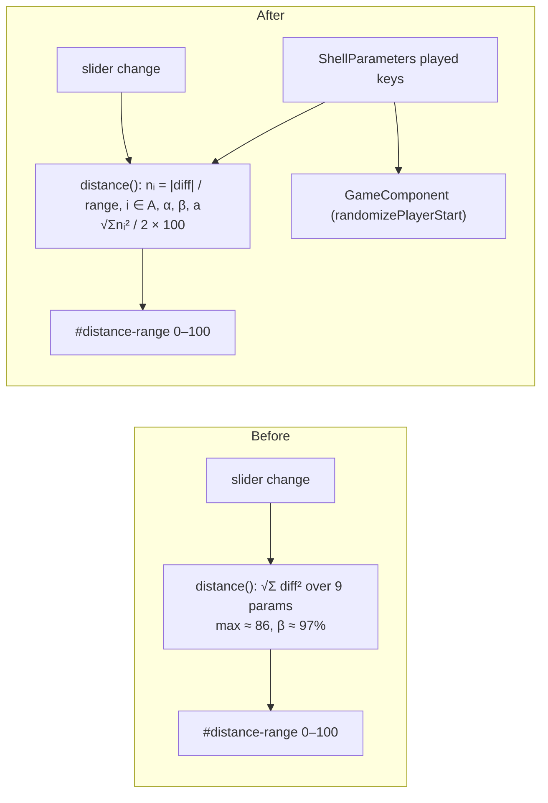

<!-- vt.idd:spec -->
## Specification

## Summary

Rescale the game's **heat bar** (`#distance-range`, the "barra de calor" between ✗ and ✓) so it covers the whole track and every played parameter counts the same. Today `ShellParameters.distance()` is the raw Euclidean distance over all 9 parameters, shown on a fixed 0–100 scale. Only A, α, β and a ever differ in a game (`setupGame()` copies the other 5 from the target), so the reading tops out at √(8² + 10² + 85² + 5²) ≈ 86 and never reaches ✗. β alone accounts for 97% of that maximum, so matching A, α or a barely moves the thumb. The fix divides each played parameter's difference by its slider range and combines them as √(Σnᵢ²) / 2 × 100. A match reads 0 (✓), every played parameter at opposite ends reads 100 (✗), and one parameter fully off with the others matching reads 50, whichever parameter it is. The win check and its thresholds are unchanged. When the bar updates and where it sits are unchanged too (#15).

## User Stories

### US-1 (P1): The bar uses the whole track

As a player, I want the heat bar to run from ✗ (as far as possible) to ✓ (a match), so its position tells me how far off I really am.

- **Scenario 1**: **Given** a target at every played parameter's minimum and an attempt at every maximum, **When** the bar value is computed, **Then** it reads at least 95 of 100 (thumb at the ✗ end).
- **Scenario 2**: **Given** an attempt equal to the target, **When** the bar value is computed, **Then** it reads 0 (thumb at the ✓ end).

### US-2 (P1): Every parameter counts the same

As a player, I want getting A, α or a right to move the bar as much as getting β right, so the bar helps with every slider, not just β.

- **Scenario 3**: **Given** an attempt that matches the target except for one played parameter (A, α, β or a), **When** that parameter goes from one end of its range to the other, **Then** the bar changes by the same amount for each of the four (within 1 point).
- **Scenario 4**: **Given** attempts inside and just outside the win thresholds, **When** the win check runs, **Then** it gives the same result as before this change (thresholds unchanged).

### US-3 (P2): The bar stays within bounds in real games

As a player, I want the bar to stay on the track and keep updating as it does now.

- **Scenario 5**: **Given** a new game (attempt at the sliders' minimums) for any target inside the ranges, **When** the bar value is computed, **Then** it is between 0 and 100.
- **Scenario 6**: **Given** the game screen, **When** the player releases a parameter slider, **Then** the bar shows the new, rescaled value (update timing unchanged from #15).

## Requirements

### Functional Requirements

- **FR-001** `ShellParameters.distance()` MUST use only the played parameters A, α, β and a, with each difference divided by that parameter's slider range: nᵢ = |attemptᵢ − targetᵢ| / (maxᵢ − minᵢ).
- **FR-002** It MUST combine them as √(Σnᵢ²) / 2 × 100. That gives 0 for a match, 100 when all four are at opposite ends, and 50 for one parameter fully off with the others matching.
- **FR-003** The copied parameters (b, μ, ω, φ, θ) MUST NOT affect the bar.
- **FR-004** For attempts and targets inside the slider ranges, the result MUST stay within `distMin`–`distMax` (0–100). Link targets are already clamped to the ranges.
- **FR-005** The played-parameter list MUST be defined once, in `ShellParameters`, as `static readonly playedParameterKeys` with an exported `PlayedParameterKey` type (`'A' | 'alpha' | 'beta' | 'a'`). Both `distance()` and `GameComponent` MUST use it; `GameComponent.playerParameterKeys` is removed. The ranges stay the existing `ShellParameters` min/max statics.
- **FR-006** `checkParametersAreSimilar()` and its thresholds MUST be unchanged.
- **FR-007** The bar's markup, position, 0–100 scale and update timing (slider `change`, new game, constructor) MUST be unchanged.
- **FR-008** Unit tests MUST cover Scenarios 1–3 and 5 with an explicit target and attempt (no random target, no dependence on `Math.random`).

### Key Entities

- **`ShellParameters`** (`src/app/shell-parameters.ts`): parameter ranges (`AMin`…`thetaMax`), bar scale (`distMin` = 0, `distMax` = 100), and `distance(other)`, which is rewritten here.
- **Played parameters**: A (5–13), α (80–90), β (0–85), a (1–6). These are the four the player controls with sliders.
- **Heat bar**: `#distance-range`, bound to `GameComponent.distance`, `direction: rtl` (0 = ✓ on the right, 100 = ✗ on the left).
- **Win check**: `GameComponent.checkParametersAreSimilar()` (thresholds A 1.5, α 1.5, β 8, a 1, b 3, θ 0.25). Not touched.

## Approach / Architecture

### Technical Summary

Change the math in one place. `distance()` is only called by `GameComponent` (in the constructor, `parameterUpdateEvent` and `newGame`), so rewriting it in place rescales the bar everywhere without touching the template or the update flow. The played-parameter list moves into `ShellParameters` so the distance and the game share it.

### Architecture

### Tech Context

Angular 17 / TypeScript, Karma + Jasmine (ChromeHeadless). No new dependencies.

### Project Structure Impact

- Modified: `src/app/shell-parameters.ts` (played-parameter list, `distance()` rewrite), `src/app/game/game.component.ts` (use the shared list), `src/app/shell-parameters.spec.ts` (distance cases), and possibly `src/app/game/game.component.spec.ts` (bar reads the new value).
- No template, CSS or string changes. No new files.

### Applicable Conventions

- Branch `028-*` from `dev`, PR into `dev`. Close #28 manually after merge ("Closes" only auto-closes on `main`).
- Run builds and tests pinned to 2 cores (`taskset -c 0,1`, `NG_BUILD_MAX_WORKERS=2`).
- Tests use explicit values, never a random target, and assert on the state being changed (lessons from #15, `.vt/reflections/…015…`).

### Decisions Made

- **How to combine the four normalized differences**: (a) √(Σnᵢ²) / 2, where one parameter fully off reads 50; (b) plain average Σ|nᵢ| / 4, where one parameter fully off reads 25; (c) the maximum nᵢ, which only tracks the worst parameter. Selected **(a)**. It's closest to the current Euclidean `distance()` and reacts strongly to the parameter that's furthest off. (b) moves the bar less per slider, and (c) hides progress on the other three. (Decided with the user 2026-09-24.)
- **What ✗ means**: (a) fixed across all games (100 = farthest possible in any game), or (b) per game (100 = farthest possible for this game's target). Selected **(a)**, as the issue's criteria say. The consequence: a new game from the minimums averages about 56 (80% of games between about 38 and 73), not ✗. (b) would need criterion 1 rewritten and makes readings incomparable between games. (Decided with the user 2026-09-24.)
- **✓ vs the win**: the thresholds stay unchanged and, divided by range, aren't equal (β 8/85 ≈ 9%, a 1/5 = 20%). So a win can read up to about 16, and a near miss on β alone can read about 5. Options: (a) accept and document; (b) open a follow-up; (c) change weights or thresholds here. Selected **(a)**. (c) conflicts with the issue's equal-weight and unchanged-thresholds criteria. (Decided with the user 2026-09-24; noted on #28.)
- **How the played-parameter list is shared** (CLARIFY): (a) a `static readonly playedParameterKeys` on `ShellParameters` plus an exported `PlayedParameterKey` type, with ranges read from the existing min/max statics; (b) a module-level constant plus a separate range table in a new file; (c) keep the list in `GameComponent` and pass it into `distance()`. Selected **(a)**. It keeps the key union type that `randomizePlayerStart` already relies on, adds no file, and doesn't duplicate ranges (`GameComponent.parameterRanges` already reads the same statics). (b) adds a file for four names. (c) leaves `distance()` dependent on its caller.
- **Where the math lives**: (a) rewrite `ShellParameters.distance()` in place; (b) add a new method and leave `distance()` as is; (c) compute in `GameComponent`. Selected **(a)**. The game is `distance()`'s only caller, and keeping an unused raw version would be dead code.

## Risk Assessments

### Security & Vulnerabilities

| Risk | Severity | Description | Mitigation |
|------|----------|-------------|------------|
| None | Low | Pure arithmetic on in-memory values; no input handling, network or storage change | n/a |

### Regression & Quality

| Risk | Severity | Affected Systems | Mitigation |
|------|----------|------------------|------------|
| Win check accidentally changed while sharing the played-parameter list | High | `checkParametersAreSimilar`, `randomizePlayerStart` | FR-006; thresholds untouched; existing win and link-start specs must still pass |
| Bar reads above 100 or NaN (division by a zero range, rounding) | Medium | `#distance-range` | Every played range is non-zero; FR-004 test with a start from the minimums and at the extremes |
| Flaky tests from random targets | Medium | `shell-parameters.spec.ts`, `game.component.spec.ts` | FR-008: explicit target and attempt in every new case |
| Players read ✓ as "won" when the bar is near 0 but outside a threshold | Low | Game feel | Accepted and documented (Decisions Made); win pop-up remains the only win signal |
| #15 bar spec asserts a raw-distance value | Low | `game.component.spec.ts:586` | It only asserts the value changes and the bar matches `component.distance`, so it holds; rerun |

### Testing Strategy

Unit tests (Karma/Jasmine), 2 cores:
- `shell-parameters.spec.ts`: min→max for all four ≥ 95; match = 0; each single parameter across its full range = 50 ± 1 (all four equal within 1); the copied parameters don't change the value; a start at the minimums reads between 0 and 100 for targets at both extremes and in the middle.
- `game.component.spec.ts`: the existing bar spec still passes. The win-check specs and link-start specs pass unchanged.
- Manual: in a game, the bar starts mid-track and moves visibly when A, α or a is matched. No layout change, so screenshots aren't needed.

## Verification Matrix

| ID | Acceptance Scenario | Evidence | Status |
|----|---------------------|----------|--------|
| VM-001 | US-1 S1: target at minimums, attempt at maximums → bar ≥ 95 | [pending] | Pending |
| VM-002 | US-1 S2: attempt equals target → bar 0 | [pending] | Pending |
| VM-003 | US-2 S3: one played parameter across its full range, others matching → same change for A, α, β, a (±1) | [pending] | Pending |
| VM-004 | US-2 S4: win check results unchanged (thresholds untouched) | [pending] | Pending |
| VM-005 | US-3 S5: new game from the minimums reads between 0 and 100 | [pending] | Pending |
| VM-006 | US-3 S6: bar shows the rescaled value after a slider release | [pending] | Pending |

## Success Criteria

| ID | Criterion | Evidence | Status |
|----|-----------|----------|--------|
| SC-001 | The bar can reach the ✗ end (≥ 95) and reads 0 on a match | [pending] | Pending |
| SC-002 | Each of A, α, β and a moves the bar by the same amount across its full range (within 1 point) | [pending] | Pending |
| SC-003 | The win check and its thresholds are unchanged | [pending] | Pending |
| SC-004 | The played-parameter list is defined once and shared by `distance()` and `GameComponent` | [pending] | Pending |
| SC-005 | `ng test` passes on 2 cores, with new distance specs that use explicit values | [pending] | Pending |

## Complexity Considerations

Small: one method rewritten, one list moved, about 4 files, no UI change, no new dependencies. The design questions are settled (see Decisions Made; clarifications on #28). One note: with a fixed ✗, a new game usually starts mid-track rather than at ✗, which is by design.

## Post-Mortem

_Filled after merge. Do not complete during specification._

| Category | Finding |
|----------|---------|
| Risks that materialized but were not declared | |
| Declared risks that did not materialize | |
| Review findings the risk assessment missed | |
| Template sections that were not useful | |
| Process improvements for next feature | |

