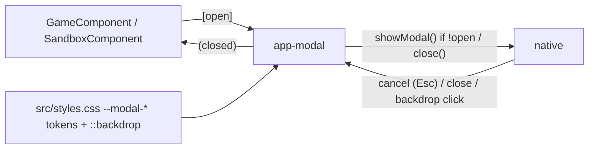

<!-- vt.idd:plan -->
## Implementation Plan

**Generated**: 2026-09-28
**Issue**: #31 - [App] Shared pop-up component on `<dialog>`, styled after Pico.css

### Technical Context

- **Framework**: Angular 17.3 (`@angular/core ^17.3.4`), **NgModule** (not standalone) — new component declared in `src/app/app.module.ts`.
- **Language**: TypeScript. **Tests**: Karma `~6.3.0` + Jasmine `~4.1.0` (2-core harness convention when a run is requested).
- **Platform**: browser SPA; native `<dialog>` (Safari/iOS 15.4+, accepted). No new dependencies — Pico v2 is a style reference only, credited (MIT) in a CSS comment.
- **Screens touched**: `GameComponent` (4 pop-ups), `SandboxComponent` (2 pop-ups); global tokens in `src/styles.css`.

### Research Findings

- **`showModal()` throws `InvalidStateError` on an already-open dialog.** `GameComponent.checkGameIsOver()` runs on load (`ngAfterViewInit` on dev; `ngOnInit` in this PR) and on every slider release (`game.component.ts:154,239,352`), each currently setting `modalWindow.style.display='block'`. Driving `showModal()` unconditionally would throw on the second win-check → **FR-005 open-guard** (`if (!dialog.open) dialog.showModal()`).
- **Native close paths.** `<dialog>` fires `cancel` on Esc and `close` on `close()`. A backdrop click is detected by comparing `event.target === dialogEl`. All three funnel to one `emitClosed()` that fires `(closed)` — replaces `onEscape` (`game.component.ts:75-77`) and both `modalMouseDown` chains (`game.component.ts:495`, `sandbox.component.ts:205`).
- **Side menus are NOT modals.** `menu`/`visualizationMenu` `style.display` toggles (`game.component.ts:250-263`, `sandbox.component.ts:170-193`) are the parameter/visualization side menus — **out of scope**, must be left untouched. FR-012 targets only the six pop-up windows.
- **Top-layer stacking** is by open order: the how-to opens on load, ¡Victoria! opens later on a win → ¡Victoria! sits on top natively (Scenario 8), no z-index work. A win on load opens both in the same pass, in template order, so ¡Victoria! is the last `<app-modal>` in the game template.
- **Focus.** Native `showModal()` moves focus into the dialog. Default focus target = ✕; Nuevo juego overrides to its first choice button (FR-009); "Con clave" continues to focus `gameKeyInput` (existing #23 flow).
- **Scroll lock** already provided by `html, body { overflow: hidden }` (D6) — no new code (Scenario 15).

### Data Model

No persistent data. Component contract only:

- **`ModalComponent` (`app-modal`)**
  - `@Input() open: boolean` — drives `showModal()` (guarded) / `close()`.
  - `@Input() titleId: string` — id set on the projected `<h2>`, referenced by `aria-labelledby`.
  - `@Input() initialFocus?: 'close' | ElementRef | HTMLElement` — element focused on open (default ✕).
  - `@Output() closed = new EventEmitter<void>()` — fires on ✕, Esc/`cancel`, backdrop click.
  - Content projection: `[modal-title]`, default slot (body), optional `[modal-footer]`.

### API Contracts

No network/API. Parent↔component contract per pop-up: parent holds a boolean (e.g. `showVictoria`), binds `[open]="showVictoria"`, and sets it `false` in `(closed)`. Opening-from-code (welcome/how-to) sets the boolean `true` in `ngOnInit`, before the first render (setting it in `ngAfterViewInit` would change a bound value after it was checked).

### Architecture

### Project Structure

**Add**
- `src/app/modal/modal.component.ts` / `.html` / `.css` / `.spec.ts`

**Modify**
- `src/app/app.module.ts` — declare `ModalComponent`.
- `src/app/game/game.component.html` — 4 pop-ups → `<app-modal>`; titles → `<h2>`, lines → `
` (keep `.label-howto-line`).
- `src/app/game/game.component.ts` — replace `style.display` toggles with `[open]` booleans + `(closed)` handlers; add open-guard on win-check; **remove** `onEscape`/`@HostListener` (:75), `modalMouseDown` (:495), modal `@ViewChild`s no longer needed.
- `src/app/game/game.component.css` — remove `.modal`, `.modal-content`, `.modal-*-content`, `.modal-close-button`, `.modal-title`, **both** `.modal-button-bar` (:272,:359); keep content-only inner layout (e.g. `.new-game-choices`, `.key-entry-row`).
- `src/app/sandbox/sandbox.component.{html,ts,css}` — same treatment for welcome + parameter-help (incl. "Resolución"); remove `modalMouseDown` (:205) and modal `style.display` sites (leave menu/visualizationMenu).
- `src/styles.css` — add `--modal-*` custom properties (spacing 1rem, radius .25rem, Pico v2 shadow, widths ~510/~700px, `--modal-overlay: rgba(0,0,0,.4)`) + `dialog::backdrop`; Pico MIT credit comment.
- `src/app/game/game.component.spec.ts`, `src/app/sandbox/sandbox.component.spec.ts` — register `ModalComponent` in TestBeds; migrate ~11 `.modal`/`style.display` assertions to `dialog.open`.

**Remove** — no standalone files; only the rules/methods above.

### Constitution Check

No `.vt/memory/constitution.md` or `foundational-principles.md` present — architect gate had no triggers; constitution check is a no-op. No Critical/Security findings. Convention alignment: NgModule declaration, `AppStrings` for all copy, spec assertions on existing class/id names — all honoured.

### Implementation Waves

1. **Component + specs** — `ModalComponent` (`<dialog>`, `[open]` guard, `cancel`/backdrop/✕ → `(closed)`, `aria-labelledby`, initial-focus), `--modal-*` tokens + `::backdrop` in `styles.css`, full `modal.component.spec.ts` (VM-001–004, 016, 017, 012-guard).
2. **Game's 4 pop-ups** — ¡Victoria!, Nuevo juego (initial-focus + #23 flows), how-to, parameter-help; remove `onEscape`/`modalMouseDown`/`style.display`; open-guard on win-check; migrate game specs.
3. **Initial screen's 2 pop-ups** — welcome (auto-open, keep empty `img-intro-equation`), parameter-help incl. "Resolución"; remove `modalMouseDown`/modal `style.display`; migrate sandbox specs.
4. **Screenshots** — before/after all six at 390/768/1280 px (+844×390) posted here for approval (SC-010); re-confirm #1 backdrop.

### Gap Analysis Summary

- Exists: six hand-built `.modal` divs, `AppStrings` copy, `role/aria-modal/aria-labelledby` on Nuevo juego only, Esc on Nuevo juego only.
- To build: shared component, token set, `::backdrop`, migrated specs.
- Conflicts to resolve: duplicate `.modal-button-bar`; `showModal()` vs. repeated win-check; distinguishing modal vs. side-menu `style.display` (side menus stay).

