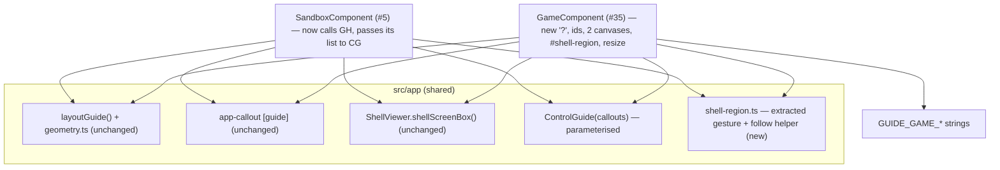

<!-- vt.idd:plan -->
## Implementation Plan

**Generated**: 2026-09-29
**Issue**: #35 - [Game] Add help icon explaining the controls ("?" guide)

### Technical Context

Angular 17.3 (NgModule), TypeScript, three.js OrbitControls, Karma/Jasmine
ChromeHeadless, ESLint. No new dependencies. The guide, its layout, the callout
markup and `ShellViewer.shellScreenBox()` already exist from #5; the test viewport
helper `src/testing/viewport.ts` exists from #5/#6. Branch from **dev** (176 ahead
of main, 0 behind).

### Research Findings

- **Reusable as-is (no change):** `layoutGuide()` + `geometry.ts`
  (`src/app/callout/`); `<app-callout [guide]>` mode; `ShellViewer.shellScreenBox()`
  (`src/app/shell-viewer.ts:289`). `layoutGuide()` already stacks a bottom row's
  bubbles upward, so the game's bottom controls are handled by existing code.
- **Inline in `SandboxComponent`, must be shared (FR-010):** the pointer
  tap-vs-drag gesture (`canvasPointerDown/Up/Cancel`, `presses`, `pinching`,
  `TAP_SLOP`) and `followShell()` + `SHELL_REGION_SCALE`
  (`sandbox.component.ts:189-244`). Extract into a shared, DOM-light helper so both
  screens call one implementation.
- **`ControlGuide`** (`src/app/control-guide.ts`) hard-codes the initial screen's
  `GUIDE` list. Change it to take the callout list as a constructor parameter; the
  sandbox passes its existing list, the game passes its own.
- **The game today has:** no "?", no control ids beyond `#toggle-switch`, no canvas
  pointer handlers (only `(mousedown)`), no `#shell-region`, and a resize handler
  that resizes the viewers but never re-follows the shell. Two canvases
  (`#canvas` user, `#target-canvas` target); the visible one is chosen by opacity +
  z-index in `setShellVisibility()`.
- **Close-rule hooks already present:** `hideMenu()`, `showMenu()`, `onEscape()`,
  `showHowToWindow()`, `openNewGamePopup()`, `checkGameIsOver()` (victory),
  `switchButtonClick()`, `clickExportImage()`, `generateTargetLinkButtonClick()`.
  Each needs a `guide.close()` or (for the "?") a close-others-then-toggle, mirroring
  the sandbox.
- **Narrow-phone rule:** the sandbox has `@media (max-width:355px)` sizing its
  toolbar buttons to 56 px; the game's CSS needs the equivalent for its toolbar +
  the new "?".

### Data Model

- **`ControlGuide(callouts: Callout[])`** — same state/methods; list injected.
- **Shared gesture/region helper** (proposed `src/app/shell-region.ts`): a class
  holding `presses`/`pinching`, `pointerDown/Up/Cancel(event)` returning a
  `'tap' | 'gesture'` result (so each screen decides `guide.close()` vs
  `followShell()`), and `follow(regionEl, box, scale)` that positions a
  `#shell-region` element from a `shellScreenBox()`. Pure enough to unit-test with a
  fake element; no Angular dependency.
- **Game guide callouts** — ten `Callout`s in reading order: `guide-game-parameters`
  (`#parameters-button`), `-save-image` (`#save-image-button`), `-home`
  (`#home-button`), `-howto` (`#howto-button`), `-help` (`#help-button`), `-view`
  (`#shell-region`, region), `-switch` (`#toggle-switch`), `-heat` (`#distance-range`
  or a wrapper id), `-new-game` (`#new-game-button`), `-share` (`#share-button`).
- **New strings** `GUIDE_GAME_*` in `app-strings.ts` (see spec D3 table). Reuse
  `BUTTON_HELP_TITLE` ("Mostrar ayuda") and `GUIDE_HELP_*` / `GUIDE_VIEW_*` where
  shared.

### API Contracts

UI-only; no network or storage contracts. The "?" toggles guide state; the guide
reads control geometry via `getBoundingClientRect()` (through the callout) and the
visible shell via `shellScreenBox()` of the visible viewer.

### Architecture

### Project Structure

**Add**
- `src/app/shell-region.ts` — shared gesture + shell-region follow helper.
- `src/app/shell-region.spec.ts` — its unit spec (tap vs drag/pinch, follow math).
- `src/app/game-control-guide.ts` *or* a `GUIDE_GAME` list in `control-guide.ts` —
  the game's ten callouts.

**Modify**
- `src/app/control-guide.ts` — callout list as a constructor parameter.
- `src/app/sandbox/sandbox.component.ts` — call `shell-region.ts` instead of the
  inline gesture/`followShell` code; pass its list to `new ControlGuide(GUIDE)`.
  Behaviour unchanged (regression-guarded by #5's specs).
- `src/app/game/game.component.ts` — `guide = new ControlGuide(GUIDE_GAME)`; the "?"
  handler (close others, toggle, follow); pointer handlers on both canvases; a
  `#shell-region` following the visible viewer; resize → follow(false); Esc, menu,
  ⓘ, how-to, Nuevo juego, victory close the guide; switch flip re-follows and keeps
  it on; save/Compartir keep it on.
- `src/app/game/game.component.html` — ids on the four toolbar buttons, the two
  `#game-actions` buttons and the heat bar; `#shell-region` div; the "?" button
  (aria-pressed/-controls, name); `(pointerdown/up/cancel)` on both canvases;
  `<app-callout [active]="help.callout" [guide]="guide.callouts">`.
- `src/app/game/game.component.css` — the "?" in the top-right corner; the
  `@media (max-width:355px)` 56 px rule for the toolbar + "?".
- `src/app/app-strings.ts` — `GUIDE_GAME_*` strings.
- `src/app/game/game.component.spec.ts` — guide-mode block (on/off, close rules,
  keep-on, 3D-view aim on both canvases + flip, layout at the listed sizes,
  live region, reduced motion, aria); extend viewport usage via `useViewport()`.

**Remove**: none.

### Waves (preview)

0. **Setup** — confirm branch from dev; no new tooling.
1. **Foundational** — extract `shell-region.ts` (+ spec); parameterise
   `ControlGuide` (+ spec); migrate `SandboxComponent` to both; keep #5 green.
2. **US1/US2 (P1)** — the "?", control ids, `#shell-region`, two-canvas pointer
   handlers, guide on/off, 3D-view aim on the visible shell; `GUIDE_GAME_*`.
3. **US3 (P2)** — close rules + reverse, keep-on actions, switch-flip re-aim, resize.
4. **US4/US5 (P2)** — 56 px narrow rule, layout at all listed sizes (record any
   best-effort), live region, reduced motion, aria; regression sweep of #5/#6.

### Constitution Check

No `.vt/memory/constitution.md` present — no MUST/SHOULD gate to evaluate. No
Critical/Security findings. UI-only change, no new dependencies, no data/network
surface. Proceed.

---
