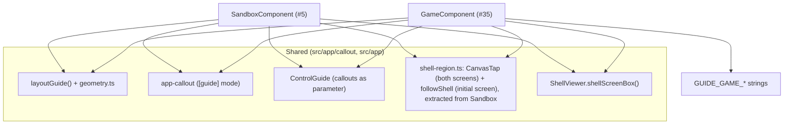

<!-- vt.idd:spec -->
## Specification

## Summary

Give the **game screen** the same "?" guide the initial screen got in #5: a
button alone in the top-right corner that turns on a set of callouts, one beside
every control, each with a short title and line. The game has nine controls and
the 3D view, none with an on-screen label (only mouse-only `title` tooltips), so on a phone
a new player has no way to learn what the gear, the switch, the heat bar or the
two action buttons do. The guide reuses #5's callout guide mode, `layoutGuide()`
and tap-vs-drag handling — extracted into shared pieces so no code is copied —
and adds the game's own control ids, anchors and Spanish text. **Amended
2026-09-30 (D8):** no bubble for the 3D view, so nine bubbles.

## User Stories

### US1 — Learn the controls at a glance (P1)

A player on the game screen wants to know what each control does without hovering
a mouse.

- **Given** the game screen with the guide off, **When** the player taps the "?"
  in the top-right corner, **Then** one callout appears beside each of the nine
  controls (gear, camera, home, book, "?", Usuario/Objetivo switch, heat bar,
  Nuevo juego, Compartir), each pointing at its control and showing its own
  title and short line.
- **Given** the guide is on, **When** a screen reader reads the page, **Then** the
  callouts are read in on-screen order (toolbar left to right, the "?", then the
  bottom controls).
- **Given** the switch is on **Usuario**, **When** the guide turns on, **Then**
  there is no callout for the 3D view (D8).
- **Given** the switch is on **Objetivo** (the target visible), **When** the guide
  turns on, **Then** the same nine callouts show, laid out as on Usuario.

### US2 — Dismiss the guide (P1)

A player who has read the guide wants it out of the way.

- **Given** the guide is on, **When** the player taps the "?" again, **Then** the
  guide turns off and the "?" reports itself as not pressed.
- **Given** the guide is on, **When** the player presses **Esc**, **Then** the
  guide turns off.
- **Given** the guide is on, **When** the player taps either canvas (moving less
  than about 10 px), **Then** the guide turns off.

### US3 — Use the screen with the guide on (P2)

A player wants to keep exploring while the guide is visible.

- **Given** the guide is on, **When** the player drags on a canvas, **Then** the
  shell rotates and the guide stays on (checked with mouse and touch).
- **Given** the guide is on, **When** the player zooms with the wheel or a pinch,
  **Then** the view zooms and the guide stays on.
- **Given** the guide is on, **When** the player saves an image, flips the
  Usuario/Objetivo switch, or taps Compartir, **Then** that action happens and the
  guide stays on.
- **Given** the guide is on, **When** the player opens the gear menu, a parameter
  ⓘ, the how-to pop-up, Nuevo juego or the ¡Victoria! pop-up, **Then** the guide
  turns off (one kind of help at a time).
- **Given** the gear menu, a ⓘ or a pop-up is open, **When** the player turns the
  guide on, **Then** that surface closes first.
- **Given** the guide is on, **When** the player interacts with any control,
  **Then** the control works normally — the callouts and leader lines never take
  the pointer.

### US4 — Fits every phone (P2)

A player on a small or short phone wants the guide readable and unobstructed.

- **Given** any of the listed viewport sizes, **When** the guide turns on,
  **Then** every callout is fully on screen, no two overlap, no leader line
  crosses another callout, and none covers a control (including the bottom
  controls).
- **Given** the guide is on, **When** the window is resized or the phone rotated,
  **Then** every callout is placed again and the rules above still hold.
- **Given** a viewport under 356 px wide, **When** the game screen renders,
  **Then** the toolbar icons and the "?" shrink to 56 px so the top row stays on
  one line (checked down to 320 px).

### US5 — Accessible guide (P2)

- **Given** the guide turns on, **When** a screen reader is active, **Then** it
  announces the callouts' text through a polite live region, in on-screen order,
  and the leader lines are hidden from it.
- **Given** `prefers-reduced-motion: reduce`, **When** the guide turns on,
  **Then** the callouts appear without animation.

## Requirements

### Functional Requirements

- **FR-001** (MUST): The game screen has a **"?" button** alone in the top-right
  corner, level with the toolbar, visible without opening any menu at 320, 338,
  360, 390 and 1280 px wide and at 844×390, drawn like #5's (matching the other
  toolbar icons in size, border and hover colours). It never overlaps another
  icon, and the toolbar plus the "?" stay on one row at every one of those sizes.
- **FR-002** (MUST): Tapping the "?" turns on a **guide**: one callout for each of
  the nine controls, each pointing at its control (arrow, or a leader line in the
  staircase) with its own title and one short line, read in on-screen order.
- **FR-003** (withdrawn 2026-09-30, D8): ~~The 3D-view callout points at the shell
  currently visible.~~ There is no 3D-view callout on the game.
- **FR-004** (MUST): Turning the guide on **closes** the gear menu, any open
  parameter ⓘ callout, and any open pop-up (how-to, Nuevo juego, ¡Victoria!).
- **FR-005** (MUST): The guide **turns off** when: the player taps the "?" again;
  presses Esc; taps either canvas moving less than about 10 px; or opens the gear
  menu, a parameter ⓘ, the how-to, Nuevo juego or ¡Victoria!. When it turns off
  via the "?", the "?" reports itself as not pressed.
- **FR-006** (MUST): While the guide is on, **every control still works**: the
  callouts and leader lines take no pointer. Dragging rotates and wheel/pinch
  zooms, both leaving the guide on (mouse and touch). Saving an image, flipping the
  switch and Compartir leave the guide on.
- **FR-007** (MUST): The "?" has a hit area of at least 44×44 px, an accessible
  name ("Mostrar ayuda"), `aria-pressed` matching the guide's state and
  `aria-controls` pointing at the guide's bubbles.
- **FR-008** (MUST): At 360×800, 390×844, 1280×800 and 844×390, and on short phone
  screens (320×568, 338×643, 360×640, 360×560, 375×553), every callout is fully on
  screen, no two overlap, no leader line crosses another callout, and none covers a
  control (including the switch, heat bar, Nuevo juego and Compartir). Resizing or
  rotating re-places every callout, keeping these rules. **Amended 2026-09-30
  (D7):** the short phones (320×568, 338×643, 360×560, 360×640, 375×553) are best
  effort: every callout still shows, fully on screen. The game's guide uses the
  compact bubbles on phone widths (560 px and less).
- **FR-009** (MUST): A screen reader announces the guide's text when it turns on
  (a polite live region), in on-screen order; the leader lines are hidden from it.
  Under `prefers-reduced-motion: reduce`, the callouts appear without animation.
- **FR-010** (MUST): No placement, layout or tap-vs-drag code is **copied** from
  the initial screen; the game uses **shared pieces** from #5. #5's initial-screen
  guide and #6's parameter ⓘ help keep working unchanged on both screens (their
  specs stay green).
- **FR-011** (MUST): The guide's text lives in `app-strings.ts`; each callout is a
  title plus one short line, and the "?" callout says how to close the guide.
- **FR-012** (SHOULD): Under 356 px wide the game's corner icons are 56 px, so the
  top row never wraps; the toolbar (gear, camera, home, book) plus the "?" fit at
  320 px.

### Key Entities

- **`ControlGuide` (parameterised)**: the guide-state class from #5, changed to
  take its callout list as a constructor parameter so the game supplies its own nine
  callouts. On/off, `callouts`, `refresh()`, `toggle()`, `close()` unchanged.
- **Shared tap-vs-drag helper and shell-region follow** (`src/app/shell-region.ts`):
  `CanvasTap` (TAP_SLOP tap vs drag/pinch), used by both screens, and `followShell`
  (keeping `#shell-region` over the shell), used by the initial screen only since
  D8; both extracted from `SandboxComponent`.
- **Game control ids**: ids added to the game's four toolbar buttons, the two
  `#game-actions` buttons and the heat bar, plus the new "?"; the switch is
  anchored through its existing `#toggle-switch`. (No `#shell-region` on the
  game: no 3D-view callout, D8.)
- **Guide callouts (game)**: nine `Callout`s in reading order, with new
  `GUIDE_GAME_*` strings in `app-strings.ts`.

## Approach / Architecture

### Technical Summary

The initial screen already has this guide (#5). Its callout guide mode
(`<app-callout [guide]>`), the pure `layoutGuide()` placement, the callout markup
and the shell-screen-box projection (`ShellViewer.shellScreenBox()`) are already
reusable. Two pieces are still inline in `SandboxComponent`: the pointer
tap-vs-drag gesture and the code that keeps `#shell-region` over the shell. Since
FR-010 forbids copying, these move into a small shared helper (a class or
directive) that both the sandbox and the game use. `ControlGuide` gains a
constructor parameter for its callout list. The game component then wires: the
"?" button, control ids, the two canvases' pointer handlers, a window-resize
handler, and the switch/menu/pop-up close rules. (Amended by D8: the game has no
3D-view callout, so no `#shell-region` and nothing following the shell.)

### Architecture

### Tech Context

Angular 17.3 NgModule; TypeScript; three.js OrbitControls; Karma/Jasmine
ChromeHeadless; ESLint. No new dependencies. Test viewport helper
(`src/testing/viewport.ts`) already exists from #5/#6.

### Project Structure Impact

- **Modified**: `src/app/control-guide.ts` (callout list as a parameter);
  `src/app/game/game.component.{ts,html,css}` (the "?", control ids, pointer
  handlers on both canvases, `#shell-region`, resize handler, close rules, the
  56 px narrow-phone rule); `src/app/app-strings.ts` (new `GUIDE_GAME_*` and the
  game "?" title if not shared); `src/app/sandbox/sandbox.component.ts` (call the
  extracted helper instead of inline code).
- **Added**: a shared gesture/shell-region helper module (e.g.
  `src/app/shell-region.ts` or a directive); its spec; a game guide-mode spec
  block extending `game.component.spec.ts`.
- **Removed**: none.

### Applicable Conventions

`CLAUDE.md`; #5's callout conventions (`src/app/callout/`); test viewport helper
`src/testing/viewport.ts`; the project's Spanish UI strings in `app-strings.ts`.

### Decisions Made

**D1 — Top-right corner vs the toolbar (owner, 2026-09-29).**
Options: (A) "?" alone in the top-right corner *(selected)*; (B) "?" appended to
the toolbar. Rationale: #5 moved the "?" to the corner because in the toolbar it
wrapped to a second row under 345 px; the game must match. #13's thumbnails were
re-homed off the top-right corner (issue edited 2026-09-29) so the "?" can own it.

**D2 — One bubble per action button (owner, 2026-09-29).**
Options: (A) one callout each for Nuevo juego and Compartir *(selected)* — ten
bubbles then, **nine since D8** (no 3D-view bubble); (B) one shared callout for the
pair — one fewer. Rationale: clearer per-control help; the extra bubble is accepted
with the best-effort clause of FR-008.

**D3 — Reuse vs game-specific wording (owner, 2026-09-29).**
Options: (A) game-specific text for the controls that mean something different in
the game (gear, book), reuse for the "?" and the camera *(selected; the 3D view's
bubble, also reused then, was withdrawn with D8)*; (B) reuse every
shared control's string. Rationale: the gear means "match the target" in the game
and the book is "how to play", so shared strings would mislead. Wording approved by
the owner on 2026-09-30 (with "Progreso" and the new Compartir line):
| Control | Title | Line |
|---|---|---|
| Gear | Parámetros | Ajusta tu caracol para acercarlo al objetivo. |
| Camera | Guardar imagen | Descarga el caracol como PNG. |
| Home | Inicio | Vuelve a la pantalla inicial. |
| Book | Cómo jugar | Abre las instrucciones del juego. |
| "?" | Ayuda | Toca de nuevo para cerrar. |
| Switch | Usuario / Objetivo | Tu caracol (blanco) o el objetivo (dorado). |
| Heat bar | Progreso | Qué tan cerca estás del objetivo. |
| Nuevo juego | Nuevo juego | Empieza otra partida, al azar o con una clave. |
| Compartir | Compartir | Copia el enlace con el caracol que estás adivinando, reta a alguien más. |

**D4 — Extract the shell-region + gesture code (spec).**
Options: (A) extract the inline Sandbox code into a shared helper *(selected)*; (B)
copy it into the game. Rationale: FR-010 forbids copying; a shared helper keeps one
implementation and #5's specs green.

**D5 — Bottom-row staircase (spec).**
The game stacks three rows of controls at the bottom under 560 px (heat bar, the
two buttons, the switch). #5's `layoutGuide()` already supports stacking upward
from a bottom row, but that path has not run in production. The spec accepts that
the shortest phones may need the FR-008 best-effort clause.

**D7 — Phones: compact bubbles + best effort (owner, 2026-09-30, during /vt.build).**
With #5's full-size bubbles, ten bubbles don't fit a phone: the toolbar's staircase
plus the game's three bottom rows leave about 40 px too little at 390×844, and
short phones (under ~700 px tall) can't fit ten at any size. Options: (A) compact
bubbles on the game's phone widths, short phones best effort *(selected)*; (B) two
pages on phones (toolbar bubbles, then the rest); (C) fewer bubbles on phones.
Rationale: smallest change; tall phones, desktop and landscape fit cleanly. Built
with fixes to the shared `layoutGuide()` on paths the initial screen never used
(a row's staircase steps only past what it would cover, controls stacked within
12 px make a row, a crowded control can sit further out with a line); #5's layout
specs pass unchanged. (The region changes made for the 3D-view bubble — sliding
along a tall shell, off-centre arrows — were reverted with D8.) The switch's line was shortened from "Cambia entre tu
caracol (blanco) y el objetivo (dorado)." to fit the then 52-character limit (75
since D8, for Compartir's line).

**D8 — No bubble for the 3D view; heat bar "Progreso"; new Compartir line (owner, 2026-09-30).**
After seeing the guide in the browser: the 3D view's bubble made the screen too
crowded, so it's omitted (nine bubbles; FR-003 withdrawn). The heat bar's title is
"Progreso". Compartir's line is the owner's "Copia el enlace con el caracol que
estás adivinando, reta a alguien más." (72 characters; the game's spec limit goes
to 75 for it). With no 3D-view bubble the game needs no `#shell-region` and no code
following the shell; tap vs drag on both canvases stays. All other wording approved.

**D6 — "Pop-up closes the guide" is a code-level check.**
While a pop-up is open it sits in front of the "?", so a user cannot toggle the
guide behind it. The rule (opening a pop-up turns the guide off; turning the guide
on closes a pop-up) is kept and unit-tested, not reachable as a manual UI step.

## Risk Assessments

### Security & Vulnerabilities

| Risk | Severity | Description | Mitigation |
|------|----------|-------------|------------|
| None material | Low | UI-only change; no new inputs, network, storage or auth. | Standard review. |

### Regression & Quality

| Risk | Severity | Affected Systems | Mitigation |
|------|----------|------------------|------------|
| Extracting Sandbox's gesture/shell-region code breaks #5 | High | `SandboxComponent`, initial-screen guide | Extract behind a helper with unchanged behaviour; #5's specs must stay green (FR-010). |
| The bubbles can't all fit the shortest phones (D7: best effort) | Medium | Guide layout on 320–360 px-wide, short screens | FR-008 best-effort clause; owner approves which sizes are exempt. |
| Two canvases / switch flips mis-aim the 3D-view bubble | Medium | — | Withdrawn with D8: no 3D-view bubble on the game. |
| The game gains a resize handler it lacked | Medium | Game layout, render | Mirror #5: resize follows the shell without an extra layout pass. |
| Compartir still uses native alert/prompt until #25 | Low | Share flow | Tests stub the alert; note #25 must also leave the guide on. |

### Testing Strategy

Karma/Jasmine unit + component specs, ChromeHeadless, pinned viewport via
`src/testing/viewport.ts`. Cover: the "?" (presence, corner, aria, 44×44, 56 px
under 356 px); guide on/off (tap, Esc, canvas tap on both canvases); close rules
(menu, ⓘ, each pop-up) and the reverse (turning on closes them); keep-on actions
(drag, wheel/pinch, save, switch flip, Compartir); no 3D-view bubble on either
shell (D8); layout at the nine listed sizes (no overlap, on
screen, lines don't cross callouts, nothing covers a control); resize/rotate
re-places; live region + reduced motion; `ControlGuide` parameterisation; the
shared helper's own spec. Regression: #5's sandbox specs and #6's parameter-help
specs stay green.

## Verification Matrix

| ID | Acceptance Scenario | Evidence | Status |
|----|---------------------|----------|--------|
| VM-001 | US1 — tap "?" shows one callout per control (9), each labelled and pointing at its control | [pending] | Pending |
| VM-002 | US1 — screen reader reads callouts in on-screen order | [pending] | Pending |
| VM-003 | US1 — on Usuario there is no 3D-view callout (D8) | [pending] | Pending |
| VM-004 | US1 — on Objetivo the same nine callouts show, laid out as on Usuario | [pending] | Pending |
| VM-005 | US2 — tap "?" again turns the guide off; "?" not pressed | [pending] | Pending |
| VM-006 | US2 — Esc turns the guide off | [pending] | Pending |
| VM-007 | US2 — a tap (<~10 px) on either canvas turns the guide off | [pending] | Pending |
| VM-008 | US3 — dragging rotates and keeps the guide on (mouse and touch) | [pending] | Pending |
| VM-009 | US3 — wheel/pinch zoom keeps the guide on | [pending] | Pending |
| VM-010 | US3 — save image, switch flip, Compartir keep the guide on | [pending] | Pending |
| VM-011 | US3 — opening the gear menu, a ⓘ, how-to, Nuevo juego or ¡Victoria! turns the guide off | [pending] | Pending |
| VM-012 | US3 — turning the guide on closes an open menu, ⓘ or pop-up | [pending] | Pending |
| VM-013 | US3 — every control works with the guide on; callouts/lines take no pointer | [pending] | Pending |
| VM-014 | US4 — every callout on screen, none overlapping, no line crossing a callout, none covering a control, at the listed sizes | [pending] | Pending |
| VM-015 | US4 — resize/rotate re-places every callout, rules still hold | [pending] | Pending |
| VM-016 | US4 — under 356 px wide the corner icons are 56 px; top row fits at 320 px | [pending] | Pending |
| VM-017 | US5 — live region announces the text on turn-on, in order; leader lines hidden | [pending] | Pending |
| VM-018 | US5 — under reduced motion the callouts appear without animation | [pending] | Pending |
| VM-019 | FR-010 — no copied code; #5 and #6 specs stay green | [pending] | Pending |
| VM-020 | FR-007 — the "?" has ≥44×44 hit area, name, aria-pressed, aria-controls | [pending] | Pending |

## Success Criteria

| ID | Criterion | Evidence | Status |
|----|-----------|----------|--------|
| SC-001 | A player can open a labelled guide over every game control from the top-right "?" | [pending] | Pending |
| SC-002 | The guide can be dismissed by tap, Esc or a canvas tap, and never blocks using the screen | [pending] | Pending |
| SC-003 | The guide reads correctly to a screen reader and honours reduced motion | [pending] | Pending |
| SC-004 | The guide lays out cleanly at the listed sizes (best-effort sizes recorded and owner-approved) | [pending] | Pending |
| SC-005 | The guide's Spanish wording is approved on this issue before merge | [pending] | Pending |
| SC-006 | Guide screenshots at 338×643, 360×640, 390×844, 1280×800 and 844×390, on Usuario and Objetivo, are approved on this issue before merge | [pending] | Pending |
| SC-007 | #5's initial-screen guide and #6's parameter help keep working (their specs stay green) | [pending] | Pending |

## Complexity Considerations

Medium. Most placement/layout logic already exists (#5); the new work is the
shared-helper extraction (the main regression risk), `ControlGuide`
parameterisation, wiring the game's two canvases and control ids, and the
bottom-row staircase on short phones. One PR, ~3–4 waves. Open items are the
best-effort sizes (settled during layout) and the wording/screenshot approvals
(on this issue before merge).

## Post-Mortem

_Filled after merge. Do not complete during specification._

| Category | Finding |
|----------|---------|
| Risks that materialized but were not declared | |
| Declared risks that did not materialize | |
| Review findings the risk assessment missed | |
| Template sections that were not useful | |
| Process improvements for next feature | |

