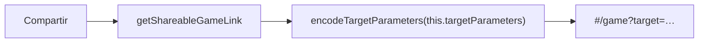

## Implementation Plan

**Generated**: 2026-10-01
**Issue**: #39 - [Game] Compartir shares the player's shell instead of the objetivo

### Technical Context
Angular 17, TypeScript, Karma/Jasmine. Unit specs run pinned to 2 cores (`taskset -c 0,1`). No new dependencies.

### Research Findings
- `game.component.ts:407` `getShareableGameLink()` calls `encodeTargetParameters(this.parameters)`; decode/clamp (`decodeTargetParameters`) and `targetParameterKeys` need no change.
- #12 pinned the old behaviour in `game.component.spec.ts` (describe "GameComponent shared challenge link (#12)" > "sharing"; describe "share button copy" with its spec title "tooltip about sharing your own shell"). The #11 clipboard/prompt specs ("the share button copies the challenge link…", "…falls back to the prompt…") only check the `#/game?target=` prefix.
- Strings: `BUTTON_SHARE_GAME_TITLE` (`app-strings.ts:27`, used by `game.component.html:174`) and `LABEL_HOWTO_NEW_GAME_SHARE` (`app-strings.ts:83`, pinned verbatim in the #10 how-to spec "uses the owner's wording").
- `GUIDE_GAME_SHARE_TEXT` already says "el caracol que estás adivinando": unchanged.
- The #12 archive lives in `specs/012-no_instant_snap_wins/` (spec/plan text says the link shares the player's shell).

### Data Model
No change. Link format `?target=d,A,alpha,beta,a,b,mu,omega,phi,theta` (2 decimals) stays; only the source shell changes.

### API Contracts
None.

### Architecture

Waves (tasks):
1. **W0 code + strings (T001)**: encode `this.targetParameters`; update the two strings; add a short comment above `getShareableGameLink` (there was none).
2. **W1 specs (T002)**: rewrite the "sharing" spec (link equals target to 2 decimals; unchanged after moving sliders); clipboard and prompt specs check the objetivo values; round-trip spec (second component from the link has the same target and a non-winning start); tooltip spec (drop the "not objetivo" assertion, expect the new text); pin the new how-to text in the #10 wording spec; reword the #12 spec comments. Revert check: restoring `this.parameters` fails the new specs and nothing else.
3. **W2 docs (T003)**: amend `specs/012-no_instant_snap_wins/` spec/plan text and the #12 comment trail to point to #39 (comment issuecomment-5937440039); stamp this spec's VM/SC at review. Wave numbers match tasks.json (Wave 0–2).

### Project Structure
Modify: `src/app/game/game.component.ts`, `src/app/app-strings.ts`, `src/app/game/game.component.spec.ts`, `specs/012-no_instant_snap_wins/*`. Add/remove: none.

### Constitution Check
No `.vt/memory/constitution.md` in this repo; gate is a no-op. No Critical/Security findings.
