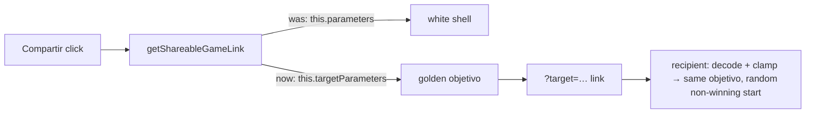

## Specification

## Summary
The **Compartir** button on the game screen should share the **objetivo** (golden) shell. Today it encodes the player's white shell (`this.parameters`), so the recipient is asked to rebuild the sender's attempt. This **reverses #12's decision** (owner, 2026-10-01): the fix is to encode `this.targetParameters`, update the two strings that say otherwise, and rewrite the specs and #12 archive text that pinned the old behaviour. #12's other fixes (random non-winning start, clamping, clearing `?target` on New Game) stay as they are.

Scope tier: Standard, kept compact (one component, strings, specs and docs; no new architecture).

## User Stories

### US1 — Share the golden objetivo (P1)
As a player, I press Compartir so another person gets the same objetivo shell I'm trying to rebuild.
1. **Given** a game with any white-shell position, **when** I press Compartir, **then** the link's `target` values equal the golden shell's parameters (2 decimals).
2. **Given** I press Compartir, move the sliders, and press it again, **when** I compare the two links, **then** they are identical.
3. **Given** the recipient opens the link in a fresh session, **when** the game loads, **then** their golden shell equals the sender's golden shell and the heat bar and distance are computed against it.
4. **Given** the recipient opens the link, **when** the game loads, **then** their white shell starts at a random position that does not already win (#12) and `Nuevo juego` still clears `?target`.

### US2 — Wording says what the button does (P2)
As a player, I read the tooltip and the how-to line and understand that I share the objetivo.
1. **Given** the game screen, **when** I hover Compartir, **then** the tooltip reads "Copiar enlace para retar con el caracol objetivo".
2. **Given** the how-to pop-up is open, **when** I read "Nuevo juego y Compartir", **then** it ends "…copia el enlace para retar a alguien con el caracol objetivo."

## Requirements
### Functional Requirements
- **FR-001** (MUST): `getShareableGameLink()` MUST encode `this.targetParameters`, using the existing `encodeTargetParameters` format (same keys, 2 decimals) and the same URL shape (`<origin><deployment path>/#/game?target=…`).
- **FR-002** (MUST): The link MUST NOT depend on the player's white shell.
- **FR-003** (MUST): The copy-to-clipboard, success alert and prompt-fallback flow is unchanged.
- **FR-004** (MUST): `BUTTON_SHARE_GAME_TITLE` = "Copiar enlace para retar con el caracol objetivo"; `LABEL_HOWTO_NEW_GAME_SHARE` = "Empieza otra partida, o copia el enlace para retar a alguien con el caracol objetivo."
- **FR-005** (MUST): `GUIDE_GAME_SHARE_TEXT` and the "Compartir" label stay unchanged.
- **FR-006** (MUST): Decoding, clamping, the random non-winning start for link games, and clearing `?target` on New Game stay unchanged (#12).
- **FR-007** (MUST): The #12 spec/plan archive text that says the link shares the player's shell is amended to point to #39.
- **FR-008** (SHOULD): Spec comments that describe the old behaviour (the "sharing" describe block and "share button copy" block) are reworded.

### Key Entities
- **Objetivo / target shell**: `GameComponent.targetParameters`, set by `randomParameters()` or decoded from a link.
- **Player shell**: `GameComponent.parameters`, driven by the sliders.
- **Share link**: `#/game?target=d,A,alpha,beta,a,b,mu,omega,phi,theta`.

## Approach / Architecture
### Technical Summary
One-line fix in `getShareableGameLink()` (`game.component.ts`): pass `this.targetParameters` to `encodeTargetParameters`. Two string changes in `app-strings.ts`. Specs in `game.component.spec.ts` updated. The `?target=` format does not change, so existing shared links keep working as challenges.

### Architecture

### Tech Context
Angular 17, Karma/Jasmine unit specs (run on 2 cores), no new dependencies.

### Project Structure Impact
Modify: `src/app/game/game.component.ts`, `src/app/app-strings.ts`, `src/app/game/game.component.spec.ts`; docs: `specs/012-no_instant_snap_wins/` archive text.

### Applicable Conventions
Issues in English; branch from `dev` (in sync with `main`); specs pin look/behaviour; unit tests on 2 cores only; strings in `app-strings.ts` in Spanish.

### Decisions Made
1. **Which shell to share** — options: A) white shell (#12, current); B) golden objetivo; C) both. **Selected B** (owner, 2026-10-01): the point of sharing is to give someone the same objetivo. Reverses #12.
2. **Tooltip and how-to wording** — selected (owner): "…retar con el caracol objetivo" in both.
3. **Old shared links** — options: migrate/mark vs leave. **Leave**: the format is unchanged, old links still open as challenges (their target is whatever shell was white then).
4. **Link format** — unchanged (no versioning), since nothing needs to tell old from new.

## Risk Assessments
### Security & Vulnerabilities
| Risk | Severity | Mitigation |
|------|----------|------------|
| The link exposes the objetivo's values in plain text | Low | Same exposure as before (it exposed the sender's shell); the game isn't competitive or secret. |

### Regression & Quality
| Risk | Severity | Mitigation |
|------|----------|------------|
| Wrong shell encoded after the change | Medium | Spec pins the link to the target and fails if the player's shell is used (revert check). |
| Shared link starts already won again | Medium | #12's random-start specs stay green; one spec opens a link built from a target. |
| Wording specs (tooltip, how-to pop-up) drift | Low | Update the spec at `game.component.spec.ts:~561` and the pinned how-to text at `:~1715`. |

### Testing Strategy
- Unit: rewrite "encodes the player's current shell…" to assert the link equals the target (2 decimals) and does not change when the sliders move; clipboard and prompt specs check the objetivo values, not only the prefix; tooltip and how-to specs on the new strings; revert check against the old line.
- Round trip: build a link, create a second GameComponent from it, assert its target equals the first's target to 2 decimals and its start isn't winning.
- No visual change, so no screenshots.

## Verification Matrix
| ID | Acceptance Scenario | Evidence | Status |
|----|---------------------|----------|--------|
| VM-001 | US1.1 The link's target values equal the golden shell (2 decimals) | [pending] | Pending |
| VM-002 | US1.2 The link is identical before and after moving the sliders | [pending] | Pending |
| VM-003 | US1.3 A fresh session opened from the link has the sender's objetivo and measures the heat bar/distance against it | [pending] | Pending |
| VM-004 | US1.4 The recipient's start doesn't win and New Game clears `?target` | [pending] | Pending |
| VM-005 | US2.1 The tooltip reads the new text | [pending] | Pending |
| VM-006 | US2.2 The how-to line reads the new text | [pending] | Pending |

## Success Criteria
| ID | Criterion | Evidence | Status |
|----|-----------|----------|--------|
| SC-001 | A shared link always reproduces the sender's objetivo, whatever the sliders say | [pending] | Pending |
| SC-002 | The tooltip and the how-to line say "caracol objetivo" and the specs pin them | [pending] | Pending |
| SC-003 | #12's other behaviour (random non-winning start, clamping, New Game clears `?target`) is unchanged: its specs pass untouched | [pending] | Pending |
| SC-004 | The old white-shell behaviour is gone: the revert spec fails on dev's old line | [pending] | Pending |

## Complexity Considerations
Small: about 1 code line, 2 strings, 4-6 specs, docs. No open questions.

## Post-Mortem
_Filled after merge. Do not complete during specification._

| Category | Finding |
|----------|---------|
| Risks that materialized but were not declared | |
| Declared risks that did not materialize | |
| Review findings the risk assessment missed | |
| Template sections that were not useful | |
| Process improvements for next feature | |
