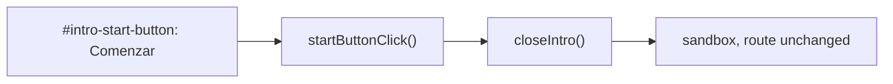

## Implementation Plan

**Generated**: 2026-10-01
**Issue**: #40 - [App] Welcome pop-up: replace "Jugar" with "Comenzar" (close and stay in the sandbox)

### Technical Context
Angular 17, TypeScript, Karma/Jasmine. Unit specs and builds pinned to 2 cores (`taskset -c 0,1`, `NG_BUILD_MAX_WORKERS=2`). No new dependencies.

### Research Findings
- `sandbox.component.html`: `<footer modal-footer>` holds `#intro-play-button (click)="this.playButtonClick()"` with `LABEL_INTRO_PLAY`; the `<app-modal>` comment says "title, text and \"Jugar\"".
- `sandbox.component.ts`: `playButtonClick()` = `closeIntro()` + `navigateToGame()`; `closeIntro()`'s comment lists "Jugar" among the ways out. `navigateToGame()` is also used by the toolbar game button — keep it.
- `<app-modal>` only focuses `initialFocus` when given; the intro passes none, so focus is the browser default (the ✕). Nothing to change.
- Specs pinning "Jugar" (`sandbox.component.spec.ts`): #31 pop-up spec "has no Cerrar button, and only \"Jugar\" in its footer"; #3 welcome specs "is centred: title, text and \"Jugar\"…", describe "Conoce más and Jugar" (button-in-footer, "closes the pop-up and opens the game", on-screen at 320×568 / 844×390), and the expander spec "collapses on every close" (clicks `#intro-play-button`, spies on the router).
- #3 archive: `specs/003-to_infinity_and_the_equation/spec.md` (summary, US3, FR-007, FR-008, architecture, D4, D9/D10 notes, risks, VM-009/VM-010) and `plan.md`.

### Data Model
None.

### API Contracts
None.

### Architecture

Waves (tasks, numbered like tasks.json):
1. **W0 code + string (T001)**: `LABEL_INTRO_START = "Comenzar"` replaces `LABEL_INTRO_PLAY`; template id/handler/label; `startButtonClick()` only calls `closeIntro()`; comments updated.
2. **W1 specs (T002)**: update the #31 footer spec and the #3 welcome specs to `#intro-start-button` / "Comenzar"; rewrite "closes the pop-up and opens the game" → "closes the pop-up and stays in the sandbox" (router spy not called, parameters unchanged, `introOpen` false); add a focus-on-open spec (active element is not "Comenzar"); rename the describe to "Conoce más and Comenzar". Revert check: dev's template/component/strings fail the #40 specs only.
3. **W2 docs (T003)**: "Superseded by #40" note + inline markers in `specs/003-to_infinity_and_the_equation/{spec,plan}.md`; comment on #3. Lint, tests, build.

### Project Structure
Modify: `src/app/app-strings.ts`, `src/app/sandbox/sandbox.component.{html,ts,spec.ts}`, `specs/003-to_infinity_and_the_equation/{spec,plan}.md`. Add/remove: none.

### Constitution Check
No `.vt/memory/constitution.md` in this repo; gate is a no-op. No Critical/Security findings.
