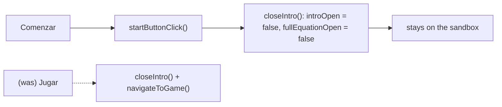

## Specification

## Summary
The welcome pop-up's footer button changes from **"Jugar"** (closes the pop-up and opens the game) to **"Comenzar"** (closes the pop-up and leaves the visitor in the sandbox). The pop-up opens on every visit, so its first action should be to start exploring, not to leave. This **reverses #3's decision D4** (owner, 2026-10-01). The copy that mentions the game, the equation and "Conoce más" are unchanged; focus on open stays on the ✕; "Comenzar" does not open the "?" guide.

Scope tier: Standard, kept compact (one component, one string, specs, #3 archive notes).

## User Stories

### US1 — Start exploring from the welcome pop-up (P1)
As a visitor, I press "Comenzar" and land in the sandbox, ready to move the sliders.
1. **Given** the welcome pop-up is open, **when** I look at its footer, **then** it shows only a centred "Comenzar" button (no "Jugar", no "Cerrar").
2. **Given** the pop-up is open, **when** I press "Comenzar", **then** it closes, the route stays on the sandbox (no navigation), and the camera and sliders are unchanged.
3. **Given** I expanded "Ver ecuación completa" and pressed "Comenzar", **when** I reopen the pop-up from the book icon, **then** the equation is collapsed.
4. **Given** a 320×568 or 844×390 screen, **when** the pop-up is open, **then** the ✕ and "Comenzar" stay reachable, the text scrolling between them.

### US2 — Keyboard and screen reader (P2)
1. **Given** the pop-up opens, **when** focus lands, **then** it is on the ✕ as before (not on "Comenzar").
2. **Given** the pop-up is open, **when** I press Esc, click ✕ or click the backdrop, **then** it closes as before.
3. **Given** a screen reader, **when** it reaches the footer button, **then** it is a button named "Comenzar".

## Requirements
### Functional Requirements
- **FR-001** (MUST): The footer button reads `LABEL_INTRO_START = "Comenzar"` and replaces "Jugar"; `LABEL_INTRO_PLAY` is removed.
- **FR-002** (MUST): Pressing it calls only `closeIntro()` (closes, collapses the expander); it MUST NOT call `navigateToGame()` or the router.
- **FR-003** (MUST): Rename `#intro-play-button` → `#intro-start-button` and `playButtonClick()` → `startButtonClick()`; comments no longer say "Jugar".
- **FR-004** (MUST): Position, centring (`modal-centered`), style and type (`<button type="button">`) unchanged from #3.
- **FR-005** (MUST): No initial focus is set on open (the ✕ keeps the browser-default focus); "Comenzar" does not open the #5 guide.
- **FR-006** (MUST): `navigateToGame()` stays for the toolbar game button; `LABEL_PLAY_AGAIN`, `LABEL_START_KEYED_GAME` and the game how-to's "¡A jugar!" are untouched.
- **FR-007** (MUST): The pop-up copy (LINE1–LINE5, including "En el modo juego te retamos…"), the equation and "Conoce más" are unchanged.
- **FR-008** (MUST): `specs/003-to_infinity_and_the_equation/` gets a "Superseded by #40" note plus inline markers on D4, FR-007, US3, VM-009, VM-010 and other "Jugar" mentions; #3 gets a short comment.
- **FR-009** (SHOULD): The PR carries one before/after image of the footer; no owner screenshot sign-off is required.

### Key Entities
- **Welcome pop-up**: `<app-modal id="modal-intro" class="modal-centered">` in `sandbox.component.html`, open state `introOpen`, expander `fullEquationOpen`.
- **Footer button**: `#intro-start-button` → `startButtonClick()` → `closeIntro()`.

## Approach / Architecture
### Technical Summary
Template: rename the button and bind `startButtonClick()` and `LABEL_INTRO_START`. Component: replace `playButtonClick()` with `startButtonClick()` that only calls `closeIntro()`; update the two comments that list "Jugar". Strings: swap the constant. Specs: update the #3 welcome specs to the new id/label and assert no navigation.

### Architecture

### Tech Context
Angular 17, Karma/Jasmine on 2 cores, no new dependencies.

### Project Structure Impact
Modify: `src/app/sandbox/sandbox.component.html`, `sandbox.component.ts`, `src/app/app-strings.ts`, `src/app/sandbox/sandbox.component.spec.ts`; docs: `specs/003-to_infinity_and_the_equation/{spec,plan}.md`.

### Applicable Conventions
Issues in English; branch from `dev` (in sync with `main`); Spanish UI strings in `app-strings.ts`; specs reference issue numbers; tests and builds pinned to 2 cores; validation harness under `validaciones/shell_generator/40/`, never committed.

### Decisions Made
1. **Button label** — options: Comenzar, Iniciar, Empezar, Explorar. **Selected Comenzar** (owner): reads as "start exploring"; Iniciar sounds like a session, Explorar less like a dismiss button.
2. **What the button does** — A) close + stay in sandbox; B) keep navigating to the game. **Selected A** (owner). Reverses #3 D4.
3. **Initial focus** — A) unchanged, ✕ (browser default); B) focus "Comenzar". **Selected A** (owner): screen readers read the text and equation in order; Enter/Esc still close in one key.
4. **After Comenzar** — A) just close; B) also open the "?" guide (#5). **Selected A** (owner): the pop-up opens every visit; returning visitors would be interrupted.
5. **#3 history** — superseded note + inline markers + comment on #3 (owner), same pattern as #39/#12.
6. **Screenshots** — browser check on own instances + one before/after footer image; no owner sign-off (owner).

## Risk Assessments
### Security & Vulnerabilities
| Risk | Severity | Mitigation |
|------|----------|------------|
| None new: a static label and a handler that only flips two booleans | Low | — |

### Regression & Quality
| Risk | Severity | Mitigation |
|------|----------|------------|
| Button still navigates (handler or template left on the old path) | Medium | Spec spies on `Router.navigate` and asserts it isn't called; revert check against dev's template/component. |
| Expander reset lost | Low | #3's "collapses on every close" spec updated to click "Comenzar". |
| Layout drift in the footer (centring, reach at 320×568 / 844×390) | Low | #3's centring and on-screen specs updated to the new id; browser check at 4 sizes. |
| Stale "Jugar" references (comments, specs, #3 archive) | Low | grep for `intro-play`, `LABEL_INTRO_PLAY`, `playButtonClick`; archive markers. |

### Testing Strategy
- Unit (`sandbox.component.spec.ts`, describe "SandboxComponent welcome pop-up (#3)" and the #31 pop-up specs): footer holds only "Comenzar"; it's a `type="button"` in the footer; pressing it closes and does not navigate (router spy) and leaves the parameters unchanged; expander collapsed on reopen; centring; ✕ and "Comenzar" on screen at 320×568 / 844×390; no element other than the browser default gets focus on open.
- Revert check: dev's template/component/strings fail the #40 specs only.
- Browser check (Playwright, own instances, PR vs dev) at 320×568, 390×844, 1280×800, 844×390: label, centring, click stays on `/`, Esc/✕/backdrop, focus on the ✕; before/after footer image.

## Verification Matrix
| ID | Acceptance Scenario | Evidence | Status |
|----|---------------------|----------|--------|
| VM-001 | US1.1 The footer shows only a centred "Comenzar" | [pending] | Pending |
| VM-002 | US1.2 "Comenzar" closes the pop-up, no navigation, camera and sliders unchanged | [pending] | Pending |
| VM-003 | US1.3 The equation is collapsed when the pop-up reopens after "Comenzar" | [pending] | Pending |
| VM-004 | US1.4 ✕ and "Comenzar" reachable at 320×568 and 844×390 | [pending] | Pending |
| VM-005 | US2.1 Focus on open is the ✕, not "Comenzar" | [pending] | Pending |
| VM-006 | US2.2 Esc, ✕ and backdrop still close the pop-up | [pending] | Pending |
| VM-007 | US2.3 The button is a real button named "Comenzar" | [pending] | Pending |

## Success Criteria
| ID | Criterion | Evidence | Status |
|----|-----------|----------|--------|
| SC-001 | A visitor who presses "Comenzar" stays in the sandbox every time | [pending] | Pending |
| SC-002 | No "Jugar" remains in the welcome pop-up, its code or its specs | [pending] | Pending |
| SC-003 | The rest of the pop-up (copy, equation, Conoce más, centring, close paths) behaves as before | [pending] | Pending |
| SC-004 | #3's archive and issue point to #40 for the reversed decision | [pending] | Pending |

## Complexity Considerations
Small: about 6 code lines, 1 string, ~6 specs, archive notes. No open questions.

## Post-Mortem
_Filled after merge. Do not complete during specification._

| Category | Finding |
|----------|---------|
| Risks that materialized but were not declared | |
| Declared risks that did not materialize | |
| Review findings the risk assessment missed | |
| Template sections that were not useful | |
| Process improvements for next feature | |
