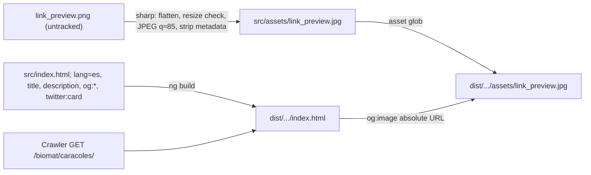

<!-- vt.idd:plan -->
## Implementation Plan

**Generated**: 2026-10-07
**Issue**: #43 - [App] Add Open Graph link preview for shared links

### Technical Context
Angular 17 (`@angular-devkit/build-angular:browser`, `outputPath: dist/shell-generator`, `baseHref: "."`), static hosting on museo (Apache, HTTPS). Karma/Jasmine unit specs and builds pinned to 2 cores (`taskset -c 0,1`, `NG_BUILD_MAX_WORKERS=2`). No new dependencies. One-off image step uses sharp installed in a scratchpad folder outside the repo (precedent #8).

### Research Findings
- `src/index.html` head today: `lang="en"`, `<title>ShellGenerator</title>`, relative `<base href="/">` (rewritten to `.` by the build), favicon, apple-touch-icon, manifest and `theme-color`. No description, OG or Twitter tags.
- Nothing in `src/` reads `document.title` or matches "ShellGenerator", so the title change doesn't affect any spec.
- `angular.json` copies `src/assets` into the build, so `src/assets/link_preview.jpg` becomes `dist/shell-generator/assets/link_preview.jpg` with no config change.
- `ngsw-config.json` puts `/assets/**` and `/*.jpg` in the `assets` group (`installMode: lazy`), so the service worker never prefetches the preview image for visitors.
- Share links are built in `game.component.ts` as `${origin}${deploymentPath}/#/game?target=…`. Crawlers drop the fragment and fetch `/biomat/caracoles/`, the page that carries the tags, so no routing change is needed.
- #8 already established the image-tooling pattern (sharp 0.35 in a scratchpad folder, no committed script or dependency) and the verification style (build plus `dist/` inspection, no unit spec for static head content).
- Source image `link_preview.png` (repo root, untracked): 1200×630, RGBA, about 367 KB, opaque dark background. A baseline JPEG re-encode at quality 85 should land around 100–150 KB (built: 87 KB).

### Data Model
None.

### API Contracts
None. The "contract" is the set of meta tags read by link-preview crawlers (Open Graph protocol, X Cards), listed in FR-001…FR-005.

### Architecture

Waves (tasks, numbered like tasks.json):
- **W0 image (T001)**: In a scratchpad folder, install sharp and convert `link_preview.png` to `src/assets/link_preview.jpg`: flatten onto the background colour, baseline JPEG at quality 85 (optimised Huffman + trellis; no mozjpeg preset, which forces progressive output), metadata stripped. Check that it's JPEG, RGB (3 channels), 1200×630 and under 300 KB, and inspect it visually. If it's over the limit, lower the quality in steps of 5 (not below 75). Leave the PNG untracked and the scratchpad uncommitted.
- **W1 head (T002)**: In `src/index.html`, set `lang="es"` and the Spanish `<title>`, then add `<meta name="description">`, `og:type`, `og:site_name`, `og:locale`, `og:title`, `og:description`, `og:url`, `og:image`, `og:image:type`, `og:image:width`, `og:image:height`, `og:image:alt`, `twitter:card` with the exact values from FR-001…FR-005, plus a one-line comment that the absolute URLs follow the museo path (FR-010). Existing relative links and `<base href>` stay unchanged.
- **W2 verify (T003)**: Lint and the unit suite (pinned). Production build (pinned). Parse `dist/shell-generator/index.html` and assert every tag value. Map the `og:image` path to `dist/shell-generator/assets/link_preview.jpg` and re-check format, channels, dimensions and size. Check that `package.json` and `package-lock.json` are unchanged and that `link_preview.png` isn't staged. The post-deploy live check (VM-003) isn't part of this wave (Decision 10).

### Project Structure
- Modify: `src/index.html`.
- Add: `src/assets/link_preview.jpg`.
- Remove: none.
- Not committed: `link_preview.png`, the scratchpad sharp folder.

### Constitution Check
No `.vt/memory/constitution.md` in this repo, so the gate is a no-op. No Critical or Security findings.
