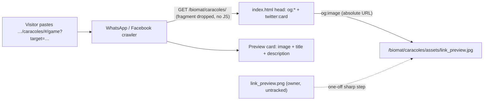

<!-- vt.idd:spec -->
## Specification

## Summary
Links to the app, including the "Compartir" challenge links, show no preview card when pasted into WhatsApp, Facebook, X or Slack, because `src/index.html` has no Open Graph or Twitter Card tags. This adds a **static** link preview: one image, title and description shared by every link. The page's scaffold leftovers `<html lang="en">` and `<title>ShellGenerator</title>` also become Spanish. Absolute URLs point at the museo deployment (`https://mumat.matcuer.unam.mx/biomat/caracoles/`). The owner's `link_preview.png` is turned into an optimized JPEG under `src/assets/`. A per-challenge image is out of scope: share links carry the target in the `#` fragment, which crawlers never see, and the museo hosting is static.

Scope tier: Standard, kept compact (one HTML file, one new asset, no application code).

## User Stories

### US1 — Shared link shows a preview card (P1)
As a visitor sharing the app or a challenge, I want the pasted link to show a card with an image, title and description, so people see what they're opening.
1. **Given** the production build, **when** a crawler fetches `index.html`, **then** it finds `og:title`, `og:description`, `og:url`, `og:type`, `og:site_name`, `og:locale`, `og:image` (with type, width, height, alt) and `twitter:card`, all with the agreed values and absolute URLs.
2. **Given** the production build, **when** `og:image` is resolved against the build root, **then** the file exists at that path and is an RGB JPEG of 1200×630 under 300 KB.
3. **Given** the deployed app on museo, **when** the app URL and a "Compartir" challenge link are pasted into the Facebook Sharing Debugger and WhatsApp, **then** both show the card with image, title and description. (Post-deploy, non-blocking.)

### US2 — Page announces itself in Spanish (P2)
As a visitor or a search/preview crawler, I see the page's real name and language.
1. **Given** the app is open in a browser, **when** I look at the tab, **then** it reads "Caracoles: diseña conchas con matemáticas".
2. **Given** the production `index.html`, **when** it is parsed, **then** `<html lang="es">` and `<meta name="description">` carry the Spanish values.

### US3 — App is otherwise unchanged (P2)
1. **Given** the change, **when** the unit suite and the production build run, **then** both pass, and the app, service worker, manifest and share links behave as before.

## Requirements
### Functional Requirements
- **FR-001** (MUST): `src/index.html` has `<html lang="es">` and `<title>Caracoles: diseña conchas con matemáticas</title>`. The `<noscript>` message is Spanish too: `Activa JavaScript para usar esta aplicación.` (added in review, m1).
- **FR-002** (MUST): `src/index.html` has `<meta name="description" content="Los caracoles y las conchas tienen formas muy distintas, pero todos crecen siguiendo las mismas reglas.">`, the same text as `LABEL_INTRO_LINE1`.
- **FR-003** (MUST): Open Graph tags: `og:type=website`, `og:site_name=Caracoles`, `og:locale=es_MX`, `og:title` = the title, `og:description` = the description, `og:url=https://mumat.matcuer.unam.mx/biomat/caracoles/`.
- **FR-004** (MUST): Image tags: `og:image=https://mumat.matcuer.unam.mx/biomat/caracoles/assets/link_preview.jpg`, `og:image:type=image/jpeg`, `og:image:width=1200`, `og:image:height=630`, `og:image:alt=Concha de caracol en espiral generada por la aplicación`.
- **FR-005** (MUST): `twitter:card=summary_large_image`. No `twitter:title`, `twitter:description` or `twitter:image` tags, because X falls back to the `og:` tags.
- **FR-006** (MUST): `src/assets/link_preview.jpg` is derived from the owner's `link_preview.png`: RGB (no alpha), exactly 1200×630, under 300 KB, with no visible loss.
- **FR-007** (MUST): The image is produced by a one-off, uncommitted step (sharp in a scratchpad folder outside the repo, as in #8). `package.json` and the lockfile are unchanged, and the source PNG is not committed.
- **FR-008** (MUST): `baseHref` stays `"."`, and the existing relative links in `index.html` (favicon, apple-touch-icon, manifest) are unchanged. Only the new meta tags use absolute URLs.
- **FR-009** (MUST NOT): No change to the manifest's `name`/`short_name`, `theme-color`, `ngsw-config.json`, share-link code or routing. No `fb:app_id`.
- **FR-010** (SHOULD): A short comment in `index.html` notes that the absolute URLs must follow the app if it moves from `/biomat/caracoles/`.

### Key Entities
- **Page head**: `src/index.html`. It's copied into `dist/shell-generator/index.html` by the Angular browser builder, which keeps the meta tags.
- **Preview image**: `src/assets/link_preview.jpg` → `dist/shell-generator/assets/link_preview.jpg` (already covered by the `src/assets` asset glob, and by the service worker's `lazy` assets group).
- **Canonical URL**: `https://mumat.matcuer.unam.mx/biomat/caracoles/`. Every share link (`…/caracoles/#/game?target=…`) resolves to it for crawlers.

## Approach / Architecture
### Technical Summary
Edit `src/index.html`: set the language and title, and add the description, OG and Twitter meta tags. Generate `src/assets/link_preview.jpg` once from the owner's PNG with sharp (flatten → baseline JPEG, quality 85, optimised Huffman tables and trellis quantisation, no metadata; sharp's mozjpeg preset was not used because it forces progressive output), check its size and dimensions, and commit only the JPEG. No TypeScript changes.

### Architecture

### Tech Context
Angular 17 (`@angular-devkit/build-angular:browser`), static hosting on museo (Apache, HTTPS). Karma/Jasmine unit tests pinned to 2 cores. No new dependencies.

### Project Structure Impact
- Modify: `src/index.html`.
- Add: `src/assets/link_preview.jpg`.
- Not committed: `link_preview.png` (stays untracked at the repo root) and the scratchpad sharp folder.

### Applicable Conventions
Issues in English; branch from `dev` (not behind `main`); Spanish user-facing text; one-off image tooling outside the repo, with no new dependency (precedent #8); tests and builds pinned to 2 cores (`taskset -c 0,1`); no validation harness or live instances unless the owner asks.

### Decisions Made
1. **Preview level**: A) a static image for every link; B) a per-challenge image showing the goal shell. **Selected A** (owner). B needs non-fragment URLs plus server-side rendering, which the static museo hosting can't do.
2. **Absolute URL source**: A) hard-code the museo URL in `src/index.html`; B) a production build configuration that swaps in a separate index; C) a placeholder replaced at deploy time. **Selected A** (owner). Museo is the only production deployment. B adds config to maintain, and C adds a manual deploy step that can be forgotten.
3. **Card text**: A) title "Caracoles: diseña conchas con matemáticas" plus the `LABEL_INTRO_LINE1` description; B) a challenge-oriented title; C) owner-written text. **Selected A** (owner). It reads well for both the plain app link and challenge links.
4. **lang/title in scope**: A) include both; B) OG tags only. **Selected A** (owner). Same file and purpose; crawlers fall back to `<title>`.
5. **Verification**: A) split, with blocking pre-merge build checks and a non-blocking post-deploy live check; B) deploy before merging. **Selected A** (owner). A merge shouldn't wait on a museo deploy.
6. **Image format**: A) JPEG quality about 85; B) quantized PNG (pngquant). **Selected A**. A photographic render with fine mesh lines compresses far better as JPEG, which also drops the alpha channel. Both were allowed in the issue.
7. **Image tooling**: A) sharp in a scratchpad folder (as in #8); B) `npx sharp-cli`; C) apt `pngquant`/ImageMagick. **Selected A**. It's a proven path in this repo and needs no sudo.
8. **Twitter tags**: A) only `twitter:card`; B) a full `twitter:*` set. **Selected A**. X falls back to the `og:` tags, so this avoids duplicate values.
9. **Unit test for the head**: A) none; verify with build-output checks, as in #8; B) a Karma spec that reads `index.html`. **Selected A**. Karma doesn't load `src/index.html`, and wiring it in would add test infrastructure for static text.
10. **How the post-deploy check closes out** (clarified): A) close #43 on merge into `dev` as usual. `/vt.review` stamps VM-003 and SC-001 as `Partial` with "post-deploy check pending", and the live check is recorded later as a comment on #43 after the next museo deploy, updating those rows to `Pass`; B) keep #43 open until the live check is done; C) open a separate follow-up issue for the live check. **Selected A**. It matches the owner's split-verification decision (merge isn't blocked) and the repo's habit of closing issues on merge into `dev`. B leaves an issue open for an unscheduled deploy, and C splits one feature's acceptance record across two issues.

## Risk Assessments
### Security & Vulnerabilities
| Risk | Severity | Description | Mitigation |
|------|----------|-------------|------------|
| None new | Low | Static meta tags and a static image; no user input reaches the head | — |
| Image metadata leak | Low | An Inkscape export could carry EXIF or XMP data | The sharp re-encode drops metadata by default; check with `file`/`identify`-like output |

### Regression & Quality
| Risk | Severity | Affected Systems | Mitigation |
|------|----------|------------------|------------|
| Image over 300 KB, so WhatsApp shows no image | Medium | WhatsApp preview | Byte-size check in the pre-merge verification; lower the quality step if needed |
| Absolute URL typo or wrong path | Medium | All previews | Check that the `og:image` path, made relative to the site root, exists in `dist/` |
| Platform cache keeps an old (empty) preview | Low | Facebook, WhatsApp | Re-scrape with the Facebook Sharing Debugger after deploying (post-deploy check) |
| Build drops or rewrites meta tags | Low | Production `index.html` | Inspect the production `dist/shell-generator/index.html` |
| Accidental change to relative links or `baseHref` | Low | App loading under `/biomat/caracoles/` | Diff review: only head additions plus the lang/title edits |
| Previews from non-museo deployments point at museo | Low | Local/test instances | Accepted (Decision 2); noted in an `index.html` comment |

### Testing Strategy
- No new unit tests (static head and asset, as in #8). The existing Karma suite must stay green.
- Pre-merge checks: the production build succeeds. Parse `dist/shell-generator/index.html` and assert every FR-001…FR-005 value. Confirm `dist/shell-generator/assets/link_preview.jpg` exists and is a JPEG, RGB, 1200×630 and under 300 KB. Confirm `package.json` and the lockfile are unchanged and `link_preview.png` is not committed.
- Post-deploy (non-blocking): the image URL loads, and the Facebook Sharing Debugger and a WhatsApp paste work for the app URL and a challenge link.

## Verification Matrix
| ID | Acceptance Scenario | Evidence | Status |
|----|---------------------|----------|--------|
| VM-001 | US1.1 Production `index.html` has every OG/Twitter tag with the agreed values and absolute URLs | ✅ crawler view of the app URL and a real "Compartir" link: 13/13 tags with the agreed values, absolute museo URLs · browser check 36/36 at d1981df (validaciones/shell_generator/43) · T003 dist parse (ef96a18) | Pass |
| VM-002 | US1.2 `og:image` resolves to an RGB JPEG of 1200×630 under 300 KB in the build | ✅ dist/shell-generator/assets/link_preview.jpg: 200 image/jpeg, 89,224 B, 1200×630, 3 components, baseline (bc03504) · browser check 36/36 at d1981df (validaciones/shell_generator/43) | Pass |
| VM-003 | US1.3 Facebook Sharing Debugger and WhatsApp show the card for the app URL and a challenge link (post-deploy; `Partial` until checked, see Decision 10) | ⏳ post-deploy check pending (Decision 10); simulated WhatsApp/Facebook cards from the crawled tags show image + title + description (capturas/simulated-cards.png) | Partial |
| VM-004 | US2.1 The browser tab reads "Caracoles: diseña conchas con matemáticas" | ✅ document.title "Caracoles: diseña conchas con matemáticas" at 1280×800 and 390×844 (dev: "ShellGenerator") · browser check 36/36 at d1981df (validaciones/shell_generator/43) | Pass |
| VM-005 | US2.2 `<html lang="es">` and `<meta name="description">` carry the Spanish values | ✅ lang="es" and meta description equal to LABEL_INTRO_LINE1 in crawler and browser views; <noscript> Spanish (079edd8) · browser check 36/36 at d1981df (validaciones/shell_generator/43) | Pass |
| VM-006 | US3.1 Unit suite and production build pass; app, service worker, manifest and share links unchanged | ✅ unit 473/473, ng lint, production build after fixes ([fix summary](https://github.com/C3Idea/shell-generator/pull/44#issuecomment-6043358405)); share link, welcome pop-up and game with no console errors; image only in the lazy SW group, never fetched by visitors · browser check 36/36 at d1981df (validaciones/shell_generator/43) | Pass |

## Success Criteria
| ID | Criterion | Evidence | Status |
|----|-----------|----------|--------|
| SC-001 | Every link to the app (plain or challenge) produces a preview card with image, title and description on WhatsApp and Facebook | ⏳ VM-003 pending the museo deploy; VM-001 shows every link (plain and challenge) carries the card tags | Partial |
| SC-002 | The preview image stays within platform limits (1200×630, under 300 KB, RGB) | ✅ VM-002 (87 KB, 1200×630, RGB) | Pass |
| SC-003 | The page identifies itself in Spanish (language, title, description) | ✅ VM-004, VM-005 (lang, title, description, noscript) | Pass |
| SC-004 | No new dependency and no behavior change in the app | ✅ package.json/package-lock.json unchanged vs dev; link_preview.png untracked; VM-006 | Pass |

## Complexity Considerations
Small: one HTML file (about 15 lines), one generated asset, no TypeScript. The only open item is the post-deploy live check, which depends on the next museo deploy and doesn't block the merge.

## Post-Mortem
_Filled after merge. Do not complete during specification._

| Category | Finding |
|----------|---------|
| Risks that materialized but were not declared | |
| Declared risks that did not materialize | |
| Review findings the risk assessment missed | |
| Template sections that were not useful | |
| Process improvements for next feature | |

